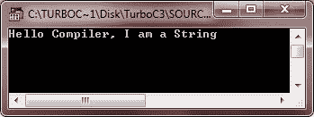
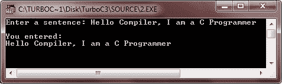
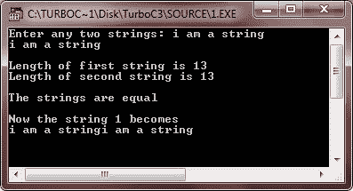
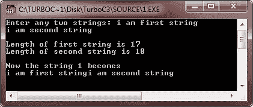
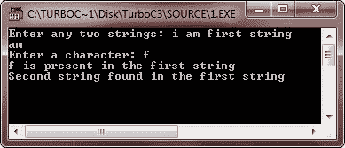
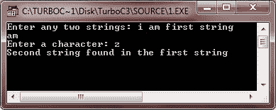
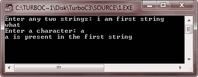
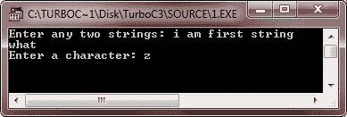

# C 弦

> 原文：<https://codescracker.com/c/c-strings.htm>

在 C 语言中，一个字符串就是一个空终止字符[数组](/c/c-arrays.htm)。换句话说，字符串实际上是由字符组成的一维数组， 以空字符(' \0 ')结束。

## 用 C 语言声明一个字符串

下面的示例显示了如何在 C 中声明字符串:

```
char str[80];
```

在这里，str 最多可以包含 80 个字符，包括空终止字符(即' \0 ')。

**注意** -无论何时声明一个将保存一个字符串的字符数组，你必须声明它比 所能保存的最大字符串长一个字符。

**注意**——编译器自动将 null 加到字符串[常量](/c/c-constants.htm)的末尾。

字符串常量是用双引号括起来的字符列表。这里有一个例子。

```
"i am string"
```

## C 字符串示例

这是一个演示简单字符串的字符数组的示例程序。

```
/* C Strings - This program illustrates the
 * concept of array of characters or simply
 * strings in C language */

#include<stdio.h>
#include<conio.h>
void main()
{
   char str[40] = "Hello Compiler, I am a String";
   clrscr();

   printf("%s", str);

   getch();
}
```

以下是上述 C 程序的示例输出:



这是另一个例子。这个程序将字符串初始化为用户输入的字符串。

```
/* C Strings */

#include<stdio.h>
#include<conio.h>
void main()
{
   char str[40];
   clrscr();

   printf("Enter a sentence: ");
   gets(str);
   printf("\nYou entered:\n");
   printf("%s", str);

   getch();
}
```

下面是上述 C 程序的运行示例:



## 在 C #中操作字符串的函数

c 提供了很多操作字符串的函数，比如 [strcat()](/c/function/string-character/strcat.htm) ， [strchr()](/c/function/string-character/strchr.htm) ， [strcmp()](/c/function/string-character/strcmp.htm) ， [strcoll()](/c/function/string-character/strcoll.htm) ， [strcpy()](/c/function/string-character/strcpy.htm) ， [strcspn()](/c/function/string-character/strcspn.htm) ， [strerror()](/c/function/string-character/strerror.htm) ， [strlen()](/c/function/string-character/strlen.htm) ，[下表列出了 C 语言中操纵字符串的最常见函数 :](/c/function/string-character/strncat.htm)

| 函数名 | 作品 |
| [strcpy(s1，s2)](/c/function/string-character/strcpy.htm) | 将 s2 复制到 s1 |
| [strcat(s1，s2)](/c/function/string-character/strcat.htm) | 将 s2 连接到 s1 的末尾 |
| [strlen(s)](/c/function/string-character/strlen.htm) | 返回 s 的长度 |
| [strcmp(s1，s2)](/c/function/string-character/strcmp.htm) | 如果 s1 和 s2 相同，则返回 0。如果 s1 小于 s2，则返回小于 0 的值。
如果 s1 大于 s2，则返回大于 0 的值。 |
| [strchr(s，ch)](/c/function/string-character/strchr.htm) | 返回一个指针，指向 s 中第一个出现的 ch |
| [strstr(s1，s2)](/c/function/string-character/strstr.htm) | 返回一个指针，指向 s1 中第一次出现的 s2 |

要详细了解所有操作字符串和字符的函数，请参考 [C 字符串和字符函数](/c/function/string-character/c-string-character-functions.htm)。

现在让我们举一些例子来演示 C 语言中的字符串。

```
/* C Strings */

#include<stdio.h>
#include<conio.h>
void main()
{
   char str1[80], str2[80];
   clrscr();

   printf("Enter any two strings: ");
   gets(str1);
   gets(str2);

   printf("\nLength of first string is %d\n", strlen(str1));
   printf("Length of second string is %d\n", strlen(str2));

   if(!strcmp(str1, str2))
   {
      printf("\nThe strings are equal\n");
   }
   strcat(str1, str2);
   printf("\nNow the string 1 becomes\n");
   printf("%s", str1);

   getch();
}
```

下面是上述 C 程序的两个运行示例。第一种，当用户输入相等的字符串时。第二种，当用户输入不相等的字符串时。




这里还有一个例子。这个程序要求用户输入两个字符串和一个字符。然后这个程序检查这个字符是否出现在第一个字符串中。如果存在，则将显示一条消息，告知该字符存在于第一个字符串中，否则将不显示任何消息。然后这个程序检查第二个字符串是否存在于第一个字符串中。如果存在，将显示一条消息，说明该字符串存在于第一个字符串中。否则，不会显示任何消息。：

```
/* C Strings */

#include<stdio.h>
#include<conio.h>
void main()
{
   char str1[80], str2[80];
   char ch;
   clrscr();

   printf("Enter any two strings: ");
   gets(str1);
   gets(str2);
   fflush(stdin);
   printf("Enter a character: ");
   scanf("%c", &ch);

   if(strchr(str1, ch))
   {
      printf("%c is present in the first string\n", ch);
   }
   if(strstr(str1, str2))
   {
      printf("Second string found in the first string\n");
   }

   getch();
}
```

下面是这个 C 程序的 4 个运行示例。






### 更多示例

这里有更多的例子来演示 C 语言中的字符串，你可以试试:

*   [找出字符串的长度](/c/program/c-program-find-length-of-string.htm)
*   [比较两个字符串](/c/program/c-program-compare-two-string.htm)
*   [复制字符串](/c/program/c-program-copy-string.htm)
*   [连接字符串](/c/program/c-program-concatenate-string.htm)
*   [反串](/c/program/c-program-reverse-string.htm)
*   [从字符串中删除元音](/c/program/c-program-delete-vowels-from-string.htm)
*   [从句子中删除单词](/c/program/c-program-delete-words-from-sentence.htm)
*   [查找字符的频率](/c/program/c-program-frequency-character.htm)
*   [计算句子中的单词数](/c/program/c-program-count-words-in-sentence.htm)
*   [删除字符串中的空格](/c/program/c-program-remove-spaces-from-string.htm)
*   [对字符串进行排序](/c/program/c-program-sort-string.htm)
*   [将大写转换成小写](/c/program/c-program-convert-uppercase-into-lowercase.htm)
*   [将小写转换成大写](/c/program/c-program-convert-lowercase-into-uppercase.htm)
*   [交换两根弦](/c/program/c-program-swap-two-strings.htm)
*   [是否检查字谜](/c/program/c-anagram-program.htm)

[C 在线测试](/exam/showtest.php?subid=2)

* * *

* * *