# C 指针

> 原文：<https://codescracker.com/c/c-pointers.htm>

指针在 C 语言中非常重要。正确理解和使用指针对成功的 C 编程非常重要。这背后有以下原因:

*   指针提供了函数修改其调用参数的方法
*   指针支持动态分配
*   指针可以提高某些例程的效率。
*   指针提供了对动态数据结构的支持，如[二叉树](/c/c-trees.htm)和 [链表](/c/c-linked-lists.htm)

## 什么是指针？

指针是一个[变量](/c/c-variables.htm)，保存一个内存地址。这个地址是内存中另一个对象(通常是另一个变量)的位置。 例如，如果一个变量包含另一个变量的地址，那么第一个变量指向第二个变量。这里 是说明这种情况的图:

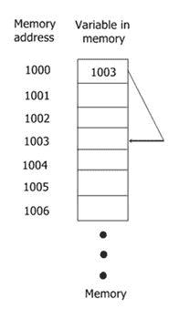

## 指针变量

如果一个变量是一个指针，它必须像这样声明:

```
type *name;
```

如您所见，指针声明由一个基类型、一个*和一个变量名组成。这里 type 是指针的基类型，可以是任何有效的类型。指针变量的名称由 name 指定。

指针的基本类型定义了指针将指向的对象的类型。

## 指针运算符

有以下两种指针运算符:

1.  *
2.  &

&是一元运算符，返回其操作数的内存地址。

永远记住一元运算符只需要一个操作数。下面是例子。

```
a = &count;
```

这将变量 count 的内存地址放入 m 中。这个地址是变量在计算机内部的位置。

指针*是&的补码。它是一个一元运算符，返回位于其后地址的值。它也被称为“地址值”运算符。例如，如果 m 包含变量 count 的内存地址，那么

```
n = *m;
```

将 count 的值放入 n 中。也就是说，如果 count 的值为 10，则 n 也将具有相同的值 10。

## 指针分配

下面是指针赋值的示例程序:

```
/* C Pointers - Pointer Assignments
 * This program illustrates the
 * pointer assignments in C
 */

#include<stdio.h>
#include<conio.h>
void main()
{
   int a = 99;
   int *ptr1, *ptr2;
   clrscr();

   ptr1 = &a;
   ptr2 = ptr1;

   // printing the value of a twice
   printf("Value of ptr1 : %d\n", *ptr1);
   printf("Value of ptr2 : %d\n\n", *ptr2);

   // printing the address of a twice
   printf("Address pointed to by ptr1 : %p\n", ptr1);
   printf("Address pointed to by ptr2 : %p\n\n", ptr2);

   getch();
}
```

在这个程序中，在这个赋值序列之后:

```
ptr1 = &a;
ptr2 = ptr1;
```

ptr1 和 ptr2 都指向 a。下面是这个 C 程序的示例输出:

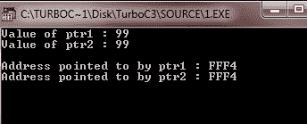

**注** -始终记住，地址是使用%p printf()格式说明符显示的，这使得 printf()以主机使用的格式显示地址 。

## 指针转换

当一种类型的指针要指向另一种数据类型的变量或要分配另一种类型的指针时，需要进行指针转换。

这个程序试图通过指针 ptr 给 a 和 b 赋值。这个程序编译没有错误，但是输出不是期望的输出。

```
/* C Pointer - Pointer Conversion
 * This program illustrates the
 * pointer conversion in C
 */

#include<stdio.h>
#include<conio.h>
void main()
{
   double a = 100.1, b;
   int *ptr;
   clrscr();

   /* here this statement causes ptr (which
    * is an integer pointer) to point to a
    * double.
    */
   ptr = (int *) &a;

   /* and here this statement doesn't operate
    * as expected.
    */
   b = *ptr;  // this attempt to assign b the value of a through ptr

   // and now this statement won't output as 100.1
   printf("The (incorrect) value of a is : %f", b);

   getch();
}
```

下面是这个 C 程序的输出:

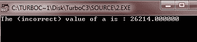

## 通用指针

在 C 语言中，允许将 void *指针赋给任何其他类型的指针。也允许将任何其他类型的指针赋给 void *指针。void *指针称为泛型指针。void *指针用于指定一个其基类型未知的指针。void *类型允许函数指定一个参数，该参数能够接收任何类型的指针参数，而不会报告类型不匹配。

## 指针算法

在 C 语言中，您只能对指针使用以下两种算术运算:

*   添加
*   减法

为了理解指针算术指针，让我们假设指针 ptr1 是一个当前值为 1000 的整数指针。另外，假设 int 的长度为 2 个字节。所以在表达完之后

```
ptr++;
```

ptr 包含 1002。这样做的原因是每次当 ptr 递增时，它将指向下一个整数。同样的概念也适用于减量。

现在专注于这个示例程序:

```
/* C Pointer - Pointer Arithmetic
 * This program illustrates the
 * concept of pointer arithmetic
 */

#include<stdio.h>
#include<conio.h>
void main()
{
   int *ptri, *ptrd, i;
   clrscr();

   ptri = ptrd = 1000;

   printf("Incrementing Integer Pointer...\n");
   for(i=0; i<5; i++)
   {
      printf("%d\n", ptri);
      ptri++;
   }
   printf("\n");
   printf("Decrementing Integer Pointer...\n");
   for(i=0; i<5; i++)
   {
      printf("%d\n", ptrd);
      ptrd--;
   }

   getch();
}
```

下面是这个 C 程序的运行示例:

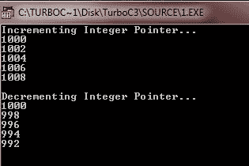

## 指针比较

在 C 语言中，你也可以在一个关系表达式中比较两个指针。例如，这里给出了两个指针 ptr1 和 ptr2，这个语句在 C:

```
if(ptr1 < ptr2)
{
   printf("ptr1 points to lower memory than ptr2");
}
```

下面是一个简单的示例程序来说明指针比较的概念。集中精力，这个程序是基于栈的。要停止程序，只需输入-1。

```
/* C Pointer - Pointer Comparisons
 * This program illustrates the
 * concept of pointer comparisons
 * in C language
 */

#include<stdio.h>
#include<conio.h>
#include<stdlib.h>

#define SIZE 50

void push(int);
int pop(void);
int *tos, *ptr;
int stack[SIZE];

void main()
{
   int val;
   clrscr();

   tos = stack;   // now tos points to the top of the stack
   ptr = stack;   // initialize ptr

   do
   {
      printf("Enter value : ");
      scanf("%d", &val);
      if(val != 0)
      {
         push(val);
      }
      else
      {
         printf("value on top is %d\n", pop());
      }
   }while(val != -1);

   getch();
}
void push(int i)
{
   ptr++;
   if(ptr == (tos+SIZE))
   {
      printf("Stack Overflow..!!\n");
      exit(1);
   }
   *ptr = i;
}
int pop(void)
{
   if(ptr == tos)
   {
      printf("Stack Underflow..!!\n");
      exit(1);
   }
   ptr--;
   return *(ptr+1);
}
```

下面是这个程序的运行示例:

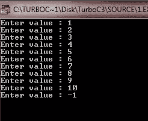

要了解更多关于 C 栈的知识，请详细阅读我们关于 C 栈的单独教程。

## 指针和数组

在 C 语言中，指针和数组有着密切的关系。让我们考虑这段代码:

```
int arr[10], *ptr;
ptr = arr;
```

这里，ptr 被设置为 arr 中第一个数组元素的地址。要访问数组中的任何元素，就像访问 arr 中的第四个元素一样，您可以编写以下代码片段:

```
arr[3];
```

或者

```
*(ptr+3);
```

下面是示例程序。专心做这个节目。

```
/* C Pointer - Pointers and Arrays */

#include<stdio.h>
#include<conio.h>
void main()
{
   int arr[10] = {1, 2, 3, 4, 5, 6, 7, 8, 9, 10};
   int *ptr;
   int i;
   clrscr();

   ptr = arr;
   for(i=0; i<10; i++)
   {
      printf("arr[%d] = %d\t *(ptr+%d) = %d\n", i, arr[i], i, *(ptr+i));
   }

   getch();
}
```

下面是这个 C 程序的运行示例:

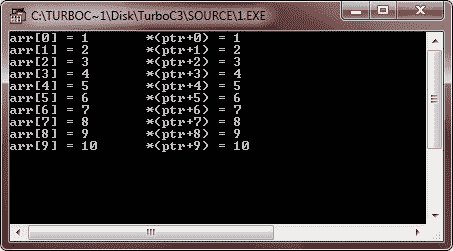

## 多重间接

在 C 语言中，还可以让一个指针指向另一个指向目标值的指针。这种情况称为多重间接寻址，或指针对指针。此图说明了多重间接寻址的概念:

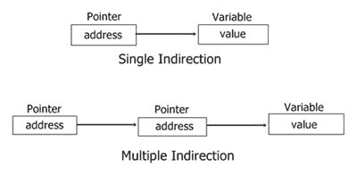

现在让我们举一个多重间接的例子。

## C 指针多重间接示例

若要访问指针间接指向的目标值，则必须应用星号运算符两次，如示例程序所示:

```
/* C Pointer - Multiple Indirection
 * This program illustrates the concepts
 * of C Pointer Multiple Indirection or
 * C pointers to pointers
 */

#include<stdio.h>
#include<conio.h>
void main()
{
   int a;
   int *ptrs, **ptrm;
   clrscr();

   a = 10;
   ptrs = &a;
   ptrm = &ptrs;

   printf("Address = %p\n", *ptrm);  // this prints the address of a
   printf("Value = %d", **ptrm);   // this prints the value of a

   getch();
}
```

下面是这个 C 程序的示例输出:

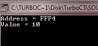

## 指示字初始化

在 C 语言中，在声明了非静态局部指针之后，但在为其赋值之前，它包含一个未知值。全局和静态局部指针自动初始化为空。

重要提示 -如果你在给它一个有效的值之前试图使用指针，你将会使你的程序崩溃，也可能是你的 电脑的操作系统，这是一个非常严重的错误！。

现在专注于这个示例程序来理解 C 语言中指针初始化的概念。

```
/* C Pointer - This program illustrates the
 * concept of pointer initialization in C
 */

#include<stdio.h>
#include<conio.h>
#include<string.h>

int search(char *p[], char *name);

char *names[] = {"programmer", "learner", "student", "coder",
      "decoder", "teacher", "professor", "enginner",
      "developer", NULL};  // null pointer constant ends the list

void main()
{
   char str[20];
   clrscr();

   printf("Who are you ? ");
   scanf("%s", str);
   if(search(names, str) != -1)
   {
      printf("%s is in the list.\n", str);
   }
   else
   {
      printf("%s is not in the list.\n", str);
   }

   getch();
}

int search(char *p[], char *name)
{
   register int i;
   for(i=0; p[i]; i++)
   {
      if(!strcmp(p[i], name))
      {
         return i;
      }
   }
   return -1;   // in case, not found
}
```

下面是这个程序的四个运行示例，两个用于 found，另外两个用于 not found。

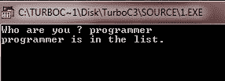
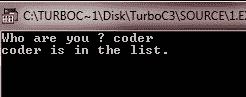
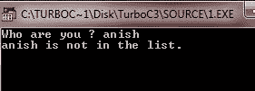
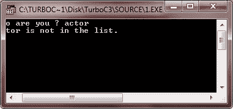

## 指向函数的指针

C 语言的一个特别令人困惑但强大的特性是函数指针。众所周知，函数在内存中有一个物理位置，可以分配给一个指针。这个地址是函数的入口点，也是调用函数时使用的地址。一旦指针指向一个函数，就可以通过这个指针调用这个函数。重要的是，你也可以允许函数作为参数传递给其他函数。下面是示例程序。

```
/* C Pointer - Pinters to Functions */

#include<stdio.h>
#include<conio.h>
#include<string.h>

void check(char *a, char *b, int (*cmp)(const char *, const char *));

void main()
{
   char str1[80], str2[80];
   int (*ptr)(const char *, const char *);   // this is a function pointer
   clrscr();

   ptr = strcmp;    // assign address of strcmp to p
   printf("Enter any two strings :\n");
   gets(str1);
   gets(str2);

   check(str1, str2, ptr);    // pass address of strcmp via p

   getch();
}
void check(char *a, char *b, int (*cmp)(const char *, const char *))
{
   printf("\n");
   if(!(*cmp)(a, b))
   {
      printf("Both the strings are equal");
   }
   else
   {
      printf("Both the strings are not equal");
   }
}
```

下面是这个 C 程序的两个示例输出，一个表示相等，另一个表示不相等:

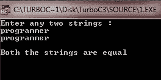
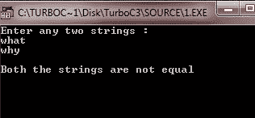

在上面的 C 程序中，检查 main()函数中 p 的声明。

```
int (*ptr)(const char *, const char *);
```

这个声明告诉编译器 ptr 是一个函数的指针，这个函数有两个 const char *参数，并返回一个 int 结果。为了让编译器正确解释这个声明，p 周围的括号是必要的。尽管函数的返回类型和参数可能不同，但在声明其他函数指针时，您必须使用类似的形式。

让我们再看一个例子来完全理解函数指针的概念。

```
/* C Pointer - Pinters to Functions */

#include<stdio.h>
#include<conio.h>
#include<ctype.h>
#include<stdlib.h>
#include<string.h>

void check(char *a, char *b, int (*cmp)(const char *, const char *));
int compval(const char *a, const char *b);

void main()
{
   char str1[80], str2[80];
   clrscr();

   printf("Enter any two values or two strings :\n");
   gets(str1);
   gets(str2);

   if(isdigit(*str1))
   {
      printf("Testing values for equality.\n");
      check(str1, str2, compval);
   }
   else
   {
      printf("Testing strings for equality.\n");
      check(str1, str2, strcmp);
   }
   getch();
}
void check(char *a, char *b, int (*cmp)(const char *, const char *))
{
   printf("\n");
   if(!(*cmp)(a, b))
   {
      printf("Equal");
   }
   else
   {
      printf("Not equal");
   }
}
int compval(const char *a, const char *b)
{
   if(atoi(a) == atoi(b))
   {
      return 0;
   }
   else
   {
      return 1;
   }
}
```

下面是这个程序的 5 个示例输出，两个用于字符串的相等和不相等，另外三个用于值的相等和不相等。

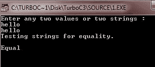
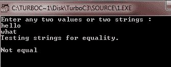
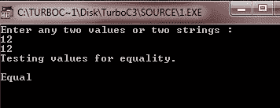
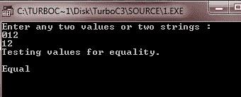
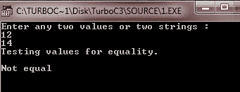

从上面的输出(运行 4)可以看出，值 012 和 12 是相等的。

[C 在线测试](/exam/showtest.php?subid=2)

* * *

* * *