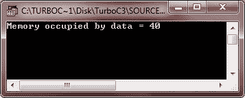
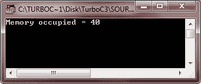
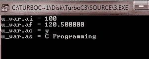
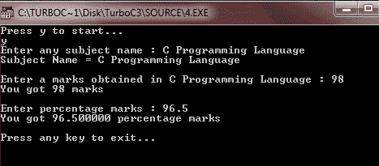

# 工会

> 原文：<https://codescracker.com/c/c-unions.htm>

众所周知，联合是一种派生的数据类型。联合用于由两个或多个不同类型的变量共享的内存位置。联合提供了一种以两种或多种不同方式解释同一位模式的方法。

## 在 C #中声明联合

声明一个联合就像声明一个结构一样。但是在声明联合时，使用 union 关键字而不是 struct。下面是在 C #中定义联合的一般形式:

```
union tag
{
   type member_name;
   type member_name;
   type member_name;
   .
   .
   .
}union_variables;
```

在这里，union 是一个关键字，必须在声明 union 时使用，tag 是一个标识符，仅仅是 union 的名称。然后 type 是任何有效的数据类型，member_name 是成员的名称。而在最后 union_variables 是一个标识符，是变量的名字，用于访问 union 成员。这里有一个例子:

```
union u_data
{
   int num;
   float fl;
   char ch;
   char str[40];
}data;
```

从上面的声明中可以看出，u_data 类型的变量可以存储整数、浮点数、字符或字符串。换句话说，单个变量，即相同的存储位置可以用于存储多种类型的数据。还可以在联合中使用任何内置或用户定义的数据类型。

**注意** -一个联合所占用的内存将足够容纳该联合中最大的成员。

例如，在上面的联合声明中，u_data type 将占用 40 字节的内存空间，因为这是名为 str 的字符串可以占用的最大空间。

## 在 C #中访问联合成员

使用成员访问运算符(。)来访问联合的任何成员。下面是访问任何工会成员的一般形式:

```
union_variable.member_name;
```

下面是一个例子，展示了如何访问上面声明的 union u_data 的成员。

```
data.num;
data.fl;
data.ch;
data.str;
```

## 在 C #中访问并初始化联合成员的值

下面是在 C #中访问和初始化任何联合成员的值的一般形式:

```
union_variable.member_name = value;
```

下面是一个示例，展示了如何访问和初始化上面声明的名为 u_data 的联合的成员的值。

```
data.num = 100;
data.fl = 120.50;
data.ch = 'y';
strcpy(data.str, "C Programming");
```

现在让我们举一些例子来完整地理解联合。

## 工会的例子

这是一个用 C 语言演示联合的示例程序。这是非常基本的联盟计划。专心做这件事。

```
/* C Unions */

#include<stdio.h>
#include<string.h>
#include<conio.h>

union u_data
{
   int num;
   float fl;
   char ch;
   char str[40];
}data;

void main()
{
   clrscr();

   printf("Memory occupied by data = %d\n", sizeof(data));

   getch();
}
```

在编译和执行上述代码时，它将产生以下结果:



您也可以在以后声明联合变量。我们来看看这个 C 程序。

```
/* C Unions */

#include<stdio.h>
#include<string.h>
#include<conio.h>

union u
{
   int n;
   float f;
   char c;
   char s[40];
};

void main()
{
   union u u_max_size;
   clrscr();

   printf("Memory occupied = %d\n", sizeof(u_max_size));

   getch();
}
```

以下是上述 C 程序的示例输出:



下面是另一个示例，说明如何逐个访问和初始化联合成员的值。

```
#include<stdio.h>
#include<string.h>
#include<conio.h>

union u
{
   int ai;
   float af;
   char ac;
   char as[40];
};

void main( )
{
   union u u_var;
   clrscr();

   u_var.ai = 100;
   printf("u_var.ai = %d\n", u_var.ai);

   u_var.af = 120.5;
   printf("u_var.af = %f\n", u_var.af);

   u_var.ac = 'y';
   printf("u_var.ac = %c\n", u_var.ac);

   strcpy(u_var.as, "C Programming");
   printf("u_var.as = %s\n", u_var.as);

   getch();
}
```

下面是这个 C 程序的输出示例:



这是另一个用 c 语言演示联合的例子。

```
#include<stdio.h>
#include<string.h>
#include<conio.h>

union u
{
   int num;
   float flt;
   char ch;
   char str[40];
};

void main()
{
   union u u_var;
   clrscr();

   printf("Press y to start...\n");
   scanf("%c", &u_var.ch);
   fflush(stdin);
   if(u_var.ch=='y' || u_var.ch=='Y')
   {
      printf("Enter any subject name : ");
      gets(u_var.str);
      printf("Subject Name = %s", u_var.str);
      printf("\n\nEnter a marks obtained in %s : ", u_var.str);
      scanf("%d", &u_var.num);
      printf("You got %d marks", u_var.num);
      printf("\n\nEnter percentage marks : ");
      scanf("%f", &u_var.flt);
      printf("You got %f percentage marks", u_var.flt);
      printf("\n\nPress any key to exit...\n");
      getch();
      exit(1);
   }

   getch();
}
```

下面是这个 C 程序的运行示例:



[C 在线测试](/exam/showtest.php?subid=2)

* * *

* * *