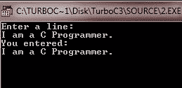

# 输入和输出

> 原文：<https://codescracker.com/c/c-input-output.htm>

输入是指通过键盘等输入设备将一些数据输入系统。

输出是指从系统中获得反馈数据的结果或输出，或者简单地说，是在输出设备如监视器上显示的输出。

## C 标准文件

c 编程语言将所有的设备视为文件。因此，显示器等设备的寻址方式与文件相同，当程序执行以提供对键盘和屏幕的访问时，下面三个文件会自动打开。

| 标准文件 | 文件指针 | 设备 |
| 标准输入 | 标准输入 | 键盘 |
| 标准输出 | 标准输出 | 屏幕 |
| 标准误差 | 标准错误 | 你的屏幕 |

文件输入和输出，是指为了读和写的目的而访问文件。但是本教程将只向您解释如何从输入设备读取值，然后如何在输出设备上打印这些值。要了解 C 文件输入输出，请参考 [C 文件输入输出](/c/c-file-io.htm)。现在我们来讨论一下 getchar()和 putchar()函数。

## C getchar()和 putchar()

如您所见，该函数是自解释的，getchar()用于获取字符输入，而 putchar()用于打印字符输出。在这里，如果你输入一个以上的字符，那么除了第一个字符之外的所有字符都将丢失，因为 getchar()和 putchar()仅用于读取字符，即单个字符。要读取用户输入的完整字符(字符串)，必须使用稍后讨论的 gets()和 puts()函数。要了解关于 getchar()和 putchar()函数的更多信息，请参考， [getchar()](/c/function/input-output/getchar.htm) 和 [putchar()](/c/function/input-output/putchar.htm) 。

### C getchar()和 putchar()示例

这里列出了四个示例程序，以便完全理解 getchar()和 putchar()函数。

#### 示例 1

```
#include<stdio.h>
#include<conio.h>
void main()
{
   int i;
   clrscr();

   printf("Enter a value: ");
   i = getchar();
   printf("You entered: ");
   putchar(i);

   getch();
}
```

下面是这个 C 程序的输出:


#### 示例 2

```
#include<stdio.h>
#include<conio.h>
void main()
{
   char c;
   clrscr();

   printf("Enter a character: ");
   c = getchar();
   printf("You entered: ");
   putchar(c);

   getch();
}
```

下面是上述 C 程序的输出:


#### 示例 3

```
#include<stdio.h>
#include<conio.h>
void main()
{
   int num;
   clrscr();

   printf("Enter the number: ");
   num = getchar();
   printf("You entered: ");
   putchar(num);

   getch();
}
```

现在输入一个以上的整数，比如 234，检查 getchar()是否存储这个三位数的整数。但是正如已经说过的，它不会存储，而是只存储整数的第一位，如下图所示:


#### 实例 4

```
#include<stdio.h>
#include<conio.h>
void main()
{
   char str;
   clrscr();

   printf("Enter the string: ");
   str = getchar();
   printf("You entered: ");
   putchar(str);

   getch();
}
```

现在输入多个字符(字符串)，比如“hello compiler ”,检查 getchar()是否存储了所有的字符(或字符串)。但是正如已经说过的，它不会存储，而是只存储字符串的第一个字符，即 h，如下所示:


现在让我们讨论 gets()和 puts()函数。

## c 获取()并放置()

gets()函数读取用户输入的所有字符，直到出现换行符或 EOF。换句话说，gets()函数读取用户输入的字符串。而 puts()函数将字符串写入输出。要详细了解这些 gets()和 puts()函数，请参考， [gets()](/c/function/input-output/gets.htm) 和 [puts()。](/c/function/input-output/puts.htm)

### C gets()和 puts()示例

下面是两个示例程序，让你完全了解 gets()和 puts()函数。

#### 示例 1

```
#include<stdio.h>
#include<conio.h>
void main()
{
   char str[40];
   clrscr();

   printf("Who are You ?\n");
   gets(str);

   printf("You are ");
   puts(str);

   getch();
}
```

下面是这个 C 程序的示例输出:


#### 示例 2

```
#include<stdio.h>
#include<conio.h>
void main()
{
   char line[80];
   clrscr();

   printf("Enter a line:\n");
   gets(line);

   printf("You entered:\n");
   puts(line);

   getch();
}
```

以下是上述 C 程序的示例输出:



现在我们来讨论一下 scanf()和 printf()函数。

## C scanf()和 printf()

scanf()函数用于从标准输入流 stdin 中读取输入，并根据提供的格式扫描该输入。要了解更多关于 C scanf()函数的信息，请参考 [scanf()](/c/function/input-output/scanf.htm) 。

printf()函数用于将输出写入标准输出流 stdout，并根据提供的格式生成输出。要了解更多关于 C printf()函数的信息，请参考 [printf()](/c/function/input-output/printf.htm) 。

格式可以是简单的常量字符串，但是您可以指定%s、%d、%c、%f 等。，分别打印或读取字符串、整数、字符或浮点。现在让我们看一些示例程序。

### C scanf()和 printf()示例

这里列出了两个示例程序，以便完全理解 scanf()和 printf()函数。

#### 示例 1

```
#include<stdio.h>
#include<conio.h>
void main()
{
   int i;
   char str[40];
   float f;
   clrscr();

   printf("Enter a value (integer): ");
   scanf("%d", &i);
   printf("You entered: %d", i);

   printf("\n\nEnter the string: ");
   scanf("%s", str);
   printf("You entered: %s", str);

   printf("\n\nEnter a value (float): ");
   scanf("%f", &f);
   printf("You entered: %f", f);

   getch();
}
```

下面是这个 C 程序的运行示例:


#### 示例 2

现在专注于这个 C 程序来理解 scanf()函数的概念:

```
#include<stdio.h>
#include<conio.h>
void main()
{
   char str[40];
   clrscr();

   printf("Enter a string: ");
   scanf("%s", str);
   printf("You entered: %s", str);

   getch();
}
```

现在运行上述 C 程序后，只需输入“你好编译器”，你会看到在输出屏幕上，“编译器”将丢失。也就是你只看到“你好”。因为函数 scanf()一遇到空格就停止读取，所以字符串“hello compiler”在“hello”的“o”后面有一个空格，也就是说，scanf()在这里只读取“hello ”,而不会读取“compiler”。因此，您将只看到函数 printf()产生的输出“hello”。下面是这个 C 程序的运行示例。


[C 在线测试](/exam/showtest.php?subid=2)

* * *

* * *