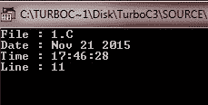
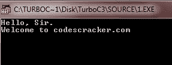
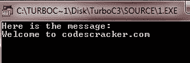
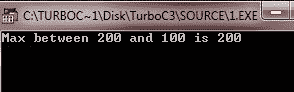

# C 预处理程序

> 原文：<https://codescracker.com/c/c-preprocessors.htm>

C 语言中的预处理器，是一个文本替换工具。它们指示 C 编译器在实际程序编译之前进行必要的预处理。

下表列出了 C 语言中所有重要的预处理器指令:

| #定义 | #endif | #ifdef | #线 |
| 艾列弗 | #错误 | #ifndef | #杂注 |
| #否则 | #如果 | #包括 | #undef |

## C 预处理程序示例

仔细阅读下面的代码片段，逐一理解各种类型的预处理程序指令。

### #定义

#define 指令定义了一个标识符和一个字符序列，每次在源文件中遇到该标识符时，它都会被替换。这里有一个例子:

```
#define MAX 100
```

### #错误

#error 指令使编译器停止编译。它主要用于调试目的。以下是#error 指令的一般形式:

```
#error *error-message*
```

这里的*错误消息*不在双引号内。

### #包括

#include 指令告诉编译器除了读取包含#include 指令的源文件之外，还要读取另一个源文件。

```
#include<stdio.h>
#include "myheader.h"
```

### #undef 和#define

```
#undef  FILE_SIZE
#define FILE_SIZE 42
```

这告诉预处理器取消现有 FILE_SIZE 的定义，并将其定义为 42

### #ifndef、#define 和#endif

```
#ifndef PRINTMESSAGE
   #define PRINTMESSAGE "You wish!"
#endif
```

这告诉预处理器只有在尚未定义 PRINTMESSAGE 时才定义 PRINTMESSAGE

```
#ifdef DEBUG
   /* Your debugging statements here */
#endif
```

如果定义了 DEBUG，这将告诉预处理器执行包含在语句中的过程。如果在编译时将-DDEBUG 标志传递给 gcc 编译器，这将非常有用。这将定义调试，因此您可以在编译期间随时打开和关闭调试。

## C 预定义宏

下面是一个示例程序，使用了 C 语言中预定义的宏:

```
#include<stdio.h>
#include<conio.h>

void main()
{
   clrscr();

   printf("File : %s\n", __FILE__ );
   printf("Date : %s\n", __DATE__ );
   printf("Time : %s\n", __TIME__ );
   printf("Line : %d\n", __LINE__ );

   getch();
}
```

上面的 C 程序将产生以下输出:



## C 预处理运算符

C 预处理器提供了以下运算符来帮助您创建宏:

## C 宏延续(\)

您可以使用宏延续(\)在多行中延续您的宏定义。这里有一个例子:

```
#define  message_for(a, b)  \
    printf(#a " and " #b ": We love you!\n")
```

## C 字符串(#)

在宏定义中使用字符串或数字符号运算符(“#”)时，会将宏参数转换为字符串常量。这里有一个例子:

```
#include<stdio.h>
#include<conio.h>

#define  message_for(a, b)  \
    printf("Hello, " #a ".\nWelcome to " #b )

void main(void)
{
   clrscr();
   message_for(Sir, codescracker.com);
   getch();

}
```

下面是这个 C 程序的输出:



## 已定义的()运算符

C #中的预处理器定义的运算符，在常量表达式中用于确定标识符是否是使用#define 定义的。这里有一个例子:

```
#include<stdio.h>
#include<conio.h>

#if !defined (PRINTMESSAGE)
   #define PRINTMESSAGE "Welcome to codescracker.com"
#endif

void main(void)
{
   clrscr();
   printf("Here is the message:\n%s\n", PRINTMESSAGE);
   getch();
}
```

以下是上述 C 程序的示例输出:



## C 参数化宏

预处理器是使用参数化宏来模拟函数的能力。这里有一个例子:

```
int square(int num)
{
   return num * num;
}
```

我们可以用这样的宏重写上面的代码:

```
#define square(num) ((num) * (num))
```

## C 参数化宏示例

下面是一个例子，在 C 语言中使用参数化宏:

```
/* C Preprocessor - C Parameterized Macro - Example Program */

#include<stdio.h>
#include<conio.h>

#define FINDMAX(num1, num2) ((num1) > (num2) ? (num1) : (num2))

void main(void)
{
   clrscr();
   printf("Max between 200 and 100 is %d\n", FINDMAX(100, 200));
   getch();
}
```

下面是上面的 C 程序产生的示例输出:



[C 在线测试](/exam/showtest.php?subid=2)

* * *

* * *