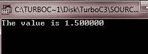
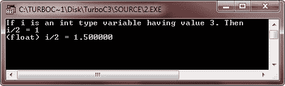
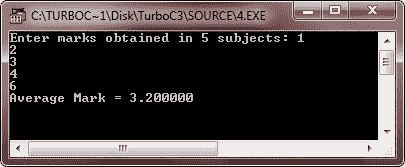
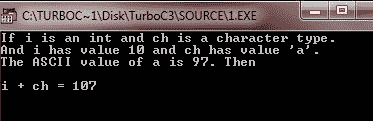
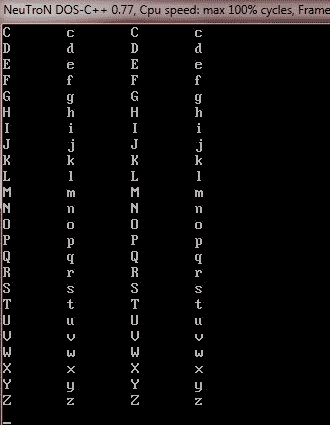
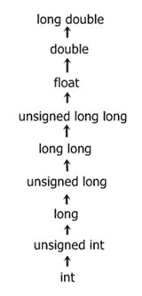

# c 型铸件

> 原文：<https://codescracker.com/c/c-type-casting.htm>

类型转换是一种通过使用转换强制表达式成为特定类型的方法。下面是一个转换的一般形式:

```
(type) expression;
```

这里，type 是任何有效的数据类型。下面是一个导致表达式 i/2 计算为 float 类型的示例。

```
(float) i/2;
```

现在让我们用一些示例程序来全面理解 c 语言中的类型转换。

## c 型铸件示例

下面是一个例子，演示 c 语言中的类型转换。

```
/* C Type Casting - This C program illustrates
 * the concept of type casting in C language
 */

#include<stdio.h>
#include<conio.h>
void main()
{
   int i=3;
   float fl;
   clrscr();

   fl = (float) i /2;
   printf("The value is %f", fl);

   getch();
}
```

以下是上述 C 程序的示例输出:



下面是另一个程序，它告诉我们在程序中强制转换表达式的好处。

```
/* C Type Casting - This program tells the
 * advantage of type casting in a program
 */

#include<stdio.h>
#include<conio.h>
void main()
{
   int i=3, resi;
   float resf;
   clrscr();

   resi = i/2;
   resf = (float) i /2;

   printf("If i is an int type variable having value 3\. Then\n");
   printf("i/2 = %d", resi);
   printf("\n(float) i/2 = %f", resf);

   getch();
}
```

下面是这个 C 程序的运行示例:



这里还有一个示例程序。

```
#include<stdio.h>
#include<conio.h>
void main()
{
   int i;
   clrscr();

   for(i=1; i<=10; i++)
   {
      printf("%d / 2 = %f\n", i, (float)i /2);
   }

   getch();
}
```

下面是这个 C 程序的运行示例:


这里还有一个例子。只要看看这个就能完全理解 c 语言中的类型转换。

```
#include<stdio.h>
#include<conio.h>
void main()
{
   int mark[5], i, sum=0;
   float avg;
   clrscr();

   printf("Enter marks obtained in 5 subjects: ");
   for(i=0; i<5; i++)
   {
      scanf("%d", &mark[i]);
      sum = sum + mark[i];
   }

   avg = (float) sum/5;

   printf("Average Mark = %f", avg);

   getch();
}
```

下面是上述 C 程序的运行示例:



## C 语言中的整数提升

整数提升是一种将小于 int 或 unsigned int 的整型值转换为 int 或 unsigned int 的方法。下面是一个在 int 中添加字符的例子:

```
#include<stdio.h>
#include<conio.h>
void main()
{
   int i = 10, sum;
   char ch = 'a';
   clrscr();

   sum = i + ch;    // ASCII values of a is 97
   printf("If i is an int and ch is a character type.\n");
   printf("And i has value 10 and ch has value 'a'.\n");
   printf("The ASCII value of a is 97\. Then\n\n");
   printf("i + ch = %d", sum);

   getch();

}
```

在编译和执行上述代码时，它将产生以下结果:



从上面的 C 程序可以看出，sum 的值是 107，因为编译器在执行实际的加法运算之前，通过将' a '的值转换为 ASCII 的值 97，在这里进行整数提升。现在我们再举一个例子。

```
#include<stdio.h>
#include<conio.h>
void main()
{
   char ch1 = 'A';
   char ch2 = 'a';
   int i1, i2;
   clrscr();

   for(i1=65, i2=97; i2<=122; i1++, i2++, ch1++, ch2++)
   {
      printf("%c\t%c\t%c\t%c\n", i1, i2, ch1, ch2);
   }

   getch();

}
```

下面是上述 C 程序的运行示例。这个程序将打印 a-z、A-Z、A-Z，然后再打印四条垂直线:



你也可以这样写上面的 C 程序:

```
#include<stdio.h>
#include<conio.h>
void main()
{
   char ch1 = 'A';
   char ch2 = 'a';
   int i1=65, i2=97;
   int l;
   clrscr();

   for(l=0; l<26; l++)
   {
      printf("%c\t%c\t%c\t%c\n", i1, i2, ch1, ch2);
      i1++;
      i2++;
      ch1++;
      ch2++;
   }

   getch();

}
```

这个 C 程序的输出将和上面的一样。

## C 语言中的算术转换

C 语言中常见的算术转换是隐式执行的，以将其值转换为通用类型。C 编译器首先执行整数提升，如果操作数仍然具有不同的类型，则它们将被转换为最高的类型，如下所示:



**注意**——C 语言中通常的算术转换，不能对赋值和逻辑运算符(& &和||)执行。

[C 在线测试](/exam/showtest.php?subid=2)

* * *

* * *