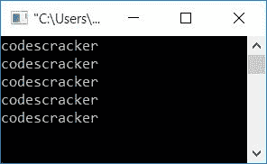
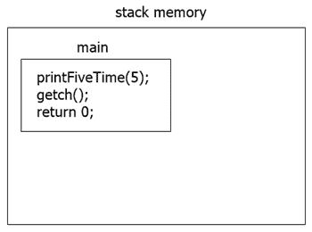
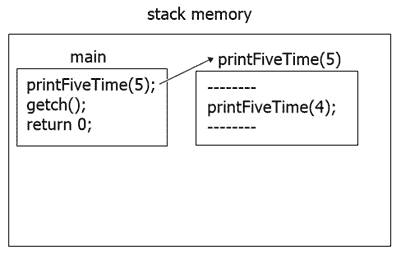
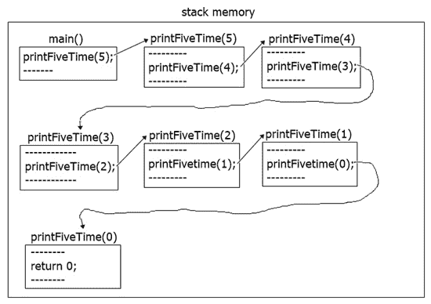

# C 语言中的递归或递归函数

> 原文：<https://codescracker.com/c/c-recursion.htm>

在本文中，我们将通过例子学习 C 语言中的递归。也就是你会得到一个递归函数在 c 中的简要解释或者工作原理。

## 递归函数的定义及实例

当一个[函数](/c/c-functions.htm)在其定义或执行过程中调用自身时，称为递归函数。 例如，一个函数名 **printFiveTime()** 调用自己五次打印任何东西，如下面的 程序所示:

```
// Example of Recursive function in C
// ------codescracker.com------

#include<stdio.h>
#include<conio.h>
int printFiveTime(int);
int main()
{
    printFiveTime(5);
    getch();
    return 0;
}
int printFiveTime(int t)
{
    if(t==0)
        return 0;
    else
    {
        printf("codescracker\n");
        printFiveTime(t-1);
    }
}
```

这个程序是在 **Code::Blocks** IDE 下编写的。以下是运行示例:



在上面给出的程序中，你可以清楚地看到，在函数 **printFiveTime()** 内部，函数调用自己。 即 **printFiveTime()** 从函数定义内部被调用。因此上面的函数 **printFiveTime()** 可以称为递归函数。

## 递归函数是如何执行的？

为了执行应用程序中的功能，在 RAM 中，[内存](/operating-system/memory.htm)将被分配给 (这里的内存称为堆栈内存)。也就是说，为了执行一个函数(或方法或块)，在堆栈内存 中会分配一些内存，称为 frame。每个函数或方法的执行都会分配特定数量的内存。

因此，当我们启动上面给出的程序时，首先[操作系统](/operating-system/index.htm)调用 **main()** 函数。所以对于 **main()** 函数，一些内存被分配。因此，这里将创建**主**框架。 因此，将分配内存量来执行上述程序 的主函数中给出的所有三条语句，如下图所示:



你可以清楚地看到， **main()** 函数的框架是在**堆栈内存**中创建的。这里的第一个语句，我们 正在调用**的 printFiveTime()** 函数，所以对于这个函数，另一个框架将被创建成这样:



上图中， **-** 表示 **printFiveTime()** 函数的其他语句。现在让我们回到代码上， 首先我们将 **5** 传递给函数 **printFiveTime()** 。所以在第一次运行时，5 被传递给函数定义。 因此，函数执行如下:

```
printf("codescracker\n");
printFiveTime(5-1);
```

当最初将 5 传递给函数 **printFiveTime()** 时，变量 **t** 保存 5。程序流程进入函数 定义部分，因为 5 不等于 0，所以程序流程进入 **else** 部分，执行上述两条语句。

由于 **t-1** 或 **5-1** 给出 4，因此我们刚刚传递了 **4** 到 **printFiveTime()** 函数。现在，对于这个 函数，创建了另一个帧。继续创建帧，直到 **t** 的值变为 0，如这里给出的 图所示:



在除 **printFiveTime(0)** 、 **else** 块外的所有帧中，最后一帧 **printFiveTime(0)** ，if 块执行 **。在 **else** 块中，以下语句:**

```
return 0;
```

会被处决。所以在这里，一旦所有的函数空间都用它的值明确定义了，所有的框架都被删除了。在递归函数中，控制是向前进行的，直到并且除非框架的所有语句都被清楚地执行。以及控件前进的顺序(正向)，控件应该返回的顺序与它开始执行的顺序相同，只有在那里它应该完成执行。

所以在这里，当 **t** 的值变为 0 时，程序流回到开始执行的地方，所有的 语句都被执行，然后控制转到**主**函数，最后两条语句被执行，它们是:

```
getch();
return 0;
```

为了澄清上面的陈述(关于递归函数中向前和向后方向的流程)，可以将 **t** 的值和 **codescracker** 一起打印出来，如下图所示:

```
// ------codescracker.com------

#include<stdio.h>
#include<conio.h>
int printFiveTime(int);
int main()
{
    printFiveTime(5);
    getch();
    return 0;
}
int printFiveTime(int t)
{
    if(t==0)
        return 0;
    else
    {
        printf("%d. codescracker\n", t);
        printFiveTime(t-1);
    }
}
```

下面给出的快照显示了示例运行:


[C 在线测试](/exam/showtest.php?subid=2)

* * *

* * *