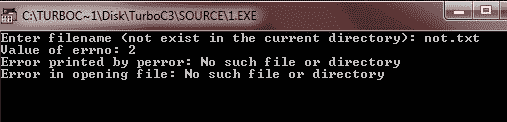
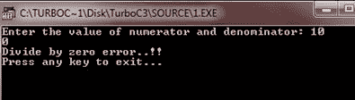
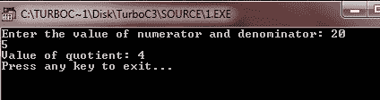
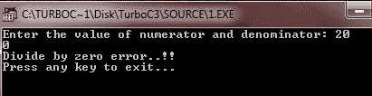

# 错误处理

> 原文：<https://codescracker.com/c/c-error-handling.htm>

c 编程不提供任何对错误处理的直接支持，但是作为一种系统编程语言，它以返回值的形式提供了对底层的访问。大多数 C 甚至 Unix 函数调用在任何错误的情况下都返回-1 或 NULL，并设置一个错误代码。

c 开发人员应该在程序初始化时将 errno 设置为 0。值为 0 表示程序中没有错误。

c 提供了两个名为 perror()和 strerror()的[函数](/c/c-functions.htm)，可以用来显示与 errno 相关的文本消息。

*   perror()函数显示您传递给它的字符串，后跟一个冒号、一个空格，然后是当前 errno 值 的文本表示
*   函数 strerror()，它返回一个指向当前 errno 值的文本表示的[指针](/c/c-pointers.htm)

## 在 C 中打开文件时处理错误

下面的 C 程序演示了如何处理打开文件时出现的错误。

```
/* C Error Handling - Error Handling Example Program */

#include<stdio.h>
#include<errno.h>
#include<string.h>
#include<conio.h>

extern int errno;

void main()
{
   FILE *fp;
   int errnum;
   char fname[20];
   clrscr();

   printf("Enter filename (not exist in the current directory): ");
   gets(fname);
   fp=fopen(fname, "r");
   if(!fp)
   {
      errnum = errno;
      fprintf(stderr, "Value of errno: %d\n", errno);
      perror("Error printed by perror");
      fprintf(stderr, "Error in opening file: %s\n", strerror( errnum ));
   }
   else
   {
      fclose(fp);
   }

   getch();
}
```

下面是上述 C 程序的输出示例。



## 处理 C 语言中的被零除错误

检查被零除错误是一个好习惯。因为有时，用户可能会在分母中输入值 0。这个程序演示了检查被零除错误的概念。

```
/* C Error Handling - This program illustrates
 * the concept of error handling in C programming
 */

#include<stdio.h>
#include<stdlib.h>
#include<conio.h>

void main()
{
   int numerator;
   int denominator;
   int quotient;
   clrscr();

   printf("Enter the value of numerator and denominator: ");
   scanf("%d%d", &numerator, &denominator);

   if(denominator == 0)
   {
      fprintf(stderr, "Divide by zero error..!!");
      printf("\nPress any key to exit...\n");
      getch();
      exit(-1);
   }
   quotient = numerator/denominator;
   fprintf(stderr, "Value of quotient: %d\n", quotient );

   getch();
}
```

这是这个 C 程序的两个运行示例。第一个表示无误差，第二个表示除以零误差。




## C 程序：退出状态

有以下两种类型的退出状态:

*   **退出 _ 成功** -定义为 0
*   **退出 _ 失败** -定义为-1

这里，这个 C 程序说明了程序退出状态的概念，即退出失败和退出成功。

```
/* C Error Handling - This program illustrates
 * the EXIT_SUCCESS and EXIT_FAILURE
 */

#include<stdio.h>
#include<stdlib.h>
#include<conio.h>

void main()
{
   int num;
   int den;
   int quot;
   clrscr();

   printf("Enter the value of numerator and denominator: ");
   scanf("%d%d", &num, &den);

   if(den == 0)
   {
      fprintf(stderr, "Divide by zero error..!!");
      printf("\nPress any key to exit...\n");
      getch();
      exit(EXIT_FAILURE);
   }
   quot = num/den;
   fprintf(stderr, "Value of quotient: %d\n", quot);

   printf("Press any key to exit...");
   getch();
   exit(EXIT_FAILURE);
}
```

在编译和执行上述代码时，它将产生以下结果:




现在让我们来看看记忆术。

### _doserrno

表示实际 DOS 错误代码的变量。以下是 declare _doserrno 的语法:

```
int _doserrno
```

当 MS-DOS 系统调用导致错误时，_doserrno 被设置为实际的 DOS 错误代码。下表列出了可以设置 _doserrno 的实际 DOS 错误代码的助记符:

| 记忆的 | DOS 错误代码 |
| E2BIG | 大概坏了 |
| EACCES | 拒绝访问 |
| EACCES | 不良访问 |
| EACCES | 是当前目录 |
| EBADF | 错误的句柄 |
| EFAULT | 内向的; 寡言少语的; 矜持的 |
| EINVAL | 错误数据 |
| EINVAL | 不良功能 |
| EMFILE | 对许多人开放 |
| ENOENT | 没有这样的文件或目录 |
| ENOEXEC | 格式错误 |
| 伊诺姆 | Mcb 被摧毁 |
| 伊诺姆 | 被遗忘 |
| 伊诺姆 | 差劲街区 |
| EXDEV | 坏驱动器 |
| EXDEV | 不同的设备 |

### 错误

指示错误类型的变量。下面是声明 errno 的语法:

```
extern int errno;
```

每当系统调用中出现错误时，errno 被设置为一个指示错误类型的值。这里的值可以是:

#### errno 中的错误号

下表列出了 errno 中错误号的助记符和含义。列出的每个值都可以用于索引 sys_errlist 数组，以显示 messaged。此外，perror 将显示消息。

| 记忆的 | 意义 |
| EZERO | 错误 0 |
| EINVFNC | 无效的函数号 |
| 结束文件 | 找不到文件 |
| 结束路径 | 找不到路径 |
| 生态网 | 内存块被破坏 |
| EINVMEM | 无效的内存块地址 |
| EINVENV | 无效环境 |
| EINVFMT | 无效格式 |
| EINVACC | 无效的访问代码 |
| EINVDAT | 无效数据 |
| EINVDRV | 指定的驱动器无效 |
| 埃库尔迪尔 | 尝试删除 CurDir |
| 伊诺萨姆 | 不同的设备 |
| 结束文件 | 没有更多文件 |
| ENOENT | 没有这样的文件或目录 |
| EMFILE | 打开的文件太多 |
| EACCES | 权限被拒绝 |
| EBADF | 错误的文件号 |
| 伊诺姆 | 内存不足 |
| enodeb | 没有这样的设备 |
| EINVAL | 非法参数 |
| E2BIG | 参数列表太长 |
| ENOEXEC | Exec 格式错误 |
| EXDEV | 跨设备链接 |
| 伊多姆 | 数学论证 |
| 埃兰格 | 结果太大 |
| EFAULT | 未知错误 |
| 存在 | 文件已经存在 |

[C 在线测试](/exam/showtest.php?subid=2)

* * *

* * *