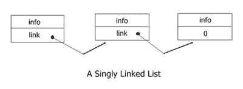
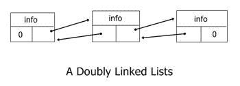
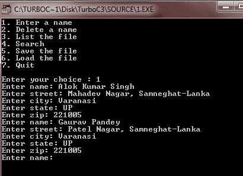
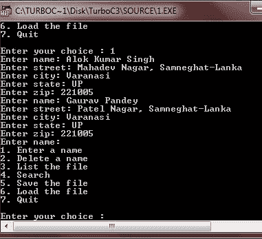
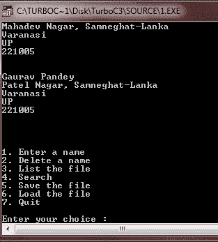
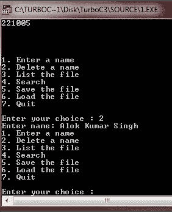
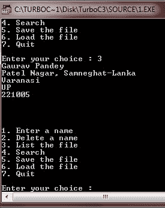
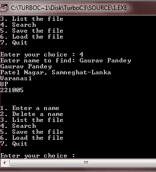
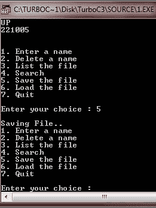

# C 链接列表

> 原文：<https://codescracker.com/c/c-linked-lists.htm>

与[堆栈](/c/c-stacks.htm)或[队列](/c/c-queues.htm)不同的是，*链表*可以以灵活的方式访问， 因为每条信息都带有一个到链中下一个数据项的链接。此外，链表检索操作不会从列表中删除或销毁一个条目。事实上，您需要添加一个特定的删除操作来实现这一点。

链表可以是单向的，也可以是双向的。单向链表包含一个到下一个数据项的链接。另一方面，一个双向链表包含了到链表中前一个和后一个元素的链接。根据您的应用程序，您将使用这些链表类型中的一种或另一种。现在我们来讨论一下单链表。

## 单链表

单链表要求每一项信息都包含一个到列表中下一个元素的链接。每个数据项通常由包括信息字段和链接指针的结构组成。让我们看看下图，它代表了一个单链表。



基本上，有两种方法来建立一个单链表。第一种方法是简单地将每个新条目放在列表的末尾。另一种是将项目以升序排序的方式插入到列表中的特定位置。

存储在链表中的条目通常由结构组成，因为每个条目都必须携带到列表中下一个条目的链接以及数据本身。因此，我们需要定义一个将在下面的例子中使用的结构。因为邮件列表通常存储在链表中，所以地址结构是一个很好的选择。邮件列表中每个元素的数据结构定义如下:

```
struct address
{
   char name[30];
   char street[40];
   char city[25];
   char state[4];
   char zip[11];
   struct address *next;    // link to the next address
}info;
```

这里显示的函数 slstore()通过将每个新元素放在末尾来构建一个单链表。并且必须向它传递一个指向包含新条目的 address 类型结构的指针，以及一个指向列表中最后一个元素的指针。在这种情况下，如果列表为 emply，那么指向列表中最后一个元素的指针必须为 null。下面是 slstore()函数的代码片段:

```
void slstore(struct address *i, struct address **last)
{
   if(!*last) *last = i;    // first item in the list
   else (*last)->next = i;
   i->next = NULL;
   *last = i;
}
```

## 双向链表

双向链表由数据加上到前一项和下一项的链接组成。让我们看看下图，它代表了一个双向链表。



拥有两个环节而不是一个环节有几个好处。也许最重要的是，这份名单可以从两个方向阅读。这简化了列表管理，使得插入和删除更加容易。它还允许我们在任一方向上扫描列表。另一个优点是只有在某种类型的故障情况下才有意义。由于可以使用前向链接或后向链接来读取整个列表，如果其中一个链接无效，则可以使用另一个链接来重建列表。

新元素可以通过以下三种方式插入到双向链表中:

*   插入新的第一个元素
*   在中间插入
*   插入新的最后一个元素

构建双向链表类似于构建单向链表，只是需要维护两个链接。因此，结构必须为这两个环节留有空间。再次使用邮件列表示例，您可以修改结构 **address** ，如此处所示，以容纳两个 链接。下面是代码片段:

```
struct address
{
   char name[30];
   char street[40];
   char city[25];
   char state[4];
   char zip[11];
   struct address *next;
   struct address *prior;
}info;
```

使用**地址**作为基本数据项，下面的函数 **dlstore()** 建立一个双向链表:

```
void dlstore(struct address *i, struct address **last)
{
   if(!*last)
   *last = i;   /* is first item in list */
   else
   (*last)->next = i;
   i->next = NULL;
   i->prior = *last;
   *last = i;
}
```

### 完整的邮件列表示例

这是完整的邮件列表示例程序。使用时，完整的列表会保存在内存中。但是，它可以存储在一个磁盘文件中，供以后使用。

```
/* C Linked Lists - A Complete Mailing List Example Program */

#include<stdio.h>
#include<conio.h>
#include<stdlib.h>
#include<string.h>

struct address {
   char name[40];
   char street[50];
   char city[30];
   char state[3];
   char zip[11];
   struct address *next;   // pointer to the next entry
   struct address *prior;  // pointer to the previous record
};

struct address *start;     // pointer to the first entry in the list
struct address *last;      // pointer to the last entry
struct address *find(char *);

void enter(void);
void search(void);
void save(void);
void load(void);
void list(void);
void mldelete(struct address **, struct address **);
void dls_store(struct address *i, struct address **start, struct address **last);
void inputs(char *, char *, int);
void display(struct address *);
int menu_select(void);

void main(void)
{
   clrscr();

   start = last = NULL;     // initialized start and end pointers

   for(;;)
   {
      switch(menu_select())
      {
         case 1 :
            enter();    // to enter an address
            break;
         case 2 :
            mldelete(&start, &last);     // to remove an address
            break;
         case 3 :
            list();     // to display the list
            break;
         case 4 :
            search();   // to find an address
            break;
         case 5 :
            save();     // to save the list to disk
            break;
         case 6 :
            load();     // to read from the disk
            break;
         case 7 :
            exit(0);
      }
   }

   getch();
}

// select an operation
int menu_select(void)
{
   char str[80];
   int c;

   printf("1\. Enter a name\n");
   printf("2\. Delete a name\n");
   printf("3\. List the file\n");
   printf("4\. Search\n");
   printf("5\. Save the file\n");
   printf("6\. Load the file\n");
   printf("7\. Quit\n");

   do
   {
      printf("\nEnter your choice : ");
      gets(str);
      c = atoi(str);
   }while(c<0 || c>7);
   return c;
}

// enter the names and addresses
void enter(void)
{
   struct address *info;

   for(;;)
   {
      info = (struct address *)malloc(sizeof(struct address));
      if(!info)
      {
         printf("\nout of memory..!!");
         return;
      }

      inputs("Enter name: ", info->name, 40);
      if(!info->name[0])  break;   // stop entering
      inputs("Enter street: ", info->street, 40);
      inputs("Enter city: ", info->city, 30);
      inputs("Enter state: ", info->state, 3);
      inputs("Enter zip: ", info->zip, 10);

      dls_store(info, &start, &last);
   }  // entry loop
}

/* this function will input a string up to the
 * length in count and will prevent the string
 * from being overrun. It will also display a
 * prompting message
 */
void inputs(char *prompt, char *s, int count)
{
   char p[255];

   do
   {
      printf(prompt);
      fgets(p, 254, stdin);
      if(strlen(p) > count)
      {
         printf("\nToo Long..!!\n");
      }
   }while(strlen(p) > count);

   p[strlen(p)-1] = 0;   // remove newline character
   strcpy(s, p);
}

// now create a doubly linked list in the sorted order
void dls_store(struct address *i, struct address **start, struct address **last)
{
   struct address *old;
   struct address *p;

   if(*last == NULL)
   {
      i->next = NULL;
      i->prior = NULL;
      *last = i;
      *start = i;
      return;
   }
   p = *start;    // start at top of the list

   old = NULL;
   while(p)
   {
      if(strcmp(p->name, i->name)<0)
      {
         old = p;
         p = p->next;
      }
      else
      {
         if(p->prior)
         {
            p->prior->next = i;
            i->next = p;
            i->prior = p->prior;
            p->prior = i;
            return;
         }
         i->next = p;     // new first element
         i->prior = NULL;
         p->prior = i;
         *start = i;
         return;
      }
   }
   old->next = i;    // put on end
   i->next = NULL;
   i->prior = old;
   *last = i;
}

// remove an element from the list
void mldelete(struct address **start, struct address **last)
{
   struct address *info;
   char str[80];

   inputs("Enter name: ", str, 40);
   info = find(str);
   if(info)
   {
      if(*start==info)
      {
         *start=info->next;
         if(*start)
         {
            (*start)->prior = NULL;
         }
         else
         {
            *last = NULL;
         }
      }
      else
      {
         info->prior->next = info->next;
         if(info!=*last)
         {
            info->next->prior = info->prior;
         }
         else
         {
            *last = info->prior;
         }
      }
      free(info);    // returned memory to system
   }
}

// find an address
struct address *find(char *name)
{
   struct address *info;

   info = start;
   while(info)
   {
      if(!strcmp(name, info->name)) return info;
      info = info->next;   // get next address
   }
   printf("Name not found..!!\n");
   return NULL;    // not found
}

// display the complete list
void list(void)
{
   struct address *info;

   info = start;
   while(info)
   {
      display(info);
      info = info->next;   // get next address
   }
   printf("\n\n");
}

// now this function prints the fields in each address
void display(struct address *info)
{
   printf("%s\n", info->name);
   printf("%s\n", info->street);
   printf("%s\n", info->city);
   printf("%s\n", info->state);
   printf("%s\n", info->zip);
   printf("\n\n");
}
// look or search for a name in the list
void search(void)
{
   char name[40];
   struct address *info;

   printf("Enter name to find: ");
   gets(name);
   info = find(name);
   if(!info)
   {
      printf("Not found..!!\n");
   }
   else
   {
      display(info);
   }
}

// now save the file to the disk
void save(void)
{
   struct address *info;
   FILE *fp;

   fp = fopen("mlist", "wb");
   if(!fp)
   {
      printf("Cannot open file..!!\n");
      exit(1);
   }
   printf("\nSaving File..\n");

   info = start;
   while(info)
   {
      fwrite(info, sizeof(struct address), 1, fp);
      info = info->next;      // get next address
   }
   fclose(fp);
}

// load the address file
void load()
{
   struct address *info;
   FILE *fp;

   fp = fopen("mlist", "rb");
   if(!fp)
   {
      printf("Cannot open file..!!\n");
      exit(1);
   }

   // now free any previously allocated memory
   while(start)
   {
      info = start->next;
      free(info);
      start = info;
   }

   // reset top and bottom pointers
   start = last = NULL;

   printf("\nLoading file..\n");
   while(!feof(fp))
   {
      info = (struct address *) malloc(sizeof(struct address));
      if(!info)
      {
         printf("Out of Memory..!!");
         return;
      }
      if(1 != fread(info, sizeof(struct address), 1, fp)) break;
      dls_store(info, &start, &last);
   }
   fclose(fp);
}
```

这个程序将你的输入数据保存在文件中。以下是一些示例输出，请集中注意力:



输入这两条记录后，就按回车键。按下 ENTER 键后，您将得到以下输出:



现在按 3，然后按回车键显示文件。下面是按下键 3 后的输出示例，然后输入:



如您所见，在按下 3 then ENTER 键后，您将在输出屏幕上看到输入的记录。现在按 2 从列表中删除一条记录。输入你想从列表中删除的名字，这里我们将输入阿洛克·库马尔·辛格。输入要删除的名称后，只需按 enter 键即可从列表中删除该名称。完成此操作后，以下是示例输出:



要检查所需的记录是否从列表中删除，只需按 3 即可显示整个列表，并检查该姓名是否在列表中，这是之前执行的删除操作。以下是示例输出:



如您所见，删除操作已成功执行，即阿洛克·库马尔·辛格现在不在列表中。现在要搜索任何记录，只需输入 4，然后输入要搜索的名称。下面是搜索操作的示例输出。



要保存文件(记录)，只需按 5 保存即可。以下是示例输出:



如你所见，你可以相应地做任何动作。要退出程序，只需输入 7，但在退出程序之前，请按 5 保存您输入的记录，以备将来使用。

[C 在线测试](/exam/showtest.php?subid=2)

* * *

* * *