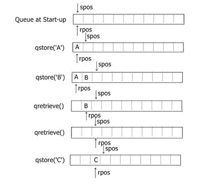
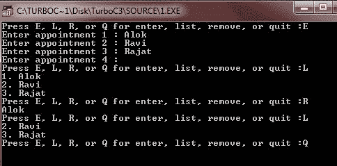
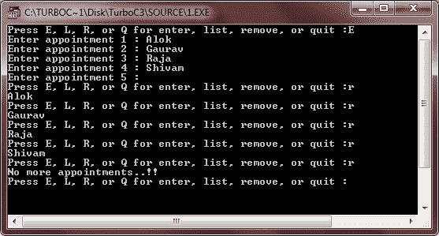

# C 队列

> 原文：<https://codescracker.com/c/c-queues.htm>

在 C 编程中，队列是一个线性的信息列表，按照先入先出的顺序访问，也称为 FIFO。

放在队列中的第一项是检索到的第一项，放入的第二项是检索到的第二项，依此类推。这是队列中唯一的存储和检索方式。不允许随机访问任何特定项目。

现实生活中，排队是很常见的。例如，在任何快餐店排队都是排队。来想象队列是如何工作的。考虑两个名为 **qstore()** 和 **qretrieve()** 的函数。函数 **qstore()** 将一个项目放在队列的末尾， 函数 **qretrieve()** 从队列中移除第一个项目并返回其值。

## 队列工作

下表显示了一系列这些操作的效果:

| 行动 | 队列内容 |
| qstore(A) | A |
| qstore(B) | 一个 B |
| qstore(C) | 公元前 |
| qretrieve()返回一个 | 公元前 |
| qstore | B C D |
| qretrieve()返回 B | 激光唱片 |
| qretrieve()返回 C | D |

**注意**:请记住，检索操作从队列中删除一个项目，如果它没有存储在其他地方，就销毁它。因此，在所有项目都被移除后，队列将为空 。

队列用于许多编程场合。最常见的是在模拟中。操作系统的任务调度程序也使用队列，队列也用于 I/O 缓冲。

为了查看队列的运行示例，这里我们将使用一个简单的约会调度程序。该程序允许您输入多个约会；然后，当每个约会被满足时，它被从列表中取出。为了简单起见，每个约会描述将被限制在 255 个字符以内。并且预约人数任意限定为 100 人。

首先，这里显示的 **qstore()** 函数和 **qretrieve()** 函数是简单调度程序所需要的。它们将存储指向描述约会的字符串的 指针。

```
#define MAX 100
char *p[MAX];
int rpos = 0, spos = 0;

// store an appointment
void qstore(char *q)
{
   if(spos==MAX)
   {
      printf("List Full..!!\n");
      return;
   }
   p[spos] = q;
   spos++;
}

// retrieve an appointment
char *qretrieve()
{
   if(rpos==spos)
   {
      printf("No more appointments..!!\n");
      return '\0';
   }
   rpos++;
   return p[rpos-1];
}
```

注意，这些函数需要两个全局变量，即 **spos** (保存下一个空闲存储位置的索引)和 **rpos** (保存下一个要检索的项目的索引)。您还可以使用这些函数来维护其他数据类型的队列，方法是改变它们所操作的数组的基本类型 。

这里， **qstore()** 函数将指向新约会的指针放在列表的末尾，并检查列表是否已满。当有事件要执行时， **qretrieve()** 函数 将应用程序从队列中取出。随着每个新预约的安排， **spos** 增加，并且随着每个预约的完成， rpos 增加。本质上，RPO**通过队列追逐 spo**。 如果**RPO**和**spo**相等，则没有事件留在日程中。即使存储在队列中的信息没有被 **qretrieve()** 实际销毁 ，但它实际上被销毁了，因为它再也不能被访问了。

让我们看看这个图，来理解 C 队列的概念:



## C 队列示例

下面是一个简单的 C 队列示例程序，它是约会调度程序的完整版本:

```
/* C Queue - This is a Simple
 * Mini Appointment-Scheduler
 */

#include<stdio.h>
#include<conio.h>
#include<string.h>
#include<stdlib.h>
#include<ctype.h>

#define MAX 100

char *p[MAX];
char *qretrieve(void);
int spos = 0;
int rpos = 0;
void enter(void);
void qstore(char *q);
void review(void);
void delete_ap(void);

void main()
{
   char str[80];
   register int t;
   clrscr();

   for(t=0; t<MAX; t++)
   {
      p[t] = NULL;   // initializing array to nulls
   }
   for(;;)
   {
      printf("Press E, L, R, or Q for enter, list, remove, or quit :");
      gets(str);
      *str = toupper(*str);

      switch(*str)
      {
         case 'E' :
            enter();
            break;
         case 'L' :
            review();
            break;
         case 'R' :
            delete_ap();
            break;
         case 'Q' :
            exit(1);
         default :
            printf("Wrong choice..!!\n");
            printf("Press any key to exit...");
            getch();
            exit(2);
      }
   }
   getch();
}

// enter appointments to queue
void enter(void)
{
   char str[256], *p;

   do
   {
      printf("Enter appointment %d : ", spos+1);
      gets(str);
      if(*str==0)
      {               // no entry
         break;
      }
      p = (char *) malloc(strlen(str)+1);
      if(!p)
      {
         printf("Out of memory..!!\n");
         return;
      }
      strcpy(p, str);
      if(*str)
         qstore(p);
   }while(*str);
}

// see what is in the queue
void review(void)
{
   register int t;

   for(t=rpos; t<spos; t++)
   {
      printf("%d. %s\n", t+1, p[t]);
   }
}

// delete an appointment from the queue
void delete_ap(void)
{
   char *p;

   if((p=qretrieve())==NULL)
   {
      return;
   }
   printf("%s\n", p);
}

// store an appointment
void qstore(char *q)
{
   if(spos==MAX)
   {
      printf("List Full..!!\n");
      return;
   }
   p[spos] = q;
   spos++;
}

// retrieve an appointment
char *qretrieve(void)
{
   if(rpos==spos)
   {
      printf("No more appointments..!!\n");
      return NULL;
   }
   rpos++;
   return p[rpos-1];
}
```

这个程序要求按四个键中的任何一个，即按 E 或 E 进入，按 L 或 L 列出或显示队列，按 R 或 R 从队列中删除，或按 Q 或 Q 退出程序。按 E 或 E 后，输入一些项目(在此输入名称)。输入一些名称后，不输入任何名称，只需按 enter 键，即可告知现在不会再有项目进入。输入姓名后，只需按 L 或 L 即可观看输入的姓名。或者按 R 从队列中删除项目(名称)。或者按 Q 或 Q 退出。下面是这个程序的运行示例。



从队列中删除所有项目后，您会收到一条消息，告诉您“没有更多约会”..！!"。以下是示例输出:



[C 在线测试](/exam/showtest.php?subid=2)

* * *

* * *