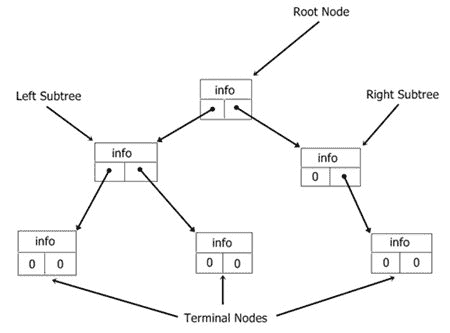
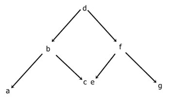
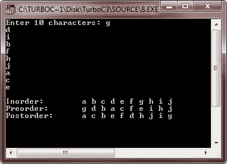

# C 二叉树

> 原文：<https://codescracker.com/c/c-trees.htm>

二叉树是特殊的树，因为在排序时，它们有助于快速搜索、插入和删除。因为树中的每一项都由信息以及指向左侧成员的链接和指向右侧成员的链接组成。这个图显示了一棵小树。



*根*是树中的第一项。每一项被称为树的*节点*、 ，任何一片树被称为*子树*。没有附属子树的节点称为*终端节点*或*叶节点*。树的*高度* 等于树根生长的层数。

**注** -树只是对内存中的数据进行逻辑组织的一种方式，内存是线性的。

二叉树是链表的一种特殊形式。可以按任何顺序插入、删除和访问项目。

大多数使用树的函数是递归的，因为树本身是一种递归的数据结构。也就是说，每个子树本身就是一棵树。

树的排序方式取决于它的访问方式。访问树中每个节点的过程称为树遍历。请参见下面的树。



有以下三种方法来遍历树:

*   使用 inorder，你可以访问左边的子树，根，然后是右边的子树
*   preorder——使用 preorder，你可以访问根，子树，然后是右边的子树
*   postorder——使用 post order，你可以访问左边的子树，右边的子树，然后是根

使用每种方法，树的访问顺序如下所示:

```
inorder      a b c d e f g
preorder   d b a c f e g
postorder   a c b e g f d
```

尽管树不需要排序，但大多数用途都需要排序。当然，什么构成一棵排序树取决于你将如何遍历树。

下面的函数 **stree()** 构建了一个排序的二叉树:

```
struct tree
{
   char info;
   struct tree *left;
   struct tree *right;
};

struct tree *stree(struct tree *root,struct tree *r,char info)
{
   if(!r)
   {
      r = (struct tree *)
      malloc(sizeof(struct tree));
      if(!r)
      {
         printf("Out of Memory..!!\n");
         exit(1);
      }
      r->left = NULL;
      r->right = NULL;
      r->info = info;
      if(!root)
         return r;    /* first entry */
      if(info < root->info)
         root->left = r;
      else
         root->right = r;
      return r;
   }
   if(info < r->info)
      stree(r, r->left, info);
   else
      stree(r, r->right, info);
   return root;
}
```

## C 二叉树例子

这是一个完整的用 C 语言演示二叉树的例子。这个程序用 C 语言构造了一个二叉树。

```
/* C Binary Tree - Binary Tree Program Example
 * This program demonstrates the concept of
 * binary tree in C programming
 */

#include<stdio.h>
#include<conio.h>
#include<assert.h>
#include<stdlib.h>

#define ARRAY_SIZE 10

typedef char DATA;

struct node
{
   DATA d;
   struct node *left;
   struct node *right;
};

typedef struct node NODE;
typedef NODE *BINARY_TREE;

BINARY_TREE newnode(void);
BINARY_TREE init_node(DATA d, BINARY_TREE p1, BINARY_TREE p2);
BINARY_TREE create_tree(DATA a[], int i, int size);
void preorder (BINARY_TREE root);
void inorder (BINARY_TREE root);
void postorder (BINARY_TREE root);

BINARY_TREE new_node()
{
   return((BINARY_TREE)malloc(sizeof(NODE)));
}

BINARY_TREE init_node(DATA d1, BINARY_TREE p1, BINARY_TREE p2)
{
   BINARY_TREE temp;

   temp = new_node();
   temp->d = d1;
   temp->left = p1;
   temp->right = p2;
   return temp;
}

BINARY_TREE create_tree(DATA a[], int i, int size)
{
   if(i >= size)
   {
      return NULL;
   }
   else
   {
      return(init_node(a[i], create_tree(a, 2*i+1, size), create_tree(a, 2*i+2, size)));
   }
}

void preorder(BINARY_TREE root)
{
   if(root != NULL)
   {
      printf("%c ", root->d);
      preorder(root->left);
      preorder(root->right);
   }
}

void inorder(BINARY_TREE root)
{
   if(root != NULL)
   {
      inorder(root->left);
      printf("%c ", root->d);
      inorder(root->right);
   }
}

void postorder(BINARY_TREE root)
{
   if(root != NULL)
   {
      postorder(root->left);
      postorder(root->right);
      printf("%c ", root->d);
   }
}

void main()
{
   char arr[ARRAY_SIZE];
   BINARY_TREE root;
   int lop;
   clrscr();

   printf("Enter %d characters: ", ARRAY_SIZE);
   for(lop=0; lop<ARRAY_SIZE; lop++)
   {
      scanf("%c", &arr[lop]);
      fflush(stdin);
   }
   root = create_tree(arr, 0, ARRAY_SIZE);
   assert(root != NULL);
   printf("\n");
   printf("Inorder:\t");
   inorder(root);
   printf("\n");
   printf("Preorder:\t");
   preorder(root);
   printf("\n");
   printf("Postorder:\t");
   postorder(root);
   printf("\n");

   getch();
}
```

下面是上述 C 程序的运行示例:



[C 在线测试](/exam/showtest.php?subid=2)

* * *

* * *