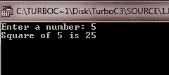
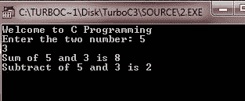

# C 头文件

> 原文：<https://codescracker.com/c/c-header-files.htm>

C 提供了很多头文件来处理 C 标准库中定义的[函数](/c/c-functions.htm)。使用#include 包含了与您 在程序中使用的函数相关的头文件。最常见的头文件是< stdio.h >，提供磁盘文件操作所必需的类型文件 。

## 头文件列表

此表列出了 C 头文件。

| 头文件 | 使用 |
|  | 定义 assert()宏 |
|  | 字符处理 |
|  | 错误报告 |
| <float.h></float.h> | 定义依赖于实现的浮点限制 |
|  | 定义各种依赖于实现的限制 |
| <locale.h></locale.h> | 支持本地化 |
| <math.h></math.h> | 数学库使用的各种定义 |
|  | 支持非本地跳转 |
| <signal.h></signal.h> | 支持信号处理 |
| <stdarg.h></stdarg.h> | 支持可变参数列表 |
| <stddef.h></stddef.h> | 定义一些常用的常数 |
| <stdio.h></stdio.h> | 支持 I/O 系统 |
| <stdlib.h></stdlib.h> | 杂项声明 |
|  | 支持字符串函数 |
|  | 支持系统时间功能 |
|  | 支持复杂运算 |
|  | 允许访问浮点状态标志和浮点环境的其他方面 |
|  | 定义一组标准的、可移植的整数类型名。还支持处理最大宽度整数的函数 |
|  | 定义对应于各种运算符的宏，如&&和^ |
| <stdbool.h></stdbool.h> | 支持布尔数据类型，这定义了宏 bool，有助于 C++ 的兼容性。 |
| <stdint.h></stdint.h> | 定义了一个标准的、可移植的整数类型名称集，这个文件包含在头文件<inttypes.h>中</inttypes.h> |
| <tgmath.h></tgmath.h> | 定义类型泛型浮点宏 |
| <wchar.h></wchar.h> | 支持多字节和宽字符函数 |
|  | 支持多字节和宽字符分类功能 |

## 如何在 C 程序中包含头文件？

使用预处理程序指令#include 包含用户和系统头文件。它有以下两种形式。此处，该表单用于包含系统头文件。

```
#include<filename.h>
```

现在，这个表单被用来包含你自己程序的头文件。换句话说，该语法用于包含用户定义的头文件。

```
#include "filename.h"
```

例如，如果你想包含系统头文件，就说<stdio.h>。用这个:</stdio.h>

```
#include<stdio.h>
```

如果你想包含你自己的头文件，比如说<myheader.h>。那就用这个:</myheader.h>

```
#include "myheader.h"
```

## 定义和使用你自己的头文件

定义和使用自己的头文件，简化了编程。让我们假设你正在做一个大项目，你需要在你的项目中使用很多函数。那么如果你把所有的功能都放在一个程序里，那么别人就很难读懂了。有时程序员在以后查看代码时也会感到困惑。因此，为了使一个大项目变得更小，您可以将所有的函数放在一个外部文件中。h 扩展名，也称为用户自定义头文件。这里有一个例子。

让我们首先创建一个文件，比如 myheader.h，并将以下代码放入该文件中。

```
int square(int a)
{
   return a*a;
}

int sum(int a, int b)
{
   return a+b;
}

int subtract(int a, int b)
{
   return a-b;
}

void welcome(void)
{
   printf("Welcome to C Programming\n");
}
```

现在您已经创建了自己的头文件，名为“myheader.h ”,具有上述功能。现在只需专注于这个程序。这里我们包含了上面的头文件，即“myheader.h ”,并将使用一个函数 square()。让我们看下面的示例程序来完全理解它:

```
#include<stdio.h>
#include<conio.h>

// now including our own header file myheader.h

#include "myheader.h"

void main()
{
   int num;
   clrscr();

   printf("Enter a number: ");
   scanf("%d", &num);
   printf("Square of %d is %d", num, square(num));

   getch();
}
```

如您所见，我们包含了头文件“myheader.h ”,并使用该头文件的函数 square()来查找用户输入的数字的平方。下面是这个 C 程序的运行示例。



下面是另一个示例程序，它也使用相同的用户定义头文件，即“myheader.h”来使用 rest 函数。

```
#include<stdio.h>
#include<conio.h>
#include "myheader.h"

void main()
{
   int num1, num2;
   clrscr();

   welcome();

   printf("Enter the two number: ");
   scanf("%d%d", &num1, &num2);

   printf("Sum of %d and %d is %d", num1, num2, sum(num1, num2));
   printf("\nSubtract of %d and %d is %d", num1, num2, subtract(num1, num2));

   getch();
}
```

以下是上述 C 程序的示例输出:



从上面两个程序可以看出，我们只创建了一个名为“myheader.h”的头文件，并且使用了两次。因此它使程序更简单。你也可以创建你自己的头文件，并在其中定义所有的函数，以便在任何时候在任何程序中使用这些函数，只要包含一个头文件，比如“myheader.h”。

[C 在线测试](/exam/showtest.php?subid=2)

* * *

* * *