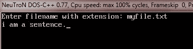
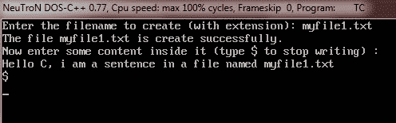
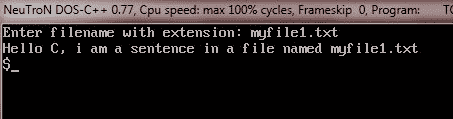
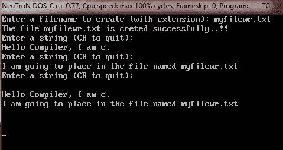
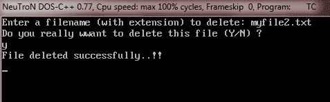
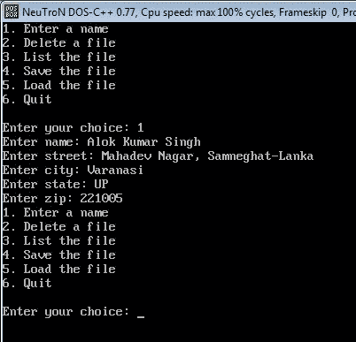
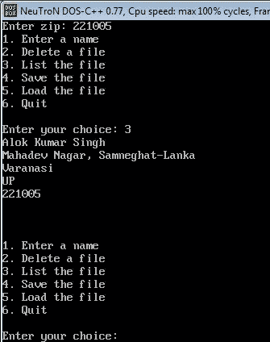
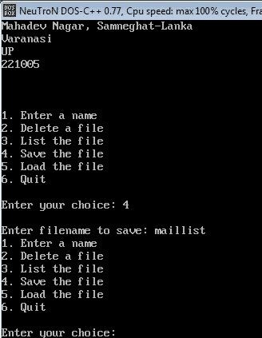

# c 文件输入输出

> 原文：<https://codescracker.com/c/c-file-io.htm>

本教程将教你所有关于 C 文件系统(C 中的文件处理)的知识，从非常基础到高级。让我们从流和文件开始。

## 流和文件

在讨论 C 文件系统之前，有必要了解一下术语流和文件或者流和文件之间的区别。C I/O 系统为程序员提供了一个与被访问的实际设备无关的一致的接口，即 C I/O 系统在程序员和设备之间提供了一个抽象层次，这个抽象称为流，而实际设备称为文件。让我们讨论一下溪流。

### 流

C 文件系统设计用于各种设备，包括终端、磁盘驱动器和磁带驱动器。然而，每个设备是非常不同的，缓冲文件系统将每个转换成一个逻辑设备，称为流。有以下两种类型的流:

*   文本流——文本流是一个字符序列。
*   二进制流-二进制流是一个字节序列，与外部设备中的字节一一对应，即不发生字符转换。

### 文件

在 C 语言中，文件可以是从磁盘文件到终端或打印机的任何东西。通过执行打开操作，可以将流与特定文件相关联。一旦文件被打开，信息就可以在它和你的程序之间交换。

## c 文件系统基础

C 文件系统由几个相互关联的函数组成。下表列出了这些函数中最常见的一些。这些函数需要头文件<stdio.h></stdio.h>

| 函数名 | 使用 |
| [fopen()](/c/function/input-output/fopen.htm) | 打开一个文件 |
| [fclose()](/c/function/input-output/fclose.htm) | 关闭文件 |
| [putc()](/c/function/input-output/putc.htm) | 将字符写入文件 |
| [fputc()](/c/function/input-output/fputc.htm) | 与 putc()相同 |
| [getc()](/c/function/input-output/getc.htm) | 从文件中读取字符 |
| [fgetc()](/c/function/input-output/fgetc.htm) | 与 getc()相同 |
| [fgets()](/c/function/input-output/fgets.htm) | 从文件中读取字符串 |
| [fputs()](/c/function/input-output/fputs.htm) | 将字符串写入文件 |
| [fseek()](/c/function/input-output/fseek.htm) | 在文件中查找指定的字节 |
| [ftell()](/c/function/input-output/ftell.htm) | 返回当前文件位置 |
| [fprintf()](/c/function/input-output/fprintf.htm) | 对于文件就像 printf()对于控制台一样 |
| [fscanf()](/c/function/input-output/fscanf.htm) | 对于文件就像 scanf()对于控制台一样 |
| [feof()](/c/function/input-output/feof.htm) | 如果到达文件结尾，则返回 true |
| [ferror()](/c/function/input-output/ferror.htm) | 如果出现错误，则返回 true |
| [倒带()](/c/function/input-output/rewind.htm) | 将文件位置指示器重置到文件的开头 |
| [remove()](/c/function/input-output/remove.htm) | 删除文件 |
| [fflush()](/c/function/input-output/fflush.htm) | 刷新文件 |

## 文件指针

文件指针只是连接 C I/O 系统的普通线程。文件指针是指向文件类型结构的指针。它指向定义文件各种信息的信息，包括文件名、状态和文件的当前位置。下面是在 C 程序中使用文件指针的语句:

```
FILE *fp;
```

## 在 C 中打开文件

要在 C 中打开一个文件，使用 fopen()函数。函数的作用是:打开一个流来使用，并把一个文件和这个流链接起来。然后它返回与该文件相关联的文件指针。下面是函数 fopen()的原型

```
FILE *fopen(const char *filename, const char *mode);
```

这里，filename 是文件的名称，mode 是文件访问模式。以下是打开文件时可以使用的所有访问模式的列表:

| 方式 | 使用 |
| r | 打开现有文本文件进行阅读 |
| w | 创建用于书写的文本文件 |
| a | 追加到文本文件 |
| 元素铷的符号 | 打开二进制文件进行读取 |
| 世界银行 | 创建用于写入的二进制文件 |
| 腹肌 | 追加到二进制文件 |
| r+ | 打开文本文件进行读/写 |
| w+ | 创建一个用于读/写的文本文件 |
| a+ | 追加或创建一个用于读/写的文本文件 |
| r+b | 打开二进制文件进行读/写 |
| w+b | 创建一个用于读/写的二进制文件 |
| a+b | 为读/写追加或创建二进制文件 |

下面的代码片段使用 fopen()函数打开一个名为 myfile.txt 的文件进行读取

```
FILE *fp;
fp = fopen("myfile.txt", "r");
```

## 在 C #中关闭文件

要在 C 中关闭一个文件，使用 fclose()函数。这个函数关闭一个通过调用 fopen()打开的流。下面是 fclose()函数的原型

```
int fclose(FILE *fp);
```

这里，fp 是调用函数 fopen()返回的文件指针。

## 用 C 语言向文件中写入字符

C I/O 系统定义了以下两个函数，用于将字符输出到文件中。两种功能是等效的。

*   putc()
*   fputc()

下面是函数 putc()的原型

```
int putc(int ch, FILE *fp);
```

这里 fp 是函数 fopen()返回的文件指针，ch 是要输出的字符。如果 putc()操作成功，它将返回写入的字符。否则，它返回 EOF(文件结束)。

## 用 C 语言从文件中读取字符

C I/O 系统定义了下面两个用于从文件中输入字符的函数。这两种功能是等效的。

*   getc()
*   fgetc()

下面是 getc()函数的原型

```
int getc(FILE *fp);
```

这里 fp 是 fopen()函数返回的 file 类型的文件指针。当到达文件末尾时，函数 getc()返回一个 EOF。

## c 文件 I/O 示例

现在我们举一些 C 文件 I/O 的例子。

### 读取一个文件的例子

这个程序读取用户输入的文件，并在输出屏幕上显示文件的内容。在运行这个程序之前，首先创建一个文件，比如“myfile.txt ”,并在文件中写入一些内容。在这里，我们在这个文件中编写了以下内容:

我是一句话。

现在把注意力集中在下面给出的程序上。

```
/* C File I/O - Reading a File in C */

#include<stdio.h>
#include<conio.h>
#include<stdlib.h>

void main()
{
   FILE *fp;
   char ch, fname[20];
   clrscr();

   printf("Enter filename with extension: ");
   gets(fname);

   fp = fopen(fname, "r");
   if(!fp)
   {
      printf("Error in opening the file..!!");
      exit(1);
   }

   ch = getc(fp);    // read one character

   while(ch != EOF)
   {
      putchar(ch);     // print on the screen
      ch = getc(fp);      // read one character
   }

   fclose(fp);       // close file after use

   getch();
}
```

现在只需输入您之前创建的文件名“myfile.txt ”,然后按回车键。该程序将在输出屏幕上显示文件的文本。下面是这个 C 程序的示例输出:



### c 写文件的例子

现在，下面的程序要求用户输入文件名(扩展名为 myfile1.txt)来创建文件，并在用户输入的文件中写入一些内容。要停止程序(写入文件)，只需键入' $ '，然后按两次 enter 键停止写入文件并关闭程序。程序如下:

```
/* C File I/O - Writing to a File in C */

#include<stdio.h>
#include<conio.h>
#include<stdlib.h>

void main()
{
   FILE *fp;
   char ch, fname[20];
   clrscr();

   printf("Enter the filename to create (with extension): ");
   gets(fname);

   fp = fopen(fname, "w");
   if(!fp)
   {
      printf("Error in opening the file..!!");
      exit(1);
   }

   printf("The file %s is create successfully.\n", fname);
   printf("Now enter some content inside it (type $ to stop writing) :\n");
   do
   {
      ch = getchar();
      putc(ch, fp);
   }while(ch != '$');

   fclose(fp);

   getch();
}
```

下面是这个 C 程序的运行示例:



正如你从上面的输出中看到的，在输入一些文本后，你会发现在你的 BIN 文件夹中(对于 TurboC++用户)，一个名为“myfile1.txt”的新文件被创建，这个文件包含你在上面的程序中输入的文本。要从程序中检查，只需运行“C 读取文件示例”的程序，键入文件名“myfile1.txt”即可读取文件。以下是输出:



## 在 C 语言中读写同一个文件

使用这个 C 程序，您可以创建一个文件并在该文件中写入一些内容，然后在将内容写入文件后读回当时写入的所有内容。换句话说，在写入文件内容后，当你按下回车键而不输入任何内容时。你会看到，所有的文字内容都显示在屏幕上。要关闭输出屏幕，只需再次按回车键。这是节目单。

```
/* C File I/O - This program writes some content
 * in the file created by the user, and then
 * reads all the content back from the file to display
 * on the content on the output screen
 */

#include<stdio.h>
#include<conio.h>
#include<stdlib.h>
#include<string.h>

void main()
{
   FILE *fp;
   char str[80];
   char fname[20];
   clrscr();

   printf("Enter a filename to create (with extension): ");
   gets(fname);

   fp = fopen(fname, "w+");
   if(!fp)
   {
      printf("Error in creating the file..!!");
      exit(1);
   }
   printf("The file %s is creted successfully..!!\n", fname);
   do
   {
      printf("Enter a string (CR to quit):\n");
      gets(str);
      strcat(str, "\n");     // adds a newline
      fputs(str, fp);
   }while(*str != '\n');

   // now read and display the file
   rewind(fp);     // reset the file position indicator to start of the file

   while(!feof(fp))
   {
      fgets(str, 79, fp);
      printf(str);
   }

   fclose(fp);
   getch();
}
```

下面是上述 C 程序的运行示例。



## 在 C 中删除文件

要删除用户输入的文件，请使用名为 remove()的函数。这是它的原型:

```
int remove(const char *filename);
```

如果文件删除成功，则返回零。否则，它返回一个非零值。这是节目单。

```
/* C File I/O - Deleting a File in C */

#include<stdio.h>
#include<conio.h>
#include<stdlib.h>
#include<ctype.h>

void main()
{
   char fname[20], ch[2];
   clrscr();

   printf("Enter a filename (with extension) to delete: ");
   gets(fname);

   printf("Do you really want to delete this file (Y/N) ?\n");
   gets(ch);

   if(toupper(*ch)=='Y')
   {
      if(remove(fname))
      {
         printf("Error in deleting the file..!!\n");
         exit(1);
      }
      printf("File deleted successfully..!!\n");
   }

   getch();
}
```

下面是上述 C 程序的运行示例。



### 完整的邮件列表示例程序

下面是完整的邮件列表示例程序:

```
/* C File I/O - This is a simple mailing list
 * example program using an array of structures
 */

#include<stdio.h>
#include<conio.h>
#include<stdlib.h>

#define MAX 100

struct address {
   char name[40];
   char street[40];
   char city[30];
   char state[3];
   unsigned long int zip;
} address_list[MAX];

void init_list(void);
void enter(void);
void delet(void);
void list(void);
void load(void);
void save(void);
int menu_select(void);
int find_free(void);

void main()
{
   char choice;
   clrscr();

   init_list();

   for(;;)
   {
      choice = menu_select();
      switch(choice)
      {
         case 1:
            enter();
            break;
         case 2:
            delet();
            break;
         case 3:
            list();
            break;
         case 4:
            save();
            break;
         case 5:
            load();
            break;
         case 6:
            exit(0);
      }
   }

   getch();
}

void init_list(void)
{
   register int i;

   for(i=0; i<MAX; i++)
   {
      address_list[i].name[0] = '\0';
   }
}

int menu_select(void)
{
   char str[80];
   int i;

   printf("1\. Enter a name\n");
   printf("2\. Delete a file\n");
   printf("3\. List the file\n");
   printf("4\. Save the file\n");
   printf("5\. Load the file\n");
   printf("6\. Quit\n");
   do
   {
      printf("\nEnter your choice: ");
      gets(str);
      i = atoi(str);
   }while(i<0 || i>6);

   return i;
}

void enter(void)
{
   int slot;
   char str[80];

   slot = find_free();

   if(slot==1)
   {
      printf("\nList Full..!!");
      return;
   }

   printf("Enter name: ");
   gets(address_list[slot].name);

   printf("Enter street: ");
   gets(address_list[slot].street);

   printf("Enter city: ");
   gets(address_list[slot].city);

   printf("Enter state: ");
   gets(address_list[slot].state);

   printf("Enter zip: ");
   gets(str);
   address_list[slot].zip = strtoul(str, '\0', 10);
}

int find_free(void)
{
   register int i;

   for(i=0; address_list[i].name[0] && i<MAX; i++) ;

   if(i==MAX) return -1;

   return i;
}

void delet(void)
{
   register int slot;
   char str[80];

   printf("Enter record #: ");
   gets(str);
   slot = atoi(str);

   if(slot>=0 && slot<MAX)
   {
      address_list[slot].name[0] = '\0';
   }
}

void list(void)
{
   register int i;

   for(i=0; i<MAX; i++)
   {
      if(address_list[i].name[0])
      {
         printf("%s\n", address_list[i].name);
         printf("%s\n", address_list[i].street);
         printf("%s\n", address_list[i].city);
         printf("%s\n", address_list[i].state);
         printf("%lu\n\n", address_list[i].zip);
      }
   }
   printf("\n\n");
}

void save(void)
{
   FILE *fp;
   register int i;
   char fname[20];

   printf("\nEnter filename to save: ");
   gets(fname);

   if((fp=fopen(fname, "wb")) == NULL)
   {
      printf("Error in opening file..!!\n");
      return;
   }

   for(i=0; i<MAX; i++)
   {
      if(*address_list[i].name)
      {
         if(fwrite(&address_list[i], sizeof(struct address), 1, fp) != 1)
         {
            printf("Error in writing to file..!!\n");
         }
      }
   }

   fclose(fp);
}

void load(void)
{
   FILE *fp;
   register int i;
   char fname[20];

   printf("Enter filename to load: ");
   gets(fname);

   if((fp=fopen(fname, "rb")) == NULL)
   {
      printf("Error in opening the file..!!\n");
      return;
   }

   init_list();
   for(i=0; i<MAX; i++)
   {
      if(fread(&address_list[i], sizeof(struct address), 1, fp) != 1)
      {
         if(feof(fp))
         {
            break;
         }
         printf("Error in reading the file..!!\n");
      }
   }

   fclose(fp);
}
```

下面是上面的 C 程序分成几个部分(这里是 3 个部分)的示例输出。在第一部分，输入您的选择(1)以输入记录。



现在选择第三个选项来列出输入的记录。



现在选择第四个选项，然后输入文件名，将记录保存在该文件中以备将来使用。



### 更多示例

在这里，我们列出了一些更多的例子，你可以去。

*   [读取文件](/c/program/c-program-read-file.htm)
*   [写入文件](/c/program/c-program-write-file.htm)
*   [读取&显示文件](/c/program/c-program-read-and-display-file.htm)
*   [复制文件](/c/program/c-program-copy-file.htm)
*   [合并两个文件](/c/program/c-program-merge-two-files.htm)
*   [列出目录](/c/program/c-program-list-files-in-directory.htm)中的文件
*   [删除文件](/c/program/c-program-delete-file.htm)
*   [加密/解密文件](/c/program/c-program-encrypt-file.htm)

[C 在线测试](/exam/showtest.php?subid=2)

* * *

* * *