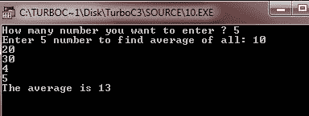

# C 变量参数

> 原文：<https://codescracker.com/c/c-variable-arguments.htm>

在 C 中，你可以指定一个[函数](/c/c-functions.htm)，它有可变数量的参数。最常见的例子是 printf()。你必须 使用三个句点或点来结束函数参数的声明，以告诉编译器未知数量的参数 将被传递给该函数。

## 在 C 中声明变量参数

下面是在 C 语言中声明变长参数的一般形式:

```
type function_name(type var_name, ...);
```

这里 type 是任何有效的数据类型，function_name 是任何指定函数名称的标识符。在括号中，类型再次是任何有效的数据类型，然后 var_name 是一个指定变量名称的标识符。您也可以像这样声明可变长度参数:

```
type function_name(type var_name1, type var_name2, ...);
```

下面是一个在 C 语言中声明变长参数的示例:

```
int func(int a, ...);
```

在这里，上面的原型指定 func()将至少有一个整数参数，然后可以有未知数量(包括 0)的参数。现在让我们看看这个原型。

```
int func(int a, int b, ...);
```

现在，这个原型指定 func()将至少有两个整数参数，然后可以有未知数量(包括 0)的参数。上面的原型只是告诉编译器 func()必须接收至少两个参数或自变量。现在让我们再看一个原型。

```
int func(int x, int y, int z, ...);
```

这里上面的原型告诉编译器 func()必须接收至少三个整数参数，然后可以有未知数量(包括 0)的参数。

### 如何在 C 中使用可变个数的参数？

在 C 中使用变长参数之前，必须包含名为<stdarg.h>的头文件。这个头文件简单地提供了实现可变长度参数功能的函数和宏。</stdarg.h>

## C 变量参数示例

这里列出了一些例子来理解变长参数在 C 程序中是如何工作的。

```
/* C Variable Length Arguments - This program
 * demonstrates variable length arguments in C
 */

#include<stdio.h>
#include<stdarg.h>
#include<conio.h>

int avg(int num, ...)
{
   va_list valist;
   int sum = 0;
   int i;

   // initializing valist for num number of arguments
   va_start(valist, num);

   // now accessing all the arguments that is assigned to valist
   for(i=0; i<num; i++)
   {
      sum = sum + va_arg(valist, int);
   }

   // now cleaning the memory reserved for the valist
   va_end(valist);

   return sum/num;
}

void main()
{
   int num1=10, num2=20, num3=30;
   clrscr();

   printf("The average is %d", avg(3, num1, num2, num3));

   getch();
}
```

以下是上述 C 程序的示例输出:


在这里，avg()中的第一个参数告诉编译器有多少个参数要传递给函数 avg()。上面一个是简单的变长参数程序。您也可以在函数 avg()中传递多于或少于 3 个参数。这里还有一个例子:

```
/* C Variable Length Arguments */

#include<stdio.h>
#include<stdarg.h>
#include<conio.h>

int avg(int num, ...)
{
   va_list valist;
   int sum = 0;
   int i;

   va_start(valist, num);

   for(i=0; i<num; i++)
   {
      sum = sum + va_arg(valist, int);
   }

   va_end(valist);

   return sum/num;
}

void main()
{
   int num1, num2, num3, num4, num5;
   int avg1, avg2;
   clrscr();

   printf("Enter any three numbers to find average of all: ");
   scanf("%d%d%d", &num1, &num2, &num3);
   avg1 = avg(3, num1, num2, num3);

   printf("Enter any five numbers to find average of all: ");
   scanf("%d%d%d%d%d", &num1, &num2, &num3, &num4, &num5);
   avg2 = avg(5, num1, num2, num3, num4, num5);

   printf("The average of %d, %d, and %d = %d", avg1);
   printf("\nThe average of %d, %d, %d, %d, and %d = %d", num1, num2, num3, num4, num5, avg2);

   getch();
}
```

下面是这个 C 程序的输出示例:


从上面的输出中可以看出，相同的函数用于可变长度的参数。有 3 个参数，然后有 5 个参数。这是另一个例子:

```
/* C Variable Length Arguments */

#include<stdio.h>
#include<stdarg.h>
#include<conio.h>

int avg(int num, ...)
{
   va_list valist;
   int sum = 0;
   int i;

   va_start(valist, num);

   for(i=0; i<num; i++)
   {
      sum = sum + va_arg(valist, int);
   }

   va_end(valist);

   return sum/num;
}

void main()
{
   int arr[20], i, num;
   int mean, sum=0, count=0;
   clrscr();

   printf("How many number you want to enter ? ");
   scanf("%d", &num);
   printf("Enter %d number to find average of all: ", num);
   for(i=0; i<num; i++)
   {
      scanf("%d", &arr[i]);
   }

   for(i=0; i<num; i++)
   {
      sum = sum + avg(1, arr[i]);
      count++;
   }

   mean = sum/count;
   printf("The average is %d", mean);

   getch();
}
```

下面是上述 C 程序的两个运行示例:




这是另一个例子。

```
/* C Variable Length Arguments */

#include<stdio.h>
#include<stdarg.h>
#include<conio.h>

int tot(int x,...)
{
   va_list valist;
   int sum = 0;
   int i;

   va_start(valist, x);

   for(i=0; i<x; i++)
   {
      sum = sum + va_arg(valist, int);
   }

   va_end(valist);
   return sum/x;
}

void main()
{
   int math, phys, chem, comp, eng;
   int perc;
   clrscr();

   printf("Enter marks obtained in the five subjects: ");
   scanf("%d%d%d%d%d",&math, &phys, &chem, &comp, &eng);
   printf("\nAverage Marks = %d\n", tot(5, math, phys, chem, comp, eng));

   getch();
}
```

下面是上述 C 程序的运行示例:


让我们再看一个例子。这个程序也接受可变参数，但是这次用户将输入参数的总数，然后在运行程序时输入参数值。只要专注于这个程序，就能完全理解变量参数。

```
/* C Variable Length Arguments */

#include<stdio.h>
#include<stdarg.h>
#include<conio.h>

double tot(int a,...)
{
   va_list valist;
   double sum = 0.0;
   int i;

   va_start(valist, a);

   for(i=0; i<a; i++)
   {
      sum = sum + va_arg(valist, int);
   }

   va_end(valist);
   return sum/a;
}

void main()
{
   int sub[50], num, i, count = 0;
   double sum = 0;
   clrscr();

   printf("Enter number of subjects: ");
   scanf("%d",&num);
   printf("Enter marks obtained in %d subjects: ", num);
   for(i=0; i<num; i++)
   {
      scanf("%d", &sub[i]);
      sum = sum + tot(1, sub[i]);
      count++;
   }
   sum = sum/count;
   printf("Average Marks = %f\n", sum);

   getch();
}
```

下面是上述 C 程序的两个运行示例:


[C 在线测试](/exam/showtest.php?subid=2)

* * *

* * *