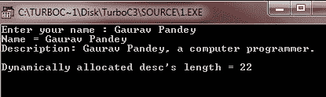
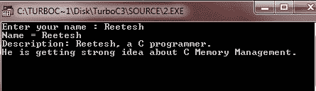

# 内存管理

> 原文：<https://codescracker.com/c/c-memory-management.htm>

c 语言为内存分配和管理提供了几个函数。这些函数可以在头文件<stdlib.h>中找到。</stdlib.h>

## C 语言中的动态分配函数

下表列出了 C 语言中用于执行内存分配和管理的几个函数

| 功能 | 描述 |
| void *calloc(整数，整数大小) | 用于分配 num 个元素的数组，每个元素的大小以字节为单位 |
| void *malloc(int num) | 用于分配 num 字节的数组，并使它们保持初始化。 |
| 免于作废(作废*地址) | 这个函数释放一个由地址指定内存块。 |
| void *realloc(void *address，int newsize) | 用于重新分配内存，将其扩展到新的大小。 |

## c 动态内存分配示例

下面是 C 语言中动态内存分配的一个例子:

```
/* C Memory Management - This program illustrates
 * the concept of dynamic memory allocation in C
 */

#include<stdio.h>
#include<stdlib.h>
#include<string.h>
#include<conio.h>

void main()
{
   char name[100];
   char *desc;
   int len1, len2;
   clrscr();

   printf("Enter your name : ");
   gets(name);

   desc = malloc(200 * sizeof(char));
   if(desc == NULL)
   {
      fprintf(stderr, "Error - unable to allocate required memory\n");
   }
   else
   {
      strcpy(desc, "a computer programmer.");
   }
   printf("Name = %s\n", name );
   printf("Description: %s, %s\n", name, desc);
   len1 = strlen(desc);
   len2 = strlen("a computer programmer.");
   if(len1 == len2)
   {
      printf("\nDynamically allocated desc's length = %d\n", len1);
   }
   else
   {
      printf("Not possible..!!");
   }
   getch();
}
```

下面是这个 C 程序的运行示例:



同样的程序可以用 calloc()编写，你唯一需要做的就是用 calloc()替换 malloc()，如下所示:

```
calloc(200, sizeof(char));
```

下面是另一个程序，展示了如何在 C 中调整内存大小和释放内存:

```
/* C Memory Management - Dynamic Memory Management Program */

#include<stdio.h>
#include<stdlib.h>
#include<conio.h>
#include<string.h>

void main()
{
   char name[100];
   char *desc;
   clrscr();

   printf("Enter your name : ");
   gets(name);

   desc = malloc(30 * sizeof(char));
   if(desc == NULL)
   {
   fprintf(stderr, "Error - unable in allocating the required memory\n");
   }
   else
   {
      strcpy(desc, "a C programmer.");
   }
   desc = realloc(desc, 100 * sizeof(char));
   if(desc == NULL)
   {
      fprintf(stderr, "Error - unable to allocate required memory\n");
   }
   else
   {
      strcat(desc, "\nHe is getting strong idea about C Memory Management.");
   }
   printf("Name = %s\n", name );
   printf("Description: %s, %s\n", name, desc);
   free(desc);
   getch();
}
```

下面是这个 C 程序的示例输出:



在不重新分配额外内存的情况下尝试上面的例子，strcat()函数会由于描述中缺少可用内存而产生错误

[C 在线测试](/exam/showtest.php?subid=2)

* * *

* * *