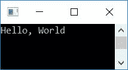
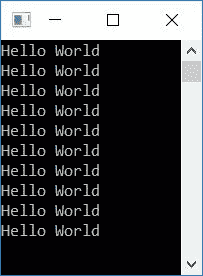

# C 程序：打印 Hello World 

> 原文：<https://codescracker.com/c/program/c-program-print-hello-world.htm>

在本文中，您将学习并获得用 C 编程打印 *Hello World* 的代码。你好世界节目在 以下列方式播出:

*   使用分号打印 **Hello World**
*   不使用分号
*   使用[循环](/c/c-for-loop.htm)10 次
*   使用[循环](/c/c-while-loop.htm)10 次
*   使用[字符串](/c/c-strings.htm)
*   使用用户自定义的[功能](/c/c-functions.htm)

## 用 C 语言打印 Hello，World

这个程序简单地使用 *printf ()* 函数打印出 *Hello，World* 。该函数在*stdio . h*T8】头文件中定义。

```
#include<stdio.h>
#include<conio.h>
int main()
{
    printf("Hello, World");
    getch();
    return 0;
}
```

这个程序是在 **Code::Blocks** IDE 下构建和运行的。下面是它的示例输出:



### 不使用分号打印 Hello World

要在不使用分号(，)的情况下打印 *Hello World* ，只需将前面程序中给出的 **printf()** 函数内的 **Hello World** 而不是 **Hello，World** 即可。其余的事情都一样。

## 使用`for`循环打印 Hello World 10 次

现在让我们创建另一个程序，它使用循环的*来执行下面给出的语句 10 次:*

```
printf("Hello World\n");
```

如下面给出的程序所示:

```
#include<stdio.h>
#include<conio.h>
int main()
{
    int i;
    for(i=0; i<10; i++)
        printf("Hello World\n");
    getch();
    return 0;
}
```

下面是它的运行示例:



该循环的工作方式如下:

*   最初(在循环的*第一次运行时)，0 被初始化为 *i* 并检查其是否小于 10 的*
*   条件评估为真，因此程序流程进入循环内部并执行语句
    `printf("Hello World");`
    ，打印 *Hello World*
*   现在程序流程进入循环更新部分。增加 *i* 的值，并再次比较或检查状态。
*   在 *i* 的每个更新值之后，程序检查它是否小于 10
*   如果条件满足或评估为真，则只有程序流进入循环。否则，程序流程退出循环
*   这样， *Hello World* 在输出屏幕上打印 10 次

## 使用`while`循环打印 Hello World 10 次

现在，这个程序不再使用*来代替*循环，而是使用*而*循环来完成与前一个程序相同的工作。 要了解更多( [`while`循环](/c/c-while-loop.htm))，可以参考它单独的教程。

```
#include<stdio.h>
#include<conio.h>
int main()
{
    int i=0;
    while(i<10)
    {
        printf("Hello World\n");
        i++;
    }
    getch();
    return 0;
}
```

产生与前一个程序相同的输出。

## 使用字符串打印 Hello World

这个程序使用*字符串*来打印 *Hello World* 。也就是说，一个[变量](/c/c-variables.htm)比如 类型*字符*的 **str** 被 *Hello World* 声明并初始化。并使用 **%s** 格式说明符打印 **str** 的值作为输出。

```
#include<stdio.h>
#include<conio.h>
int main()
{
    char str[20] = "Hello World";
    printf("%s", str);
    getch();
    return 0;
}
```

在输出上打印 **Hello World** 。

## 使用函数打印 Hello World

这是最后一个 **Hello World** 程序，它是使用一个用户自定义函数 **printHello()** 创建的，该函数从 **main()** 函数调用 。也就是我们在 *main()* 之前声明了函数，在 *main()* 之后定义了函数。现在我们可以从 *main()* 中调用它了。当它被调用时，它的定义部分被执行，在输出中打印出 *Hello World* 。

```
#include<stdio.h>
#include<conio.h>
void printHello(void);
int main()
{
    printHello();
    getch();
    return 0;
}
void printHello(void)
{
    printf("Hello World");
}
```

还在输出上打印 **Hello World** 。

#### 其他语言的相同程序

*   [C++ 程序打印 Hello World](/cpp/program/cpp-program-print-hello-world.htm)
*   [Java 程序打印 Hello World](/java/program/java-program-print-hello-world.htm)
*   [Python 程序打印 Hello World](/python/program/python-program-print-hello-world.htm)

[C 在线测试](/exam/showtest.php?subid=2)

* * *

* * *