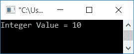

# C 程序：打印整数

> 原文：<https://codescracker.com/c/program/c-program-print-integer.htm>

在这篇文章中，你将学习如何在 C 编程中在输出屏幕上打印一个整数值。这里，整数的打印在两个程序中实现:

*   打印整数
*   打印用户输入的整数

## 打印整数

要在 c 编程中打印整数值，使用 **printf()** [函数](/c/c-functions.htm)和 **%d** 格式说明符，如下图所示。 *%d* 格式说明符用于输出数字数据。

```
#include<stdio.h>
#include<conio.h>
int main()
{
    int num=10;
    printf("Integer Value = %d", num);
    getch();
    return 0;
}
```

这个程序是在 **Code::Blocks** IDE 下构建和运行的。下面是它的示例输出:



[变量](/c/c-variables.htm) **num** 被声明(属于 *int* 类型)并用 10 初始化。 使用 *%d* 格式说明符打印其值。

## 打印用户输入的整数

这个程序在运行时从用户那里接收一个整数值，并在输出时打印出来。

```
#include<stdio.h>
#include<conio.h>
int main()
{
    int val;
    printf("Enter the Value: ");
    scanf("%d", &val);
    printf("You entered %d", val);
    getch();
    return 0;
}
```

下面是它的初始输出:


现在输入任意数值，比如说 **20** ，按`ENTER`键可以看到如下输出:


#### 其他语言的相同程序

*   [C++ 程序打印整数](/cpp/program/cpp-program-print-integer.htm)
*   [Java 程序打印整数](/java/program/java-program-print-integer.htm)

[C 在线测试](/exam/showtest.php?subid=2)

* * *

* * *