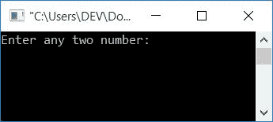
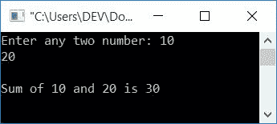
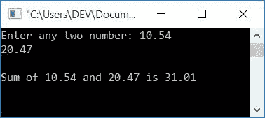
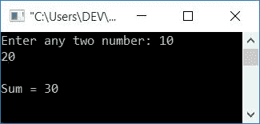
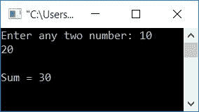

# C 程序将两个数相加

> 原文：<https://codescracker.com/c/program/c-program-add-two-numbers.htm>

在本文中，您将学习并获得有关如何在 C 中添加两个数字的代码。以下是本文中使用的在 C 中添加两个数字的方法列表:

*   将两个整数相加
*   将两个浮点型数字相加
*   使用函数将两个数相加
*   使用递归将两个数相加

## 将 C 中的两个数相加

首先，我们将学习如何将两个整数相加。在 C 编程中，要将两个数相加，可以让用户输入任意两个数。将输入的两个数相加，放入同一数据类型的第三个变量中。最后打印第三个[变量](/c/c-variables.htm)的值。

```
#include<stdio.h>
#include<conio.h>
int main()
{
    int num1, num2, add;
    printf("Enter any two number: ");
    scanf("%d%d", &num1, &num2);
    add = num1+num2;
    printf("\nSum of %d and %d is %d", num1, num2, add);
    getch();
    return 0;
}
```

由于上述程序是在 **Code::Blocks** IDE 下编写的，因此下面是示例运行的初始快照:



现在提供任意两个数字，如 **10** 和 **20** ，然后按下**回车键**查看输出，如同一样品运行的第二个快照 所示:



#### 上述程序中使用的步骤

以下是上述计划中涉及的一些主要步骤:

*   声明任意三个变量说 **num1，num2** 和**相加**
*   这里 **num1** 和 **num2** 保存用户输入的第一个和第二个数字， **add** 将用于存储给定两个数字的加法 结果
*   现在扫描用户输入的任意两个数字
*   初始化 **num1** 和 **num2** 到**的加法**
*   打印**的值，将**相加作为输出

### 在 C 语言中添加两个实数

以上程序只适用于整数值。如果用户提供任何两个包含十进制的数字，那么上述程序将不适用这种情况。这是 C 语言中两个数字相加的修改版本，不管输入的数字是整数值还是实数。

```
#include<stdio.h>
#include<conio.h>
int main()
{
    float num1, num2, add;
    printf("Enter any two number: ");
    scanf("%f%f", &num1, &num2);
    add = num1+num2;
    printf("\nSum of %0.2f and %0.2f is %0.2f", num1, num2, add);
    getch();
    return 0;
}
```

这里给出的快照显示了上述程序的运行示例:



正如你在上面的程序中看到的，代替 **int** ，声明所有三个 **float** 类型的变量。要了解更多关于 数据类型的信息，请参考 C 教程中的[数据类型。](/c/c-data-types.htm)

这里的 **%0.2f** 用于打印精确到小数点后两位的实数。

## 在 C 语言中使用函数将两个数相加

现在，让我们创建另一个程序，做同样的工作，但这一次使用函数。让我们来看看这个程序:

```
#include<stdio.h>
#include<conio.h>
int sum(int, int);
int main()
{
    int num1, num2, add;
    printf("Enter any two number: ");
    scanf("%d%d", &num1, &num2);
    add = sum(num1, num2);
    printf("\nSum = %d", add);
    getch();
    return 0;
}
int sum(int a, int b)
{
    return a+b;
}
```

以下是运行示例:



要了解 C 中函数的更多信息，请参考 C 中的[函数](/c/c-functions.htm)教程文章。

## 在 C 语言中使用递归将两个数相加

问题是**用 C 写个程序用递归函数**把两个数相加。我们先来看看程序:

```
#include<stdio.h>
#include<conio.h>
int sum(int, int);
int main()
{
    int num1, num2, add;
    printf("Enter any two number: ");
    scanf("%d%d", &num1, &num2);
    add = sum(num1, num2);
    printf("\nSum = %d", add);
    getch();
    return 0;
}
int sum(int a, int b)
{
    if(b==0)
        return a;
    else
        return (1+sum(a, b-1));
}
```

下面是上述程序运行示例的快照:



要详细了解递归，请参考 C 教程中的[递归。](/c/c-recursion.htm)

#### 其他语言的相同程序

*   [C++加两个数](/cpp/program/cpp-program-add-two-numbers.htm)
*   [Java 加两个数](/java/program/java-program-add-two-numbers.htm)
*   [Python 加两个数](/python/program/python-program-add-two-numbers.htm)

[C 在线测试](/exam/showtest.php?subid=2)

* * *

* * *