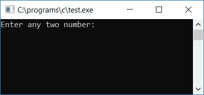
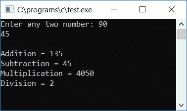
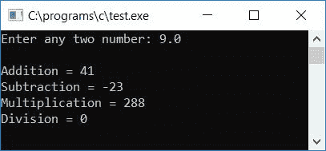
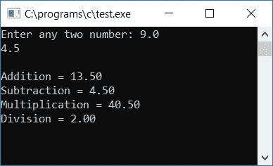
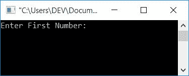
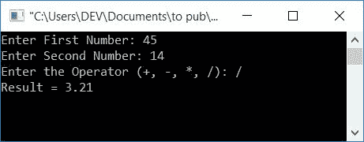

# C 程序：执行加、减、乘、除

> 原文：<https://codescracker.com/c/program/addition-subtraction-multiplication-division.htm>

在本文中，我们将学习如何创建一个程序，以下列方式处理著名的四种数学运算，如加、减、乘、除:

*   仅对整数数据进行数学运算
*   对实际数据或浮点值的数学运算
*   使用用户定义函数的数学运算
*   基于用户选择的数学运算

## C 语言中的加减乘除

问题是:用 C 写一个程序，执行所有四种基本的数学运算，如加、减、乘、除。

下面是解决上述问题的 C 语言程序，但只适用于整数数据。

```
#include<stdio.h>
#include<conio.h>
int main()
{
    int num1, num2, res;
    printf("Enter any two number: ");
    scanf("%d%d", &num1, &num2);
    res = num1+num2;
    printf("\nAddition = %d", res);
    res = num1-num2;
    printf("\nSubtraction = %d", res);
    res = num1*num2;
    printf("\nMultiplication = %d", res);
    res = num1/num2;
    printf("\nDivision = %d", res);
    getch();
    return 0;
}
```

上面的程序是在 Code::Blocks IDE 中编写的，因此，在成功编译和运行之后，下面是初始输出:



现在提供任意两个数字，比如 90 和 45，作为输入，并按回车键查看以下输出:



#### 上述程序中使用的主要步骤

以下是上述程序中使用的一些主要步骤:

*   初始化三个整型变量，比如 num1、num2 和 res。
*   变量 num1 和 num2 将用于保存用户在运行时输入的第一个和第二个数字的值。并且变量 res 将用于存储在执行两个数之间的诸如加、减、乘和除之类的运算之后的值。
*   接收来自用户的输入。
*   现在将分别存储在变量 num1 和 num2 中的给定两个数的加法结果初始化到变量 res。
*   将 res 的值打印为给定两个数的相加结果。
*   对减法、乘法和除法运算进行同样的操作。

### 运算实数的程序

现在，如果用户提供任何不是纯整数的输入数字会怎么样呢？让我们假设用户提供了任何输入，比如 9.0 和 4.5，那么上面的程序将不会产生正确的结果，如下面给出的输出所示:



为了解决这个问题，下面是上述程序的修改版本:

```
#include<stdio.h>
#include<conio.h>
int main()
{
    float num1, num2, res;
    printf("Enter any two number: ");
    scanf("%f%f", &num1, &num2);
    res = num1+num2;
    printf("\nAddition = %.2f", res);
    res = num1-num2;
    printf("\nSubtraction = %.2f", res);
    res = num1*num2;
    printf("\nMultiplication = %.2f", res);
    res = num1/num2;
    printf("\nDivision = %.2f", res);
    getch();
    return 0;
}
```

这里，我们将数据类型更改为“float ”,以处理真实数据或任何可能包含或不包含小数的真实数字。运行上述程序后，输入任意两个数字，比如 9.0 和 4.5，然后按回车键查看以下输出:



若要接收任何浮点(实数)数据，请使用%f 作为格式说明符。为了打印 res 变量的值，我们在格式说明符之间放置了. 2，比如%和 f，以便只打印小数点后的两位数。

## 使用自定义函数的 C 语言数学运算程序

下面的程序与上面的程序工作原理相同，但是在内部，这个程序是使用用户定义的函数来编程的。让我们来看看:

```
#include<stdio.h>
#include<conio.h>
float Add(float, float);
float Sub(float, float);
float Mul(float, float);
float Div(float, float);
int main()
{
    float num1, num2, res;
    printf("Enter any two number: ");
    scanf("%f%f", &num1, &num2);
    res = Add(num1, num2);
    printf("\nAddition = %.2f", res);
    res = Sub(num1, num2);
    printf("\nSubtraction = %.2f", res);
    res = Mul(num1, num2);
    printf("\nMultiplication = %.2f", res);
    res = Div(num1, num2);
    printf("\nDivision = %.2f", res);
    getch();
    return 0;
}
float Add(float a, float b)
{
    return a+b;
}
float Sub(float a, float b)
{
    return a-b;
}
float Mul(float a, float b)
{
    return a*b;
}
float Div(float a, float b)
{
    return a/b;
}
```

如果您运行上面的程序，它将与本文中的前一个程序一样工作。要了解关于函数的更多信息，请参考 C 中的[函数。](/c/c-functions.htm)

## 基于用户选择的数学运算

现在这里是另一个版本的程序，几乎与以前的程序相同，但这一次，程序不会自动运行，并在输出屏幕上打印所有四个数学运算的结果。

相反，这个程序会问用户做什么，或者是寻找加法或者任何其他三个数学运算，如减法，乘法和除法。让我们来看看:

```
#include<stdio.h>
#include<conio.h>
int main()
{
    float num1, num2;
    char ch;
    printf("Enter First Number: ");
    scanf("%f", &num1);
    printf("Enter Second Number: ");
    scanf("%f", &num2);
    printf("Enter the Operator (+, -, *, /): ");
    scanf(" %c", &ch);
    if(ch=='+')
        printf("Result = %0.2f", num1+num2);
    else if(ch=='-')
        printf("Result = %0.2f", num1-num2);
    else if(ch=='*')
        printf("Result = %0.2f", num1*num2);
    else if(ch=='/')
        printf("Result = %0.2f", num1/num2);
    else
        printf("Wrong Operator");
    getch();
    return 0;
}
```

当编译并执行上述 C 程序时，将产生以下结果:



提供任意输入，比如第一个数字是 45，第二个数字是 14，按/作为除法运算符，然后按 ENTER 键查看输出，如下图所示:



要了解更多关于 **if-else** 语句的信息，请参考 C 语言中的 [if-else。](/c/c-if-statement.htm)

#### 其他语言的相同程序

*   [C++加减乘除](/cpp/program/addition-subtraction-multiplication-division.htm)
*   [Java 加减乘除](/java/program/addition-subtraction-multiplication-division.htm)
*   [Python 加减乘除](/python/program/python-program-addition-subtraction-multiplication-division.htm)

[C 在线测试](/exam/showtest.php?subid=2)

* * *

* * *