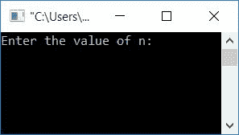
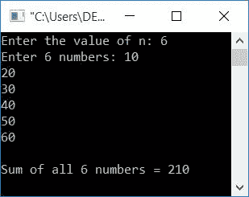
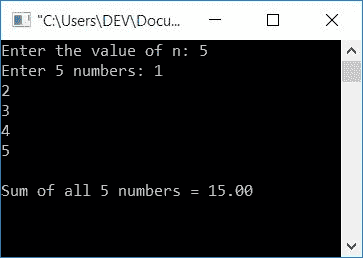
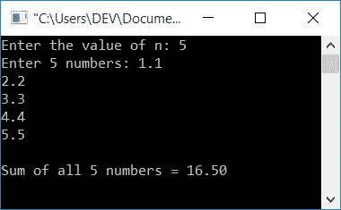
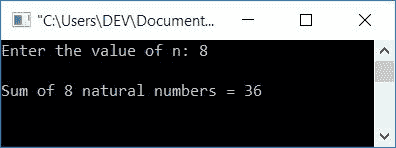

# C 程序：将 N 个数相加

> 原文：<https://codescracker.com/c/program/c-program-add-n-numbers.htm>

在本文中，您将学习并获得关于如何在 C 编程中将 N 个数字(N 个整数、N 个实数和 N 个自然数)相加的代码。这里的“n”表示数量。也就是说，用户想要输入多少个数字，然后将它们添加到这里。

例如，如果用户输入 5 作为 n 的值，那么程序将进一步要求用户输入任意 5 个数字。从用户那里收到 5 个数字，比如 10、20、30、40 和 50，程序将对所有 5 个数字求和，并在输出中显示其总和。那将是 150(因为 10 + 20 + 30 + 40 + 50 等于 150)。

## 求 C 中 N 个数的和

在 C 编程中加 N 个数，你得让用户输入 n 的值，然后要求输入 N 个数来执行用户提供的所有 N 个数的相加。然后在屏幕上显示相加结果作为输出。让我们来看看这个程序。

```
#include<stdio.h>
#include<conio.h>
int main()
{
    int i, n, num, sum=0;
    printf("Enter the value of n: ");
    scanf("%d", &n);
    printf("Enter %d numbers: ", n);
    for(i=0; i<n; i++)
    {
        scanf("%d", &num);
        sum = sum+num;
    }
    printf("\nSum of all %d numbers = %d", n, sum);
    getch();
    return 0;
}
```

这个程序是用 Code::Blocks IDE 编写的。以下是示例运行的初始快照:



提供 n 的值，比如 6，然后输入任意 6 个整数值，比如 10、20、30、40、50 或 60，并按 enter 键查看输出，如示例运行的第二个快照所示:



#### 上述程序中使用的步骤

上述程序中使用的一些主要步骤是:

*   声明每个变量所需的量，即 I、n、num 和 sum。
*   用 0 初始化总和。
*   得到 n 的值
*   使用循环( [for loop](/c/c-for-loop.htm) )接收所需数量的数字。
*   在`for`循环中，我们在每次接收数字时都应用了求和运算。
*   也就是说，当用户输入第一个数字，比如 10，sum+num 或 0+10 被初始化为 sum。
*   同样，当用户输入第二个数字，比如 20，sum+num 或 10+20 被初始化为 sum。
*   对所有数字进行运算。也就是说，如果用户输入 6 作为 n 的值，那么操作进行 6 次。
*   打印总和的值。

### 如果用户输入十进制数字会怎样？

只有当用户以整数形式(没有任何小数)提供所有数字时，上面给出的程序才是正确的。这是上面程序的修改版本，对整数和小数都正确。

这个程序适用于求所有实数的和。

```
#include<stdio.h>
#include<conio.h>
int main()
{
    int n, i;
    float num, sum=0;
    printf("Enter the value of n: ");
    scanf("%d", &n);
    printf("Enter %d numbers: ", n);
    for(i=0; i<n; i++)
    {
        scanf("%f", &num);
        sum = sum+num;
    }
    printf("\nSum of all %d numbers = %0.2f", n, sum);
    getch();
    return 0;
}
```

这是第一次样本运行的快照。在这个示例运行中，我们将所有数字都作为整数值提供:



这是第二次样本运行的快照。在这个示例运行中，我们提供了所有浮点值的数字:



在上面的程序中，我们只做了这些更改:

*   将 num 和 sum 变量声明为实数运算的浮点数据类型。
*   对于这两个变量，这里使用了%f 格式说明符
*   0.2f 用于打印最多两位小数的 sum 值
*   程序的其余部分与上面的相同

## C 程序：求 N 个自然数之和

众所周知，正数 1，2，3，...是自然数。所以这里我们只需要问用户 n 的值，也就是自然数最多延续多少项，求那个自然数的和。

例如，如果用户输入 n 的值为 8，则求前八个自然数的和，这八个自然数将是 1、2、3、4、5、6 和 8。让我们来看看这个程序:

```
#include<stdio.h>
#include<conio.h>
int main()
{
    int i, n, sum=0;
    printf("Enter the value of n: ");
    scanf("%d", &n);
    for(i=1; i<=n; i++)
        sum = sum+i;
    printf("\nSum of %d natural numbers = %d", n, sum);
    getch();
    return 0;
}
```

以下是示例运行的快照:



#### 其他语言的相同程序

*   [C++ 加 N 个数](/cpp/program/cpp-program-add-n-numbers.htm)
*   [Java 相加 N 个数字](/java/program/java-program-add-n-numbers.htm)

[C 在线测试](/exam/showtest.php?subid=2)

* * *

* * *