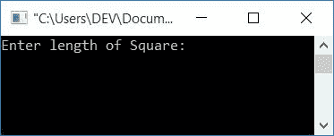
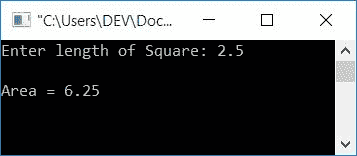
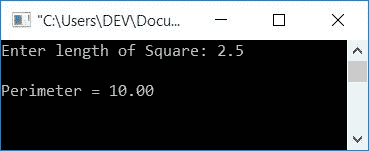

# 计算正方形面积和周长的 c 程序

> 原文：<https://codescracker.com/c/program/c-program-calculate-area-perimeter.htm>

在本文中，您将学习并获得关于下面给出的程序的代码:

*   求正方形的面积
*   用函数求正方形的面积
*   求正方形的周长
*   用函数求正方形的周长

## 如何求正方形的面积？

求正方形的面积，用简单的公式， **area = len*len** 或**area = len<sup>2</sup>T5。这里 **len** 表示 正方形的边长。众所周知，正方形的四条边都等长。现在让我们看一下下面给出的程序。**

## C 语言中平方程序的面积

要在 C 编程中计算正方形的面积，您必须要求用户输入正方形的边长，然后执行给定数字与其自身(正方形的长度)相乘的简单操作，如下面的程序所示:

```
#include<stdio.h>
#include<conio.h>
int main()
{
    float len, area;
    printf("Enter length of Square: ");
    scanf("%f", &len);
    area = len*len;
    printf("\nArea = %0.2f", area);
    getch();
    return 0;
}
```

下面是上述程序的运行示例。这是初始输出的快照:



输入正方形的长度，比如说 **2.5** 并按下 **ENTER** 键，以查看该区域，如下面给出的最终输出快照所示:



#### 上述程序中使用的步骤

以下是上述程序中使用的一些主要步骤:

*   声明任意两个浮点类型的变量。因为正方形边长可能包含十进制值
*   在 **len** 变量中接收正方形的长度
*   将给定值与 **len** 变量自身进行乘法运算，并初始化为**区**变量
*   现在只需打印**区域**的值作为输出
*   变量 **area** 表示输出屏幕上正方形的面积
*   此处 **%0.2f** 用于打印**区**的值，精确到小数点后两位

## 用函数计算 C 语言中正方形的面积

现在让我们创建另一个程序，它的工作与前面的程序相同。只不过这个程序是用函数创建的。让我们来看看:

```
#include<stdio.h>
#include<conio.h>
float findAreaSquare(float);
int main()
{
    float len, area;
    printf("Enter length of Square: ");
    scanf("%f", &len);
    area = findAreaSquare(len);
    printf("\nArea = %0.2f", area);
    getch();
    return 0;
}
float findAreaSquare(float leng)
{
    return leng*leng;
}
```

这个程序产生与前一个程序相同的输出。

## 如何求正方形的周长？

要计算正方形的周长，使用公式**周长= 4 *边长**。这里的**边**表示正方形的边长。 要计算周长，我们必须找到正方形的边长。由于正方形有 4 条等长的边，所以这里我们只需要 去求边长，然后乘以 4 就可以了。那将是警戒线。

## C 语言中正方形程序的周长

这是用 C 语言编写的程序，它计算给定长度的正方形的周长(由用户在运行时计算)。

```
#include<stdio.h>
#include<conio.h>
int main()
{
    float len, perimeter;
    printf("Enter length of Square: ");
    scanf("%f", &len);
    perimeter = 4*len;
    printf("\nPerimeter = %0.2f", perimeter);
    getch();
    return 0;
}
```

当编译并执行上述 c 程序时，它将产生以下结果:



你可以自己清楚地理解这个程序，这里不包含任何额外的内容。所以我要做下一个程序，用函数计算正方形的周长。

## 用函数计算 C 中正方形的周长

这是本文的最后一个程序，它做的工作和前面的程序一样，即要求用户输入正方形的边长，并计算正方形的周长，但这次使用函数。让我们来看看:

```
#include<stdio.h>
#include<conio.h>
float findPeriSquare(float);
int main()
{
    float len, perimeter;
    printf("Enter length of Square: ");
    scanf("%f", &len);
    perimeter = findPeriSquare(len);
    printf("\nPerimeter = %0.2f", perimeter);
    getch();
    return 0;
}
float findPeriSquare(float len)
{
    return 4*len;
}
```

这个程序产生的输出与前面的程序相同。要了解关于函数的更多信息，请参考 C 教程中的[函数。](/c/c-functions.htm)

[C 在线测试](/exam/showtest.php?subid=2)

* * *

* * *