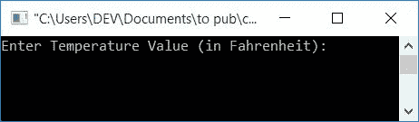
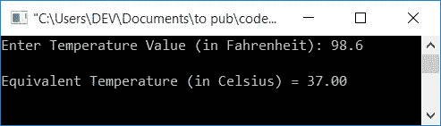

# C 程序：将华氏温度转换为摄氏温度

> 原文：<https://codescracker.com/c/program/c-program-convert-fahrenheit-to-centigrade.htm>

在本文中，您将学习并获得温度值从华氏温度到摄氏温度的转换代码。在进入程序之前，我们先了解一下它在转换中使用的公式。

### 华氏至摄氏公式

华氏温度到摄氏温度的公式是:

```
celsius = (fahrenheit-32)*(100/180)
```

要进一步了解这个公式，那么请参考[摄氏度到](/nonprog/celsius-to-fahrenheit-formula.htm)华氏度公式 的解释。在那里你会完全理解，这个公式是如何推导出来的。我知道题目是针对 **摄氏转华氏**的，但是不要在意，你看了 那篇文章就自动明白了关于华氏转摄氏的公式。

上面给出的公式也可以写成:

```
celsius = (fahrenheit-32)/(180/100)
```

并且由于 **180/100** 的值为 **1.8** ，所以上式可以进一步写成:

```
celsius = (fahrenheit-32)/1.8
```

现在让我们转到用 C 写的将华氏温度转换成摄氏温度的程序。

## 华氏温度到摄氏温度

问题是，**用 C 写一个程序，把华氏温度转换成摄氏温度**。 这个问题的答案如下:

```
#include<stdio.h>
#include<conio.h>
int main()
{
    float fahrenheit, celsius;
    printf("Enter Temperature Value (in Fahrenheit): ");
    scanf("%f", &fahrenheit);
    celsius = (fahrenheit-32)/1.8;
    printf("\nEquivalent Temperature (in Celsius) = %0.2f", celsius);
    getch();
    return 0;
}
```

该程序在 **Code::Blocks** IDE 中编译执行。让我们来看看上面程序的运行示例:



现在提供任何温度值(华氏度)，比如说 **98.6** 并按下 **ENTER** 键查看以下输出:



**注意** - **%0.2f** 格式说明符用于打印小数点后两位的数值。

## 使用函数将华氏温度转换为摄氏温度

让我们创建另一个程序，做与前一个程序相同的工作。但是这一次，它是使用用户定义的函数创建的。该函数将华氏**度**的值作为其参数，并将其转换为摄氏，然后将它作为返回值传递给 。要了解关于函数的更多信息，请参考 C 教程中的[函数。](/c/c-functions.htm)

```
#include<stdio.h>
#include<conio.h>
float fahToCelFun(float);
int main()
{
    float fahrenheit, celsius;
    printf("Enter Temperature Value (in Fahrenheit): ");
    scanf("%f", &fahrenheit);
    celsius = fahToCelFun(fahrenheit);
    printf("\nEquivalent Temperature (in Celsius) = %0.2f", celsius);
    getch();
    return 0;
}
float fahToCelFun(float fah)
{
    return ((fah-32)/1.8);
}
```

上述程序产生的输出与本文前面给出的第一个程序相同。

#### 其他语言的相同程序

*   [C++华氏温度到摄氏温度](/cpp/program/cpp-program-convert-fahrenheit-to-centigrade.htm)
*   [爪哇华氏温度到摄氏温度](/java/program/java-program-convert-fahrenheit-to-centigrade.htm)
*   [Python 华氏到摄氏](/python/program/python-program-convert-fahrenheit-to-celsius.htm)

[C 在线测试](/exam/showtest.php?subid=2)

* * *

* * *