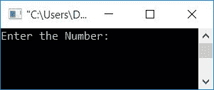
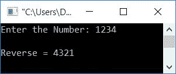

# C 程序：反转一个数

> 原文：<https://codescracker.com/c/program/c-program-reverse-numbers.htm>

在本文中，您将通过以下方式学习并获得用户在运行时反转给定数字的代码:

*   使用[循环](/c/c-for-loop.htm)反转一个数字
*   使用[反转一个数字，同时循环](/c/c-while-loop.htm)
*   不使用[循环](/c/c-loops.htm)反转一个数字
*   使用用户定义的[函数](/c/c-functions.htm)反转一个数字
*   使用[数组](/c/c-arrays.htm)反转一个数字

### 如何计算一个数的倒数？

反转一个数字的最基本的事情是:

*   逐一找出该数的余数，直到该数等于 0
*   在寻找余数时，将新值初始化为一个变量，该变量保存该数的倒数
*   每次将新值初始化为 *rev* 变量(保存给定数值的倒数)时， 不要忘记将 10 乘以其先前的值，并将余数相加

例如，假设用户输入了一个数字，比如说 **1234** (初始化为 **num** 变量)。接下来是步骤:

*   最初 **rev=0** (它保存给定数字的倒数)
*   用 <u>rem=num%10</u> 或 <u>rem=1234%10</u> 或 **rem=4** 求给定数字的余数
*   将新值初始化为 **rev** 变量
*   即 <u>rev=(rev*10)+rem</u> 或 <u>rev=(0*10)+rem</u> 或 <u>rev=0+4</u> 或 **rev=4**
*   现在用 10 除这个数
*   即 <u>num=num/10</u> 或 <u>num=1234/10</u> 或 **num=123**
*   检查这个数字，看它是否等于零
*   如果不等于零，则使用新的 *rev* 和 *num* 值继续运行
*   即 <u>rem=num%10</u> 或 <u>rem=123%10</u> 或 **rem=3**
*   并且 <u>rev=(rev*10)+rem</u> 或 <u>rem=(4*10)+3</u> 或 **rem=43**
*   现在 <u>num=num/10</u> 或者 <u>num=123/10</u> 或者 **num=12**
*   因为 *num* 再次不等于 0，那么再次继续操作
*   这样，我们将有一个 *rev* 变量来保存给定数字(1234)的倒数
*   即 **rev=4321**

现在让我们继续讨论倒数的程序。

## 使用 for 循环反转数字

该程序是使用循环的*创建的。问题是，*用 C 写一个程序，用 for 循环*反算一个数字 。以下是这个问题的答案:*

```
#include<stdio.h>
#include<conio.h>
int main()
{
    int num, rev, rem;
    printf("Enter the Number: ");
    scanf("%d", &num);
    for(rev=0; num!=0; num=num/10)
    {
        rem = num%10;
        rev = (rev*10)+rem;
    }
    printf("\nReverse = %d", rev);
    getch();
    return 0;
}
```

这个程序是在 *Code::Blocks* IDE 下构建和运行的。下面是它的运行示例:



现在输入任意数字，如 **1234** 并按`ENTER`键，输出如下:



上述程序的预演如下:

*   当用户输入一个数字，比如说 **1234** ，它就会被初始化为 **num**
*   也就是 **num=1234**
*   现在在循环的*中，0 被初始化为 *rev* 。那就是 **rev=0** 。并且评估循环的 的条件，即检查 *num* 的值是否不等于 0*
*   该条件评估为真，因为 *num* 的值不等于 0
*   程序流程进入循环，并且 *num%10* 或 *1234%10* 或 *4* 被初始化为 rem。 和 *rev*10+rem* 或 *4* 被初始化为 *rev*
*   现在 **rev=4**
*   执行完所有语句后，程序流转到循环的更新部分(即第三条语句),并且 *num* 除以 10
*   现在 **num=123**
*   然后再次评估循环的条件，即检查 **num** 的值是否不等于 0
*   条件再次评估为真，程序流程进入循环，并使用新值 *num* 和 *rev* 处理相同的步骤
*   继续操作，直到 *num* 的值等于 0
*   在退出循环后，我们将有一个名为 *rev* 的[变量](/c/c-variables.htm)，它由 保存给定数的倒数
*   在输出上打印 *rev* 的值

## 使用 while 循环反转数字

现在让我们使用 *while* 循环创建相同的程序。

```
#include<stdio.h>
#include<conio.h>
int main()
{
    int num, rev=0, rem;
    printf("Enter the Number: ");
    scanf("%d", &num);
    while(num!=0)
    {
        rem = num%10;
        rev = (rev*10)+rem;
        num = num/10;
    }
    printf("\nReverse = %d", rev);
    getch();
    return 0;
}
```

与循环的*不同，在 *while 循环*中，没有任何初始化和更新部分。它只包含 条件检查语句。因此，在 执行 *while 循环*之前，我们已经将变量 **rev** 的值初始化为 0。也就是说，初始化部分(与 while 循环相关或必须在 while 循环中使用)必须在循环之前 完成，更新部分必须在循环体内部使用。其余内容与上述程序中给出的 相同，使用*作为循环**

## 不使用循环反转一个数

现在让我们创建一个相同目的的程序，但是不使用任何类型的循环。

```
#include<stdio.h>
#include<conio.h>
int main()
{
    int num, rev=0, rem;
    printf("Enter the Number: ");
    scanf("%d", &num);
    CODESCRACKER:rem = num%10;
    rev = (rev*10)+rem;
    num = num/10;
    if(num!=0)
        goto CODESCRACKER;
    printf("\nReverse = %d", rev);
    getch();
    return 0;
}
```

这个程序产生与前一个程序相同的输出。

这里我们使用了 **goto** 关键字。要使用这个关键字，我们必须创建一个标签。也就是说，如果标签的名称 是 *CODESCRACKER* ，那么我们可以使用 *goto* 关键字发送程序控制流，从给出名为 *CODESCRACKER* 的标签的地方开始 。因此，名为 **CODESCRACKER** 的标签在 *goto* 语句之前创建。它的工作原理如下:

*   当 if 语句的条件[评估为真时](/c/c-if-statement.htm)
*   然后执行语句
    `goto CODESCRACKER;`
    。这告诉编译器转到名为 **CODESCRACKER** 的标签(或者重新开始)
*   因此，程序流程在标签**打码器**之后开始
*   也就是说，再次执行语句
    `rem = num%10;`
    ，在此之后，执行另外两个语句(在语句*之前)*
*   在执行完所有三个出现在如果块的*和标签*代码检查器*之间的语句后， 再次检查如果块*的*的状态，如果其再次评估为真，则程序流程再次 转到关键字 **goto** 后提供名称的标签*
*   如果块评估为假，程序流程继续进行到标签，直到**的条件**

**注-***goto*语句用于在程序中的任何地方发送程序控制流。

## 使用用户定义的函数反转数字

问题是，*用 c 写一个程序，用自定义函数 findRev()* 对一个给定的数求逆。以下是它的答案:

```
#include<stdio.h>
#include<conio.h>
int findRev(int);
int main()
{
    int num, rev;
    printf("Enter the Number: ");
    scanf("%d", &num);
    rev = findRev(num);
    printf("\nReverse = %d", rev);
    getch();
    return 0;
}
int findRev(int num)
{
    int rev=0, rem;
    while(num!=0)
    {
        rem = num%10;
        rev = (rev*10)+rem;
        num = num/10;
    }
    return rev;
}
```

它也将产生与本文给出的第一个程序相同的输出。

## 使用数组反转一个数

这是最后一个反数的程序。它使用 array 来完成以前的程序所完成的任务。

```
#include<stdio.h>
#include<conio.h>
int main()
{
    int num, rem, arr[10], i=0, count=0;
    printf("Enter the Number: ");
    scanf("%d", &num);
    while(num!=0)
    {
        rem = num%10;
        arr[i] = rem;
        num = num/10;
        i++;
        count++;
    }
    printf("\nReverse = ");
    for(i=0; i<count; i++)
        printf("%d", arr[i]);
    getch();
    return 0;
}
```

#### 其他语言的相同程序

*   [C++反转一个数字](/cpp/program/cpp-program-reverse-numbers.htm)
*   [Java 反转一号](/java/program/java-program-reverse-numbers.htm)

[C 在线测试](/exam/showtest.php?subid=2)

* * *

* * *