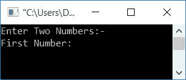
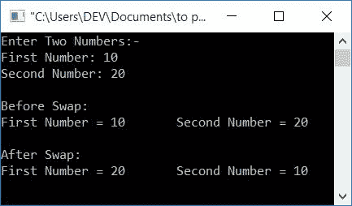

# 交换两个数的 c 程序

> 原文：<https://codescracker.com/c/program/c-program-swap-two-numbers.htm>

在本文中，您将学习并获得使用以下方法在 C 语言中交换两个数的代码:

*   使用第三个变量
*   不使用第三个变量
*   使用函数和指针

### 什么是两个数的交换？

交换两个数字意味着，第一个数字成为第二个，第二个数字成为第一个。例如，如果用户输入任意两个数字，比如 10 和 20。而且我们假设两个变量说 **num1** 和 **num2** 持有 这两个数。即 *num1=10* 和 *num2=20* 。然后在交换之后，它将像 *num1=20* 和 *num2=10*

## 使用第三个变量交换两个数

使用第三个[变量](/c/c-variables.htm)，C 语言中两个数的交换变得很容易。也就是说，这个 程序使用了一个名为 *temp* 的变量，这个变量在运行时由 用户执行给定两个数的交换操作时很有帮助。让我们先来看看这个节目

```
#include<stdio.h>
#include<conio.h>
int main()
{
    int num1, num2, temp;
    printf("Enter Two Numbers:-\n");
    printf("First Number: ");
    scanf("%d", &num1);
    printf("Second Number: ");
    scanf("%d", &num2);
    printf("\nBefore Swap:\n");
    printf("First Number = %d\tSecond Number = %d", num1, num2);
    temp = num1;
    num1 = num2;
    num2 = temp;
    printf("\n\nAfter Swap:\n");
    printf("First Number = %d\tSecond Number = %d", num1, num2);
    getch();
    return 0;
}
```

这个程序是在 *Code::Blocks* IDE 下构建和运行的。下面是它的运行示例:



现在输入第一个数字，如 *10* ，然后输入第二个数字，如 *20* 。按`ENTER`键查看以下输出:



交换两个数的主要代码块是:

```
temp = num1;
num1 = num2;
num2 = temp;
```

例如，如果用户输入 10 作为第一个数字，那么 10 被初始化为 *num1* 。如果用户输入 20 作为第二个数，那么 20 被初始化为 *num2* 。即 **num1=10** 和 **num2=20** 。

现在，在执行该语句后:

```
temp = num1;
```

*num1* 的值(即 10)被初始化为*温度*。因此， **temp=10** 。在执行该语句后:

```
num1 = num2;
```

*num2* 的值(即 20)被初始化为 *num1* 。因此， **num1=20** 。在执行该语句后，再次执行:

```
num2 = temp;
```

*temp* 的值(即 10)被初始化为 *num2* 。因此， **num2=10** 。这样， 现在变量 *num1* 保存了最初 *num2* 拥有的值。而变量 *num2* 保存 最初 *num1* 具有的值。

**注意-** 在初始化 *num2* 的值之前，不要忘记将 *num1* 的值初始化为任何第三个变量。

## 不使用第三个变量交换两个数

与前一个程序不同，这个程序不会在<u>中使用任何类型的额外(第三)变量，既不会直接</u>到<u>也不会间接</u>:

```
#include<stdio.h>
#include<conio.h>
int main()
{
    int num1, num2;
    printf("Enter Two Numbers:-\n");
    printf("First Number: ");
    scanf("%d", &num1);
    printf("Second Number: ");
    scanf("%d", &num2);
    printf("\nBefore Swap:\n");
    printf("First Number = %d\tSecond Number = %d", num1, num2);
    num1 = num1+num2;
    num2 = num1-num2;
    num1 = num1-num2;
    printf("\n\nAfter Swap:\n");
    printf("First Number = %d\tSecond Number = %d", num1, num2);
    getch();
    return 0;
}
```

这个程序将产生与前一个程序相同的输出。下面的代码块负责给定的两个数的交换。这里我使用了加减法运算:

```
num1 = num1+num2;
num2 = num1-num2;
num1 = num1-num2;
```

例如，让我们假设 10 和 20 是用户输入的两个数字。因此。 **num1=10** 和 **num2=20** 。现在，在执行以下语句后:

```
num1 = num1+num2;
```

来自 *num1+num2* 的值(将是 10+20)被初始化为 *num1* 。因此， **num1=30** 。 再次执行以下语句后:

```
num2 = num1-num2;
```

来自 *num1-num2* 的值(将是 30-20)被初始化为 *num2* 。因此， **num2=10** 。 执行下面给出的语句后再次执行:

```
num1 = num1-num2;
```

来自 *num1-num2* 的值(将是 30-10)被初始化为 *num1* 。因此， **num1=20** 。现在第一个变量的值变成第二个，第二个变量的值变成第一个。

### 使用+和-进行交换的概念

如果有两个数字。假设第一个数字变成总数。然后如果你从总数中减去第二个数，你会得到第一个数。因此，它被初始化为 *num2* (现在保存了 *num1* 的初始值)。同样，如果你从总数中减去第二个数的新值(第一个数的初始值)，你将得到第二个数的初始值。 因此它被初始化为 *num1* (现在保存了 *num2* 的初始值)。

## 使用函数和指针交换两个数

这是最后一个交换两个数的程序。这个程序使用一个名为 **swapFun()** 的用户自定义函数来交换用户给定的两个数字:

```
#include<stdio.h>
#include<conio.h>
void swapFun(int *, int *);
int main()
{
    int num1, num2;
    printf("Enter Two Numbers:-\n");
    printf("First Number: ");
    scanf("%d", &num1);
    printf("Second Number: ");
    scanf("%d", &num2);
    printf("\nBefore Swap:\n");
    printf("First Number = %d\tSecond Number = %d", num1, num2);
    swapFun(&num1, &num2);
    printf("\n\nAfter Swap:\n");
    printf("First Number = %d\tSecond Number = %d", num1, num2);
    getch();
    return 0;
}
void swapFun(int *num1, int *num2)
{
    int temp;
    temp = *num1;
    *num1 = *num2;
    *num2 = temp;
}
```

这个程序也产生与前两个程序相同的输出。

在上述程序中， **&** 被称为操作符的<u>地址。而 ***** 在</u>操作器处被称为 <u>值。因此，使用操作符的*地址，我们将两个变量 的地址传递给名为 *swapFun()* 的函数，比如 *num1* 和 *num2* (保存用户输入的两个数字)。*</u>

在函数 *swapFun()* 中，我们使用了操作符处的*值来获取两个变量地址处的可用值 。这两个变量在函数内部交换。因为我们使用了两个变量的 地址，所以在函数 *swapFun()* 中完成的操作会在整个程序中影响 变量的值。也就是说，当我们在 *main()* 函数中打印两个变量的值时(在调用函数 *swapFun()* 之后)，它的值被交换。*

要详细了解[指针](/c/c-pointers.htm)或[功能](/c/c-functions.htm)，那么 你可以按照单独的教程来进行。

#### 其他语言的相同程序

*   [C++交换两个数](/cpp/program/cpp-program-swap-two-numbers.htm)
*   [Java 交换两个数](/java/program/java-program-swap-two-numbers.htm)
*   [Python 互换两个数](/python/program/python-program-swap-two-numbers.htm)

[C 在线测试](/exam/showtest.php?subid=2)

* * *

* * *