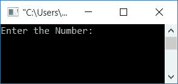
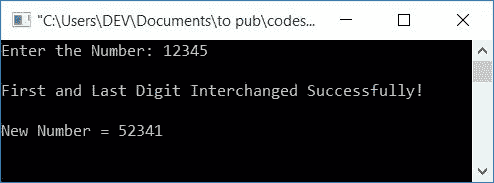
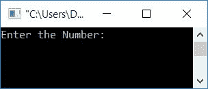
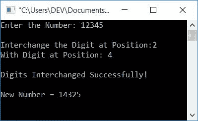
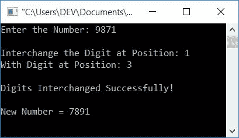

# C 程序：交换数字

> 原文：<https://codescracker.com/c/program/c-program-interchange-numbers.htm>

在这篇文章中，您将学习并获得关于在运行时交换用户给定的数字的代码。数字的互换是通过以下方式创建的:

*   交换数字的第一位和最后一位
*   使用[数组](/c/c-arrays.htm)交换数字的第一位和最后一位
*   交换一个数的任意两位数(由用户指定其位置)

## 交换数字的第一位和最后一位

让我们先用 C 语言编写一个程序，交换一个给定数字的第一位和最后一位。

```
#include<stdio.h>
#include<conio.h>
int main()
{
    int num, rem, temp, rev=0, noOfDigit=0, noOfDigitTemp, revNum, remTemp;
    printf("Enter the Number: ");
    scanf("%d", &num);
    temp = num;
    while(temp>0)
    {
        temp = temp/10;
        noOfDigit++;
    }
    if(noOfDigit<2)
    {
        printf("\nIt's a single-digit number.");
        printf("\nTo interchange the digit, enter a two or more digit number");
    }
    else if(noOfDigit==2)
    {
        temp = num;
        while(temp>0)
        {
            rem = temp%10;
            rev = (rev*10)+rem;
            temp = temp/10;
        }
        printf("\nFirst and Last Digit Interchanged Successfully!");
        printf("\n\nNew Number = %d", rev);
    }
    else
    {
        temp = num;
        while(temp>0)
        {
            rem = temp%10;
            rev = (rev*10)+rem;
            temp = temp/10;
        }
        revNum = rev;
        rev = 0;
        temp = num;
        noOfDigitTemp = noOfDigit;
        while(temp>0)
        {
            remTemp = revNum%10;
            if(noOfDigitTemp==noOfDigit)
            {
                rem = temp%10;
                rev = (rev*10)+rem;
            }
            else if(noOfDigitTemp==1)
            {
                rem = temp%10;
                rev = (rev*10)+rem;
            }
            else
            {
                rev = (rev*10)+remTemp;
            }
            temp = temp/10;
            revNum = revNum/10;
            noOfDigitTemp--;
        }
        printf("\nFirst and Last Digit Interchanged Successfully!");
        printf("\n\nNew Number = %d", rev);
    }
    getch();
    return 0;
}
```

这个程序是在 **Code::Blocks** IDE 下构建和运行的。下面是它的运行示例:



现在提供任意数字，比如说 **12345** ，然后按`ENTER`键查看以下输出:



以下代码块:

```
while(temp>0)
{
    temp = temp/10;
    noOfDigit++;
}
```

用于计算给定数字的总位数。例如，如果用户输入**12345**T10】作为数字，那么总位数是 **5** 。如果总位数小于 2，则程序将 打印一条信息，如:一位数不能互换。即要互换，必须是两位数 或两位数以上的数。如果给定的数字是两位数，那么只需 [反转数字](/c/program/c-program-reverse-numbers.htm)。比如说，如果数字是**12**T14 那么反转后就变成 **21** 。看，它的数字(第一个和最后一个)互换了。

如果给定数目的可用位数超过 2，则程序流程进入 **else** 块。 在那里，主要的逻辑是:

*   假设用户已经输入了 **12345** 作为数字输入
*   将其反转并将其反转存储在 **rev** [变量](/c/c-variables.htm)中，该变量将保存 **54321**
*   现在我们只需反转 **1** (第一位数字)和 **5** (最后一位数字)
*   如你所见， **rev** 保存了 **54321** ，其中第一个和最后一个数字被反转，但是中间的其余三个数字 也被反转
*   因此，对原始数字的第一个和最后一个数字进行反向操作，对其余数字，对反向的数字<u>进行反向操作。</u>
*   即原号码为 **12345** ，反号码为 **54321** 。 对第一个和最后一个数字(原数)进行反运算，对其余数字(反数)进行反运算，得到 **52341**

带有用户输入 **12345** 的先前程序的预演如下:

*   最初， *num=12345* ， *noOfDigit=5* ， *rev=0*
*   在 *else* 块内
*   *temp=num* 或 *temp=12345*
*   使用 [`while`循环](/c/c-while-loop.htm)，数字反转并存储在 *rev* 中
*   因此， *rev=54321*
*   *revNum=rev* 或 *revNum=54321* ， *rev=0* ， *temp=num* 或 *temp=12345* ， *noOfDigitTemp = noOfDigit*或 *noOfDigitTemp=5*
*   现在程序流进入 *`while`循环*
*   条件*温度> 0* 或 *12345 > 0* 评估为真
*   程序流程进入[循环](/c/c-loops.htm)
*   *remTemp=revNum%10* 或 *remTemp=54321%10* 或 *remTemp=1*
*   如果块评估为真，则*的条件 *noOfDigitTemp==noOfDigit* 或 *5==5**
*   程序流程进入 [if 块](/c/c-if-statement.htm)
*   *rem=temp%10* 或 *rem=12345%10* 或 *rem=5*
*   *rev=(rev*10)+rem* 或 *rev=(0*10)+5* 或 *rev=5*
*   然后 *temp=temp/10* 或者 *temp=12345/10* 或者 *temp=1234*
*   *revNum=revNum/10* 或 *revNum=54321/10* 或 *revNum=5432*
*   *noodigittemp-*表示从*noodigittemp*的前一个值中减去 1。因此 *noOfDigitTemp=4*
*   当循环时，程序流程再次进入*状态*
*   即*温度> 0* 或 *1234 > 0* 评估为真，因此程序流程再次进入循环
*   *remTemp=revNum%10* 或 *remTemp=5432%10* 或 *remTemp=2*
*   因为 *noOfDigitTemp* 等于 4，而 4 不等于 noOfDigit (5)和 1。因此程序流程进入 *else* 块
*   并且 *rev=(rev*10)+remTemp* 或 *rev=(5*10)+2* 或 *rev=52*
*   然后 *temp=temp/10* 或者 *temp=1234/10* 或者 *temp=123*
*   *revNum=revNum/10* 或 *revNum=5432/10* 或 *revNum=543*
*   *noodigittemp-*表示从*noodigittemp*的前一个值中减去 1。因此 *noOfDigitTemp=3*
*   现在程序流程再次转到*的状态，同时*循环
*   继续同样的过程，这里是每个变量的一个接一个的更新值
*   *remTemp=revNum%10* 或 *remTemp=543%10* 或 *remTemp=3*
*   在*中再次阻塞*， *rev=(rev*10)+remTemp* 或 *rev=(52*10)+3* 或 *rev=523*
*   然后 *temp=temp/10* 或者 *temp=123/10* 或者 *temp=12*
*   *revNum=revNum/10* 或 *revNum=543/10* 或 *revNum=54*
*   *需要更多=2*
*   同样， *remTemp=revNum%10* 或 *remTemp=54%10* 或 *remTemp=4*
*   在*中再一次阻塞*， *rev=(rev*10)+remTemp* 或 *rev=(523*10)+4* 或 *rev=5234*
*   然后 *temp=temp/10* 或者 *temp=12/10* 或者 *temp=1*
*   *revNum=revNum/10* 或 *revNum=54/10* 或 *revNum=5*
*   *需要更多=1*
*   同样， *remTemp=revNum%10* 或 *remTemp=5%10* 或 *remTemp=5*
*   因为 *noOfDigitTemp* (保存 1)等于 1。因此程序流程进入 *if-else* 块
*   *雷姆=温度%10* 或*雷姆= 1% 10*T4】雷姆=1
*   *rev=(rev*10)+rem* 或 *rev=(5234*10)+1* 或 *rev=52341*
*   然后 *temp=temp/10* 或者 *temp=1/10* 或者 *temp=0*
*   *revNum=revNum/10* 或 *revNum=5/10* 或 *revNum=0*
*   *需要更多=0*
*   这一次当循环、*温度> 0* 或 *0 > 0* 的条件被评估为假时， 因此程序流程退出循环并打印新的数字作为输出

**注意-** 以前的程序有一个限制，如果用户输入<u>一个以 0 开始或结束的数字</u>。所以要克服这个 问题。我们已经使用 array 创建了另一个程序。这将是交换数字的完整解决方案。

### 使用数组

这是另一个程序，做同样的工作，但使用数组。使用数组，程序变得更容易创建和理解。先把数字倒过来就行了。并一个接一个地将所有的数字初始化为数组。然后将第 **0 <sup>第</sup>T3】个索引处的数字与最后一个索引处的数字互换。需要反转一个数，因为要得到 位，一个接一个地使用 **rem=num%10** ，我们将得到一个数的最后一位。但是在反转数字后， 我们会得到反转数字的最后一位(但是是原数字的第一位)。**

```
#include<stdio.h>
#include<conio.h>
int main()
{
    int num, rem, temp, rev=0, noOfDigit=0, arr[10], i;
    printf("Enter the Number: ");
    scanf("%d", &num);
    temp = num;
    while(temp>0)
    {
        temp = temp/10;
        noOfDigit++;
    }
    temp = num;
    while(temp>0)
    {
        rem = temp%10;
        rev = (rev*10)+rem;
        temp = temp/10;
    }
    for(i=0; i<noOfDigit; i++)
    {
        rem = rev%10;
        arr[i] = rem;
        rev = rev/10;
    }
    if(noOfDigit==1)
    {
        printf("\nIt's a single-digit number.");
        printf("\nTo interchange the digit, enter a two or more digit number");
    }
    else if(noOfDigit==2)
    {
        temp = arr[0];
        arr[0] = arr[1];
        arr[1] = temp;
        printf("\nFirst and Last Digit Interchanged Successfully!");
        printf("\n\nNew Number = %d%d", arr[0], arr[1]);
    }
    else
    {
        i=0;
        temp = arr[i];
        arr[i] = arr[noOfDigit-1];
        arr[noOfDigit-1] = temp;
        printf("\nFirst and Last Digit Interchanged Successfully!");
        printf("\n\nNew Number = ");
        for(i=0; i<noOfDigit; i++)
            printf("%d", arr[i]);
    }
    getch();
    return 0;
}
```

它将产生与前一个程序相同的输出。

## 互换一个数的任意两位数

创建这个程序是为了交换出现在任何位置的一个数的两位数。用户输入的数字和位置。

```
#include<stdio.h>
#include<conio.h>
int main()
{
    int num, posFirst, posSecond;
    int rem, temp, rev=0, noOfDigit=0, arr[10], i;
    printf("Enter the Number: ");
    scanf("%d", &num);
    temp = num;
    while(temp>0)
    {
        temp = temp/10;
        noOfDigit++;
    }
    if(noOfDigit==1)
    {
        printf("\nIt's a single-digit number.");
        printf("\nTo interchange the digit, enter a two or more digit number");
        getch();
        return 0;
    }
    else
    {
        printf("\nInterchange the Digit at Position: ");
        scanf("%d", &posFirst);
        printf("With Digit at Position: ");
        scanf("%d", &posSecond);
    }
    if(posFirst>noOfDigit || posSecond>noOfDigit)
        printf("\nInvalid Position!");
    else
    {
        temp = num;
        while(temp>0)
        {
            rem = temp%10;
            rev = (rev*10)+rem;
            temp = temp/10;
        }
        for(i=0; i<noOfDigit; i++)
        {
            rem = rev%10;
            arr[i] = rem;
            rev = rev/10;
        }
        i=0;
        temp = arr[posFirst-1];
        arr[posFirst-1] = arr[posSecond-1];
        arr[posSecond-1] = temp;
        printf("\nDigits Interchanged Successfully!");
        printf("\n\nNew Number = ");
        for(i=0; i<noOfDigit; i++)
            printf("%d", arr[i]);
    }
    getch();
    return 0;
}
```

下面是它的运行示例:



现在提供任意数字，比如说 **12345** 。因为它是一个不止一位的数字。因此程序 进一步要求输入要交换或互换的数字的位置。例如，如果用户想将第二个位置的数字与第四个位置的数字互换 。然后程序将数字 2 与 数字 4 互换，新数字变成 **14325** ，如下图所示:



下面是另一个运行示例，输入编号为 **9871** ，第一个位置的数字(即 9)与第三个位置的数字(即 7)互换 :



[C 在线测试](/exam/showtest.php?subid=2)

* * *

* * *