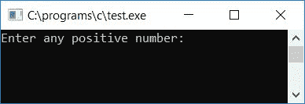
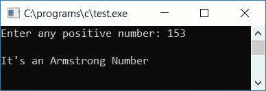
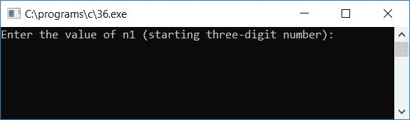
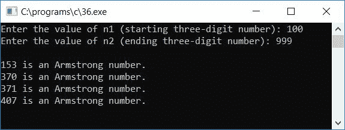

# C 程序：检查阿姆斯特朗数

> 原文：<https://codescracker.com/c/program/c-program-find-armstrong-number.htm>

在本教程中，您将学习并获得关于检查用户(在运行时)给定的数字是否是 Armstrong 数字的代码。但是在开始之前。让我们先来了解一个阿姆斯特朗数。

### 阿姆斯特朗号怎么查？

要使一个数成为阿姆斯特朗数，它的所有位数的立方之和必须等于该数本身。例如，153 是一个阿姆斯特朗数字。因为

*   153 = (1*1*1) + (5*5*5) + (3*3*3)

你可以清楚地看到，所有数字(1、5 和 3)的立方之和等于数字本身。所以这是一个阿姆斯特朗数字。但是数字 26 并不是阿姆斯特朗的数字。因为

*   26 ! = (2*2*2) + (6*6*6)

现在让我们继续，用 C 程序实现它。

## 在 C 中检查阿姆斯特朗与否

问题是，**用 C 写个程序，检查给定的数是不是阿姆斯特朗数**。这个问题的答案是:

```
#include<stdio.h>
#include<conio.h>
int main()
{
    int n, nu, num=0, rem;
    printf("Enter any positive number: ");
    scanf("%d", &n);
    nu=n;
    while(nu!=0)
    {
        rem = nu%10;
        num = num + (rem*rem*rem);
        nu = nu/10;
    }
    if(num==n)
        printf("\nIt's an Armstrong Number");
    else
        printf("\nIt's not an Armstrong Number");
    getch();
    return 0;
}
```

上述程序是在 **Code::Blocks** IDE 下编写的，因此在成功构建和运行之后，您将在输出屏幕上看到以下输出:



现在提供任意正数，比如说 **153** 并按回车键查看输出，该输出将显示是否是一个 阿姆斯特朗数，如下图所示:



#### 程序解释

*   从用户处获得任意正数作为输入，比如 **153**
*   现在将数字初始化为另一个[变量](/c/c-variables.htm)比如说 **nu** 进行运算
*   包括一个 while 循环来处理给定数字的每一位，比如说 **153**
*   我们必须一个接一个地找出这个数的余数，我们得到的第一个余数是 3
*   将 3 初始化为 **rem** 变量，计算 **rem** 的立方，将其与变量本身求和后，将其初始化为 **num** 变量
*   我们已经在程序开始时用 0 初始化了 **num** 变量
*   现在用 10 除数字 **nu**
*   并检查 **nu** 内的值是否不等于 0
*   如果条件为真，则再次进入 [while 循环](/c/c-while-loop.htm)
*   并且进行相同的操作，直到 **nu** 保持值 0
*   因此在 while 循环的第一次运行中， **rem** 持有 **3** ，**num**T22】持有 **0 + 3*3*3** 或 **27** ，而 **nu** 持有 **15** 。而在 while 循环第二次运行时， rem 持有 5，num 持有 **27 + 5*5*5** 或 **152** ，nu 持有 1。并且在第三次运行时， rem 持有 1，num 持有 **152 + 1*1*1** 或 **153** ，nu 持有 0
*   最后检查 **num** 的值是否等于给定的数(变量 **n** 中的值)
*   如果相等，则该数是阿姆斯特朗数，否则该数不是阿姆斯特朗数

这是另一个 C 语言程序，打印任意两个给定的三位数之间的所有阿姆斯特朗数。要生成或打印阿姆斯特朗号码而不考虑数字，请参考[生成阿姆斯特朗号码](/c/program/c-program-generate-armstrong-number.htm)

```
#include<stdio.h>
#include<conio.h>
int main()
{
    int n1, n2, i, temp, rem, sum, prod;
    printf("Enter the value of n1 (starting three-digit number): ");
    scanf("%d", &n1);
    printf("Enter the value of n2 (ending three-digit number): ");
    scanf("%d", &n2);
    printf("\n");
    for(i=n1; i<=n2; i++)
    {
        sum = 0;
        temp = i;
        while(temp>0)
        {
            rem = temp%10;
            sum = sum + (rem*rem*rem);
            temp = temp/10;
        }
        if(sum == i)
            printf("%d is an Armstrong number.\n", i);
    }
    getch();
    return 0;
}
```

以下是运行示例:



现在提供任意一个三位数作为起点，比如说 **100** 和另一个三位数作为终点 比如说 **999** 来打印这两个数字之间的所有阿姆斯壮数字。下面是示例运行的第二个快照:



该程序中使用的逻辑与上一个程序中使用的逻辑几乎相同，除了我们在这里使用**代替**循环 ，以 **n1** (起始编号)开始，以 **n2** (结束编号)结束。在这两个数字之间， 我们在 for 循环中使用了相同的概念，即如果发现这个数字是 Armstrong 数字，那么将它打印出来 ，否则转到下一个数字来检查 Armstrong。

检查前，将 0 初始化为 **sum** ，将 **i** 初始化为操作的临时变量。这里我们使用了**sum**T6】变量来代替 num 变量。你可以选择不同的东西，这取决于你。

#### 其他语言的相同程序

*   [C++ 检查阿姆斯特朗号](/cpp/program/cpp-program-find-armstrong-number.htm)
*   [Java 检查阿姆斯特朗号](/java/program/java-program-find-armstrong-number.htm)
*   [Python 检查阿姆斯特朗号](/python/program/python-program-check-armstrong.htm)

[C 在线测试](/exam/showtest.php?subid=2)

* * *

* * *