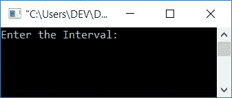
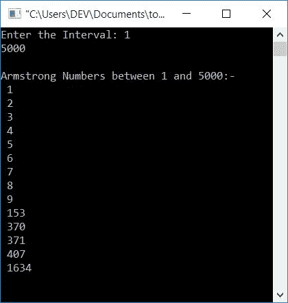

# 生成阿姆斯特朗数的 c 程序

> 原文：<https://codescracker.com/c/program/c-program-generate-armstrong-number.htm>

在本文中，您将学习并获得在使用和不使用用户定义函数的情况下打印给定范围内的 Armstrong 数字的代码。但是在开始这个程序之前，让我们先了解一下。

### 阿姆斯特朗号是什么？

阿姆斯壮数是一个等于其自身数字之和<u>的数，其中<u>的每一个数字都是其数字位数</u>的 次幂。例如， **153** 是一个阿姆斯壮数字，因为:</u>

```
153 = 13+53+33
    = 1+125+27
    = 153
```

由于 **153** 是一个 3 位数，因此每个数字都是 3 的幂。现在让我们继续，用 C 程序实现它。

## 在给定范围内生成阿姆斯特朗数

这个程序在运行时打印用户提供的范围内的所有阿姆斯特朗数。

```
#include<stdio.h>
#include<conio.h>
int main()
{
    int start, end, temp, noOfDigit, num, res=0, rem, pow, i;
    printf("Enter the Interval: ");
    scanf("%d%d", &start, &end);
    printf("\nArmstrong Numbers between %d and %d:-\n", start, end);
    while(start<=end)
    {
        temp = start;
        noOfDigit=0;
        while(temp>0)
        {
            temp = temp/10;
            noOfDigit++;
        }
        num = start;
        while(num>0)
        {
            rem = num%10;
            pow = 1;
            i = 0;
            while(i<noOfDigit)
            {
                pow = pow*rem;
                i++;
            }
            res = res + pow;
            num = num/10;
        }
        if(res==start)
            printf(" %d\n", res);
        start++;
        res = 0;
    }
    getch();
    return 0;
}
```

这个程序是在 **Code::Blocks** IDE 下构建和运行的。下面是它的运行示例:



现在供给和两个数字作为间隔说出 **1** 和 **5000** 来打印这两个 之间的所有阿姆斯特朗数字。也就是说，下面给出的快照显示了从 1 到 5000 的所有 Armstrong 数字:



**注-** 每个一位数都是阿姆斯特朗数。因为它是一个 1 位数，所以它的幂 将是 1(如上面给出的定义中所定义的)，并且任何数的 1 次幂都等于该数本身。

所以， **1，2，3，4，5，6，7，8，9，153，370，371，407，1634** 是 1 到 5000 之间的阿姆斯特朗数。因为，

*   1 = 1 <sup>1</sup> ( <u>位数为 1 的幂，为 1 位数</u>)
*   2 = 2 <sup>1</sup>
*   3 = 3 <sup>1</sup>
*   4 = 4 <sup>1</sup>
*   5 = 5 <sup>1</sup>
*   6 = 6 <sup>1</sup>
*   7 = 7 <sup>1</sup>
*   8 = 8 <sup>1</sup>
*   9 = 9 <sup>1</sup>
*   153 = 1<sup>3</sup>+5<sup>3</sup>+3<sup>3</sup>(<u>位数为 3 的幂，为 3 位数</u>)
*   370 = 3<sup>3</sup>+7<sup>3</sup>+0<sup>3</sup>
*   371 = 3<sup>3</sup>+7<sup>3</sup>+1<sup>3</sup>
*   407 = 4<sup>3</sup>+0<sup>3</sup>+7<sup>3</sup>
*   1634 = 1<sup>4</sup>+6<sup>4</sup>+3<sup>4</sup>+4<sup>4</sup>(<u>位数为 4 的幂，为 4 位数</u>)

下面的代码块

```
temp = start;
noOfDigit=0;
while(temp>0)
{
    temp = temp/10;
    noOfDigit++;
}
```

用于查找当前数字的数字的*号。也就是说， **start** 变量的值被初始化为 **temp** ，并且使用这个[变量](/c/c-variables.htm)，这个代码块发现这个数字有多少位。*

这是另一段代码，

```
pow = 1;
i = 0;
while(i<noOfDigit)
{
    pow = pow*rem;
    i++;
}
```

其用于找到*数字的幂*值。例如，如果当前数字是 **3** ，并且该数字是一个 3 位数，那么这段代码将找到 **3 <sup>3</sup>** 的值。 现在让我们使用用户定义的[函数](/c/c-functions.htm)创建一个相同用途的程序。

### 使用用户定义的函数

这个程序很难理解，因为它是使用用户定义的函数创建的。也就是说，这两个代码块需要运行一次以上，在函数中被移位，这两个函数的名称是 **findNoOfDigit(int)** (查找数字的个数)和 **pow(int rem，int noOfDigit)** (查找数字的幂的值)。寻找位数意味着，如果一个数是 370，那么它将返回 3。因为是 一个 3 位数。而寻找数字的幂值意味着，如果一个数字是 3(来自一个 3 位数)， 那么**3<sup>3</sup>T7】等于 27，因此函数返回 27。**

```
#include<stdio.h>
#include<conio.h>
int findNoOfDigit(int);
int pow(int, int);
void generateArmNos(int, int);
int main()
{
    int start, end;
    printf("Enter the Interval: ");
    scanf("%d%d", &start, &end);
    printf("\nArmstrong Numbers between %d and %d:-\n", start, end);
    generateArmNos(start, end);
    getch();
    return 0;
}
void generateArmNos(int start, int end)
{
    int noOfDigit, num, digToPowVal, i, rem, res=0;
    while(start<=end)
    {
        noOfDigit = findNoOfDigit(start);
        num = start;
        while(num>0)
        {
            rem = num%10;
            digToPowVal = pow(rem, noOfDigit);
            res = res+digToPowVal;
            num = num/10;
        }
        if(res==start)
            printf(" %d\n", res);
        start++;
        res = 0;
    }
}
int findNoOfDigit(int temp)
{
    int noOfDigit=0;
    while(temp>0)
    {
        temp = temp/10;
        noOfDigit++;
    }
    return noOfDigit;
}
int pow(int rem, int noOfDigit)
{
    int digToPowVal = 1, i=0;
    while(i<noOfDigit)
    {
        digToPowVal = digToPowVal*rem;
        i++;
    }
    return digToPowVal;
}
```

这个程序产生了与前一个程序相同的输出。

#### 其他语言的相同程序

*   [C++生成阿姆斯特朗数](/cpp/program/cpp-program-generate-armstrong-number.htm)
*   [Java 生成阿姆斯特朗数字](/java/program/java-program-generate-armstrong-number.htm)
*   [Python 生成阿姆斯特朗数字](/python/program/python-program-generate-armstrong-numbers.htm)

[C 在线测试](/exam/showtest.php?subid=2)

* * *

* * *