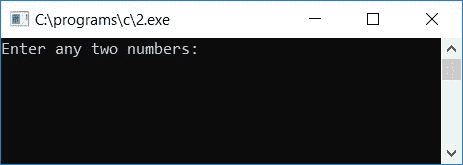
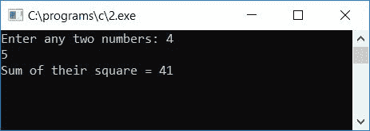
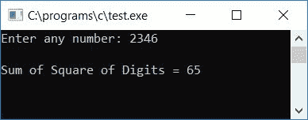

# 计算一个数字的平方和的 c 程序

> 原文：<https://codescracker.com/c/program/c-program-print-sum-of-their-square.htm>

在本教程中，我们将学习如何用 C 语言创建一个程序来查找并打印任意两个数字的平方和，还将学习如何在运行时查找并打印用户给定的任意数字的平方和。

## 求任意两个数的平方和

让我们先用 C 语言创建一个程序，要求用户输入任意两个数字，找出并打印给定两个数字的平方和。

```
#include<stdio.h>
#include<conio.h>
int main()
{
    int num1, num2, sqr1, sqr2, sum;
    printf("Enter any two numbers: ");
    scanf("%d%d", &num1, &num2);
    sqr1 = num1*num1;
    sqr2 = num2*num2;
    sum = sqr1 + sqr2;
    printf("Sum of their square = %d", sum);
    getch();
    return 0;
}
```

由于程序是在 **Code::Blocks** IDE 下编写的，因此在成功构建和运行之后，下面是运行示例:



现在提供任意两个数字，比如说 **4** 和 **5** ，然后按`ENTER`键，看看结果是给定两个数字的平方 之和。如果你将两个数平方，比如说 **4** 和 **5** ，那么你将得到 **16** 和 **25** 。对 求和后，结果是 **16+25** 等于 **41** 。下面是示例运行的第二个快照:



以下是上述程序中使用的一些主要步骤:

*   在任意两个[变量](/c/c-variables.htm)中接收来自用户的任意两个数字作为输入，比如 **num1** 和 **num2**
*   逐一计算两个数的平方，并将其平方初始化为任意两个变量，比如 **sqr1** 和 **sqr2**
*   即 **num1*num1** 被初始化为 **sqr1** 而 **num2*num2** 被初始化为 **sqr2**
*   现在计算两个变量之和，比如说 **sqr1** (第一个数字的平方)和 **sqr2** (第二个数字的平方)
*   也就是说 **sqr1+sqr2** 被初始化为一个变量，比如说 **sum** (保存两个给定数的平方和的值)
*   打印程序最后的**和**的值
*   例如，如果用户输入 4 和 5 作为输入
*   因此， **num1** 持有 4， **num2** 持有 5
*   现在 **num1*num1** 或 **4*4** 或 **16** 被初始化为 **sqr1**
*   并且 **num2*num2** 或 **5*5** 或 **25** 被初始化为 **sqr2**
*   并且 **sqr1+sqr2** 或 **16+25** 或 **41** 被初始化为**和**
*   打印输出为 41 的**和**的值

## 求一个数字的平方和

现在让我们创建一个程序，要求用户输入任意一个数字来查找并打印该数字的平方和。也就是说，如果用户输入 342 作为输入，那么程序将找到其数字的平方和，即 **(3*3) + (4*4) + (2*2)** 或 **9+16+4** 或 **29** 将是最终结果。让我们来看看这个程序:

```
#include<stdio.h>
#include<conio.h>
int main()
{
    int num, rem, sum=0;
    printf("Enter any number: ");
    scanf("%d", &num);
    while(num>0)
    {
        rem = num%10;
        sum = sum + rem*rem;
        num = num/10;
    }
    printf("\nSum of Square of Digits = %d", sum);
    getch();
    return 0;
}
```

以下是示例运行的最终快照:



以下是上述程序中使用的一些主要步骤:

*   接收任何数字作为输入
*   永远不要忘记取一个变量，比如说 **sum** (保存数字的平方和)，用 **0** 作为它的初始值
*   即在程序开始时声明并初始化 0 到**和**
*   从用户处获得变量输入后，如 **num** ，按照以下步骤操作
*   创建一个 [while 循环](/c/c-while-loop.htm)，运行直到 **num** 的值大于 0
*   在循环中，使用模运算符(%)计算该数字的位数
*   使用模运算符或余数运算符，我们将得到数字的最后一位
*   找出该数字的平方，用 **sum** 变量求和，然后将其初始化为 **sum** 变量
*   然后将数值(num)除以 10，跳过或删除最后一位数字
*   例如，如果用户输入 2346 作为输入
*   因此，在第一次运行 **while** 循环时，由于 **num** (2346)的值大于 0，因此程序流程 进入循环内部， **num%10** 或 **2346%10** 或 **6** 被初始化为 **rem** 。然后**sum+rem * rem**T29 或 **0 + 6*6** 或 **36** 被初始化为 **sum** 。最后， **num/10** 或 **2346/10** 或**234**T30】被初始化为 **num**
*   然后程序流程进入 **while** 循环的条件语句，由于值 **234** 再次大于 0，因此 **while** 循环的条件再次评估为真，因此程序流程进入循环，并且 执行与上述相同的步骤
*   即 **num%10** 或 **234%10** 或 **4** 被初始化为 **rem** 。并且 **sum + rem*rem** 或**36+4 * 4**T26 或 **36 + 16** 或 **52** 被初始化为 **sum** 。最后再次 **num/10** 或 **234/10** 或 **23** 将 初始化为 **num**
*   再次在第三次运行 **while** 循环时，作为循环的条件语句，即 **num > 0** 或 **23 > 0** 评估为真，因此程序流再次进入 **while** 循环并遵循相同的过程，直到 **num**的值变为 0
*   在 **while** 循环的最后一次运行时，变量 **sum** 保持其值为 **6*6 + 4*4 + 3*3 + 2*2** 或**36+16+9+4**T10 或 **65** 作为其最终值，因此 65 是最终输出，它是给定数 即 2346 的数字平方和的结果

[C 在线测试](/exam/showtest.php?subid=2)

* * *

* * *