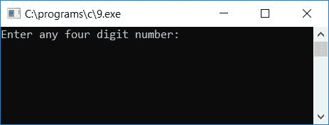
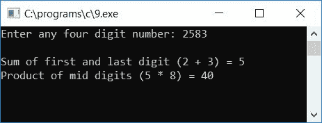
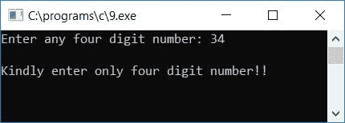
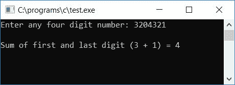

# C 程序：来寻找第一个和最后一个，中间数字的产品

> 原文：<https://codescracker.com/c/program/c-program-first-last-sum-mid-digits-product.htm>

在本教程中，我们将学习如何用 C 语言创建一个程序，要求用户输入任意一个 4 位数，以找到并打印其第一位和最后一位的和，然后是中间位数的乘积。例如，如果用户输入 8427 作为输入，那么程序将计算第一个和最后一个数字的总和，即 8+7 或 15，然后是中间数字的乘积，即 4*2 或 8。

在这个程序之后，我们还创建了一个程序，可以查找并打印用户给出的任何两位或两位以上数字的第一位和最后一位的总和。但是让我们先看看这里给出的程序，学习如何计算和打印第一个和最后一个，只有 4 位数的中间数字的乘积

```
#include<stdio.h>
#include<conio.h>
int main()
{
    int num, first, last, second, third, prod, sum;
    int rem, count=1, temp, tempcount=0;
    printf("Enter any four digit number: ");
    scanf("%d", &num);
    temp = num;
    while(temp>0)
    {
        tempcount++;
        temp = temp/10;
    }
    if(tempcount==4)
    {
        while(num>0)
        {
            rem = num%10;
            if(count==1)
                first = rem;
            else if(count==2)
                second = rem;
            else if(count==3)
                third = rem;
            else if(count==4)
                last = rem;
            num = num/10;
            count++;
        }
        sum = first+last;
        prod = second*third;
        printf("\nSum of first and last digit (%d + %d) = %d", last, first, sum);
        printf("\nProduct of mid digits (%d * %d) = %d", third, second, prod);
    }
    else
        printf("\nKindly enter only four digit number!!");
    getch();
    return 0;
}
```

由于程序是在 **Code::Blocks** IDE 下编写的，因此在成功构建和运行之后，您将得到 的输出，如这里给出的快照所示:



现在输入任意一个 4 位数，比如说 **2583** ，按`ENTER`键查看输出，如下所示:



让我们用另一个示例运行来检查上面的程序，如果用户提供任何不是 4 位数的数字，比如说 **34** ，会发生什么。以下是运行示例:



#### 程序解释

*   接收任何 4 位数字作为输入
*   现在将数字初始化为任何一个[变量](/c/c-variables.htm)，比如说**温度**
*   创建 [`while`循环](/c/c-while-loop.htm)，直到 **temp** 的值大于 0
*   在 **while** 循环中，增加任何变量，比如说 **tempcount** 并将 **temp** 除以 10
*   永远不要忘记在程序开始时将 0 初始化为 **tempcount**
*   这里，使用 **while** 循环，我们一个数字一个数字地计数，以检查给定的数字是否是一个 4 位数的 数字
*   即，如果用户输入 **2583** 作为输入，因此， **num** 保存该输入值
*   **号**的值被初始化为**温度**。现在**温度**保持 **2583**
*   由于值 **2583** 大于 0，因此程序流程进入 **while** 循环并增加 **tempcount** 的值 ，并且 **tempcount** 的初始值为 0，因此在第一次运行 **while** 循环时， **tempcount**保持其值为 **1** ， **temp/10** 或
*   在第二次运行 **while** 循环时，由于 **258** 再次大于 0，因此程序流程再次进入 **while**循环，并且 **tempcount** 递增其值并变为 **2** ，然后 **temp/10** 或 **258/10** 或 **25** 或 被初始化为 **temp**
*   第三次运行时，遵循相同的过程并继续进行，直到**温度**保持其值为 **0**
*   在从 **while** 循环中退出后，变量 **tempcount** 保存代表运行时用户在给定数字中出现的数字总数 的值。也就是说，如果用户输入 234，那么在运行并退出 **while** 循环后， **tempcount** 将其值保存为 **3**(因为它是一个 3 位数)
*   现在检查**温度计数**是否等于 4
*   如果是，那么给定的数字是一个 4 位数
*   如果它是一个 4 位数，那么按照下一步计算并打印它的第一个和最后一个数字的和，以及它的中间数字(第二个和第三个数字)的乘积
*   否则，如果它不是一个 4 位数字，则打印一条消息，如**请输入一个 4 位数字**并退出程序
*   要计算它的第一个和最后一个数字的和，以及它的中间数字的乘积，请遵循下面给出的步骤
*   使用 **while** 循环，直到 **num** 的值变为 0
*   在循环内部，使用模或余数(%)运算符找到它的数字，并将其初始化为一个变量，比如 **rem**
*   永远不要忘记声明和初始化一个变量，比如在程序开始时用 1 计数
*   现在，在计算给定数字的一个数字(最后一个数字)后，检查计数的值是多少
*   如果它的值是 1，那么将 **rem** 的值初始化为一个变量，比如说 **first** 。如果其值为 2，则将 **rem** 的值初始化为变量**秒**，依此类推。
*   将 **if-else** 块的最后一个数字除以 10，并增加 **count** 变量的值
*   例如，让我们假设用户已经输入了一个数字，比如说 **2583**
*   当在上述步骤中检查到该号码已经是一个 4 位数时
*   因此在**内如果**阻塞，在**第一次运行的同时**循环
*   最后一位数字被初始化为 **rem** 变量。即 **num%10** 或 **2583%10** 或 **3** 被初始化为 **rem**
*   第一次运行时，**计数**保持其值为 1，因此 **rem** 或 **3** 将被初始化为 **first**
*   然后 **num/10** 或 **2583/10** 或 **258** 被初始化为 **num** 和 **count++** 语句运行，即 表示 **1++** 运行，即 2 将被初始化为 **count**
*   重复上述步骤，找到数字的第二、第三和第四位
*   这里，我们将最后一个或第四个数字初始化为第一个数字，第三个数字初始化为第二个数字，第二个数字初始化为第三个数字，第一个数字初始化为最后一个或第四个数字。因为我们要求第一位和最后一位的和，即第**位+最后一位**位 和第二位和第三位的乘积，即**第二位*第三位**(中间位)。这里顺序并不重要，即 **第一个+最后一个**给出与**最后一个+第一个**相同的结果，同样地，**第三个*第二个**也给出与**第二个*第三个**相同的结果
*   您还可以将变量名称**的第一个**改为**的最后一个**，将**的第二个**改为**的第三个**，将**的第三个**改为**的第二个**，将**的最后一个**改为**的第一个**
*   因为使用 **%** 运算符计算余数会得到最后一位数字。没关系，你可以自己安排， 由你决定
*   退出 **if** 块的 **while** 循环后，初始化**第一个+最后一个**到**总和**和**第二个*第三个**到 **prod**
*   打印 **sum** (作为第一位和最后一位的和)和 **prod** (作为中间位的乘积)的值作为输出

## 打印 C 语言中第一个和最后一个数字的和

让我们创建另一个程序，要求用户输入任何数字(2 个或 2 个以上的数字)来计算和打印其第一个和最后一个数字的总和。

```
#include<stdio.h>
#include<conio.h>
int main()
{
    int num, first, last, sum;
    int rem, count=1, temp, tempcount=0;
    printf("Enter any four digit number: ");
    scanf("%d", &num);
    temp = num;
    while(temp>0)
    {
        tempcount++;
        temp = temp/10;
        if(tempcount>1)
            break;
    }
    if(tempcount>1)
    {
        while(num>0)
        {
            rem = num%10;
            if(count==1)
                first = rem;
            num = num/10;
            count++;
        }
        last = rem;
        sum = first+last;
        printf("\nSum of first and last digit (%d + %d) = %d", last, first, sum);
    }
    else
        printf("\nPlease enter 2-digit or more than 2-digit number");
    getch();
    return 0;
}
```

以下是样本运行的最终快照:



在上面的程序中，在[的 **while** 循环中，如果](/c/c-if-statement.htm)阻塞， **rem** 变量的最后一个值 将是第一位的值， **rem** 的第一个值将是给定数字 的最后一位

[C 在线测试](/exam/showtest.php?subid=2)

* * *

* * *