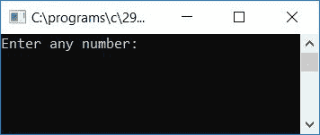
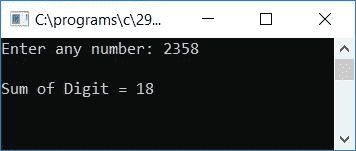

# C 程序：查找并打印任意数字的和

> 原文：<https://codescracker.com/c/program/c-program-print-all-digit-sum.htm>

在这里，我们将学习如何用 C 语言创建一个程序，要求用户输入任何数字(在运行时)作为输入，然后计算并打印该给定数字中所有数字的总和。程序如下:

```
#include<stdio.h>
#include<conio.h>
int main()
{
    int num, sum=0, rem;
    printf("Enter any number: ");
    scanf("%d", &num);
    while(num>0)
    {
        rem = num%10;
        sum = sum + rem;
        num = num/10;
    }
    printf("\nSum of Digit = %d", sum);
    getch();
    return 0;
}
```

由于程序是在 **Code::Blocks** IDE 下编写的，因此在成功构建和运行之后，下面是输出:



提供任何数字，比如 2358，然后按回车键查看所有数字的总和作为输出或结果。下面是示例运行的第二个快照:



以下是上述程序中使用的一些主要步骤:

*   在运行时接收来自用户的任何数字作为输入
*   创建一个 **while** 循环，一直运行到数字大于 0
*   在 **while** 循环中，通过应用余数或模(%)运算符找到数字的位数，即 使用 **num%10** ，它给出数字的最后一位，并将被初始化为变量 **rem** 。 初始化 **sum+rem** 到 **sum** 变量。永远不要忘记在程序开始时初始化 0 到**和**。然后 将数字除以 10，继续检查并做同样的操作
*   让我们假设用户提供了 247 作为输入
*   变量 **num** 保存大于 0 的值 247，然后程序流程进入**内部，而**循环、 和 **num%10** 或 **247%10** 或 **7** 将被初始化为 **rem** 。并且 **sum+rem** 或 **0+7** 或 **7** 将 初始化为变量 **sum** 。最后 **num/10** 或 **247/10** 或 **24** 将被初始化为 **num**
*   在第二次运行 **while** 循环时，num 保存再次大于 0 的 24，然后程序流再次进入 的 **while** 循环，并以与第一次运行 **while** 循环时相同的方式执行相同的任务
*   最后，从 **while** 循环中出来后，变量 **sum** 保存的值等于程序开始时用户给定数字的所有位数的 和

[C 在线测试](/exam/showtest.php?subid=2)

* * *

* * *