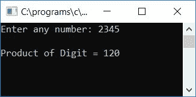

# C 程序：查找并打印任意数字的乘积

> 原文：<https://codescracker.com/c/program/c-program-print-all-digit-product.htm>

在这里，我们将学习如何用 C 语言创建一个程序，要求用户输入任何数字(在运行时)作为输入，然后计算并打印该给定数字的所有数字的乘积。这个程序将只计算非零数字的乘积:

```
#include<stdio.h>
#include<conio.h>
int main()
{
    int num, prod=1, rem;
    printf("Enter any number: ");
    scanf("%d", &num);
    while(num>0)
    {
        rem = num%10;
        if(rem!=0)
            prod = prod*rem;
        num = num/10;
    }
    printf("\nProduct of Digit = %d", prod);
    getch();
    return 0;
}
```

由于程序是在 **Code::Blocks** IDE 下编写的，因此在成功构建和运行之后，这里是您将在屏幕上看到的 输出。假设用户提供了输入号码 2345 并按下了`ENTER`键:



让我们进行另一次样本运行:

从上面的运行示例中可以看出，当给定数字的位数相乘时，0 被跳过，就好像我们将 0 与非零位数相乘，那么乘积将是 0。

以下是上述程序中使用的一些主要步骤:

*   接收任何数字作为输入
*   创建一个 **while** 循环，一直运行到数字大于 0
*   在 for 循环中，将数字除以 10，得到给定数字的余数或最后一位数字
*   如果当前余数值不等于 0，则将其乘以 **prod** 变量，并将其初始化为**prod**T4】变量，该变量负责任何给定数目的所有非零数字的乘积
*   永远不要忘记在程序开始时，在 **main()** 函数内，将变量 **prod** 初始化为 1
*   将余数乘以 **prod** 后，将数除以 10，继续检查并做同样的操作
*   假设用户已经提供了号码，比如说 **247**
*   在第一次运行**而**循环时，**号**持有大于 0 的 247
*   然后程序流程进入 **while** 循环，并且 **num%10** 或 **247%10** 或 **7** 将被初始化为不等于 0 的 **rem**变量，然后程序流程再次进入 **if** 块(出现在**while**T31】循环内)和 **prod*rem** 或 **1*7**
*   再次在第二次运行 **while** 循环时，即 **num** 保存再次大于 0 的值 24，然后 程序流再次进入 **while** 循环并进行与上述步骤相同的操作

[C 在线测试](/exam/showtest.php?subid=2)

* * *

* * *