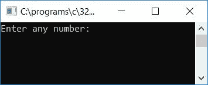
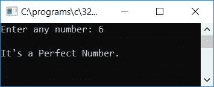
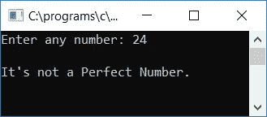
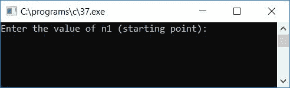
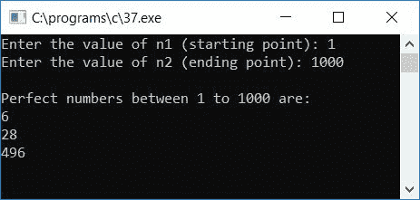

# 检查给定数是否为完全数的 c 程序

> 原文：<https://codescracker.com/c/program/c-program-perfect-number.htm>

在本教程中，我们将学习如何用 C 语言创建一个程序，要求用户输入任何数字(在运行时)作为输入，以检查给定的数字是否是一个完美的数字。一个完全数是这样一个数，其中因子的和等于该数本身。

## C 语言中检查完全数与否

问题是，*用 C 写一个程序，检查给定的数是否是完全数。*下面给出的程序 就是它的答案。6 是一个完美的数字，因为 1、2 和 3 是 6 的三个因子，对其求和后，您将得到与 6 的情况相同的数字 :

```
#include<stdio.h>
#include<conio.h>
int main()
{
    int num, sum=0, i;
    printf("Enter any number: ");
    scanf("%d", &num);
    for(i=1; i<num; i++)
    {
        if(num%i == 0)
            sum = sum + i;
    }
    if(num == sum)
        printf("\nIt's a Perfect Number.");
    else
        printf("\nIt's not a Perfect Number.");
    getch();
    return 0;
}
```

上面的程序是在 **Code::Blocks** IDE 下构建和运行的，下面是输出。这是样本运行的第一个快照:



提供任意一个数字，比如说 **6** ，按`ENTER`键查看给定的数字是否为完全数。这是样品运行的第 个快照:



让我们检查另一个数字，比如说 **24** 。以下是在 24(作为输入)的情况下运行的示例:



由于 24 的因数是 1、2、3、4、6、8、12，如果你将所有这些因数相加，即 **1+2+3+4+6+8+12** 等于 **36** ，这不等于数字本身(此处为 24)。所以根据这里给出的 完全数的定义，24 不是完全数。

以下是上述程序中使用的一些主要步骤:

*   接收任何数字作为输入，比如 6
*   为循环创建一个**,从 1 开始，比数字本身小 1(如果输入为 6，则为 5)**
*   检查该数是否能被从 1 到比 5 小一的数整除
*   如果是，则将该数字加到**和**中，并继续检查下一个数字
*   在第一次运行时， **i** 保持 1，因此 **if** 语句评估如下， **num%i == 0** 或 **6%1 == 0** ，或 **0 = = 0**。当用 1 除 6 时，我们不会得到任何余数，因此这被评估为真，并且如果阻塞语句，那么 **sum = sum + i** 或 **sum = 0 + 1** 或 **sum = 1** 将运行
*   永远不要忘记在程序开始时用 0 初始化 **sum** 变量
*   在第二次运行时， **i** 持有 2，并且 6 将再次被 2 整除而不会留下任何余数，因此在 **if** 块中再次出现 ，语句 **sum = sum + i** 或 **sum = 1 + 2** 或 **sum = 3** 将运行。或者 3 将 初始化为**和**变量
*   这样，在第三、第四和第五次运行 **for** 循环时，我们必须处理相同的步骤
*   在最后一次运行时， **sum** 的值为 6，等于数字本身，因此这里我们得出结论， 给定数字为 6 的所有因子的和等于数字本身为 6
*   因此，这是一个完美的数字
*   要将其打印出来，请检查原始数字是否等于给定数字的因子之和
*   如果是，那么把它作为一个完美的数字打印出来
*   否则，将其打印为非完美数字

## 用 C 语言打印给定范围内的所有完全数

这是另一个关于完全数的程序。这个程序会要求用户输入任意两个数作为起始和结束数或点来检查和打印所有存在于给定的两个数之间的完全数:

```
#include<stdio.h>
#include<conio.h>
int main()
{
    int n1, n2, i, j, sum, temp;
    printf("Enter the value of n1 (starting point): ");
    scanf("%d", &n1);
    printf("Enter the value of n2 (ending point): ");
    scanf("%d", &n2);
    printf("\nPerfect numbers between %d to %d are:\n", n1, n2);
    for(i=n1; i<=n2; i++)
    {
        temp = i;
        sum = 0;
        for(j=1; j<i; j++)
        {
            if(i%j==0)
            {
                sum = sum + j;
            }
        }
        if(temp==sum)
        {
            printf("%d\n", sum);
        }
    }
    getch();
    return 0;
}
```

这是示例运行的第一个快照:



提供任意两个数字，比如说以 **1** 为开始，以 **1000** 为结束，来查看存在于这两个 数字之间的所有完全数。下面是示例运行的第二个快照:



[C 在线测试](/exam/showtest.php?subid=2)

* * *

* * *