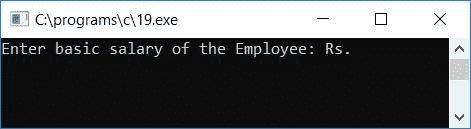
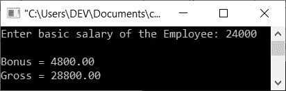

# C 程序：使用基本工资计算和打印奖金和总额

> 原文：<https://codescracker.com/c/program/c-program-calculate-bonus-gross-basic-salary.htm>

在本文中，我们将学习如何用 C 语言创建一个程序，要求用户输入他/她的基本工资作为输入，然后使用给定的员工基本工资计算奖金金额(奖金将按基本工资的 20%计算)和总工资。

```
#include<stdio.h>
#include<conio.h>
int main()
{
    float basic, bonus, gross;
    printf("Enter basic salary of the Employee: ");
    scanf("%f", &basic);
    bonus = (basic*20)/100;
    gross = bonus + basic;
    printf("\nBonus = %0.2f", bonus);
    printf("\nGross = %0.2f", gross);
    getch();
    return 0;
}
```

由于上述程序是在 **Code::Blocks** IDE 下编写的，因此在成功构建并运行之后，这里是示例运行的第一张快照 :



提供员工的基本工资，程序将打印员工的奖金@20%和总工资，如示例运行的第二个快照所示:



以下是上述程序中使用的一些主要步骤:

*   接收员工的基本工资作为输入
*   现在用基本工资的 20%来计算奖金数额
*   然后通过将奖金和基本工资金额相加来计算总工资
*   将奖金和薪金总额的值作为输出打印出来
*   这里我们使用了格式说明符 **%0.2f** 来打印小数点后两位数字

[C 在线测试](/exam/showtest.php?subid=2)

* * *

* * *