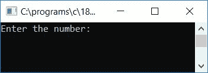
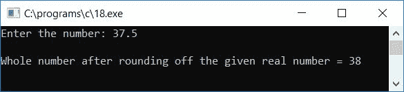
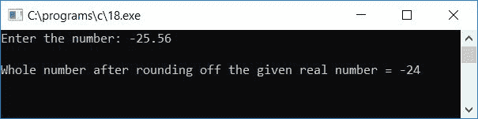

# C 程序四舍五入十进制或浮点数

> 原文：<https://codescracker.com/c/program/c-program-round-number-to-nearest-integer.htm>

在本教程中，我们将学习如何用 C 语言创建一个程序，要求用户输入任何数字(任何实数或浮点数)以将其四舍五入为最接近的整数。例如，如果用户输入 23.43，那么程序将输出最接近的整数值 23。让我们来看看这个程序:

```
#include<stdio.h>
#include<conio.h>
int main()
{
    float num;
    int tempCheck, roundNum, tempNum;
    printf("Enter the number: ");
    scanf("%f", &num);
    if(num>0)
    {
        tempNum = num*10;
        tempCheck = tempNum%10;
        if(tempCheck>=5)
        {
            roundNum = num;
            roundNum++;
        }
        else
        {
            roundNum = num;
        }
        printf("\nWhole number after rounding off the given real number = %d", roundNum);
    }
    else if(num<0)
    {
        num = -(num);
        tempNum = num*10;
        tempCheck = tempNum%10;
        if(tempCheck>=5)
        {
            roundNum = num;
            roundNum--;
        }
        else
        {
            roundNum = num;
        }
        printf("\nWhole number after rounding off the given real number = -%d", roundNum);
    }
    else
    {
        printf("\nThe given number is 0");
    }
    getch();
    return 0;
}
```

由于上面的程序是在 **Code::Blocks** IDE 下编写的，因此在成功构建和运行之后，您将得到类似于下面给出的 输出。这是示例运行的第一个快照:



现在提供任意一个实数，比如说 **37.5** ，按`ENTER`键查看给定实数 的最接近的整数值:



下面是上述程序的另一个运行示例，这一次我们假设用户提供了实数，比如说 **-25.56** 作为输入:



以下是上述程序中使用的一些主要步骤:

*   接收任何实数作为输入
*   现在用两个 **if** 语句将其四舍五入。一个如果用户提供了一个真实的数字 ，这是积极的。第二，当用户提供了负数的实数时
*   现在，如果给定的数字是一个正数，那么将该数字乘以 10，并将其初始化为一个变量，比如说 **tempNum** 。然后找到 **tempNum** (除以 10) 的余数，并将其初始化为另一个变量，比如 **tempCheck** 。检查 **tempCheck** 变量 是否保持大于 5 的值。如果是，则将 **num** 的值初始化为另一个 变量，比如说 **roundNum** ，并递增 1。然后最后打印出 **roundNum** 的值，该值将是 给定数字的最接近的整数值(由用户在运行时设置)
*   如果给定的数字是一个负数，那么首先通过将数字乘以**减(-)** 运算符使其成为正数。执行与正数 相同的步骤，除了这次我们必须减少 **roundNum** 的值，因为在负数 的情况下，数字越大意味着值越小。即 34 大于 33，但-34 小于-33
*   例如，如果用户输入了 33.45
*   如果块的 **33.45** 大于 0，则程序流程进入第一个
***   在**内如果**块， **num*10** 或 **33.45*10** 或 **334.5** 将被初始化 到 **tempNum** 和 **tempNum%10** 或 **334.5%10** 或 **4** 将被初始化到 **tempCheck***   **注意** -这里我们将数字乘以 10，然后应用模运算符(%)，使 出现在小数点后的第一个数字出现在小数点之前。这样我们就可以使用 模运算符来检查数字是否大于或等于 5(小数点后的数字)。也就是说 如果数字大于或等于 5，那么我们必须增加该值，并将其打印为给定数字的 最接近的整数，如果数字小于 5，则按原样打印该数字(不含小数部分)*   现在来看例子，由于 **tempCheck** 持有小于 5 的 **4** ，因此 程序流进入 **else** 块，并且 **num** 将被初始化为 **round num**。并打印出 **roundNum** 的值*   如果用户提供了 **-34.67** 作为输入，那么当数字小于 0 时，那么 程序流程进入**否则如果**块*   数字乘以减运算符(-)并初始化为数字本身，即**-【num】**或 **-(-34.67)** 或 **34.67** 将被初始化为 **num** 。并且 **num*10** 或 **34.67*10** 或 **346.7** 将被初始化为**tempNum**,**tempNum % 10**或 **346.7%10** 或 **6**将被初始化为 **tempCheck** 。*   由于 **tempCheck** 变量持有大于 5 的值，因此如果块和 **num** 将被初始化为**round num**T9 并且值递减，则程序 流程进入**内部。最后打印输出值 33****

 **[C 在线测试](/exam/showtest.php?subid=2)

* * *

* * ***