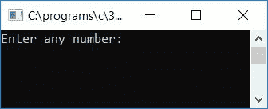
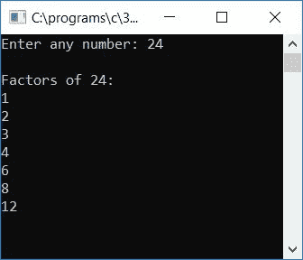
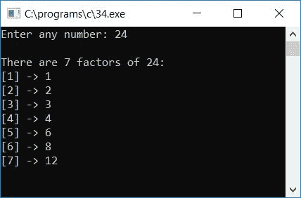

# c 程序查找并打印给定数字的所有因子

> 原文：<https://codescracker.com/c/program/c-program-print-factors-of-number.htm>

在本教程中，我们将学习如何用 C 语言创建一个程序，要求用户输入任何数字(在运行时)作为输入，并找到和打印该给定数字的所有因子作为输出。程序如下:

```
#include<stdio.h>
#include<conio.h>
int main()
{
    int num, rem, i;
    printf("Enter any number: ");
    scanf("%d", &num);
    printf("\nFactors of %d:\n", num);
    for(i=1; i<num; i++)
    {
        if(num%i==0)
            printf("%d\n", i);
    }
    getch();
    return 0;
}
```

该程序是在 **Code::Blocks** IDE 下编写的，下面是成功构建并运行后的运行示例。这是样品运行的第一张 快照:



按下`ENTER`键后，提供任意数字，如 **24** 以查看 24 的所有因子:



以下是上述程序中使用的一些主要步骤:

*   接收任何数字作为输入，比如 24
*   为循环创建一个**，从 1 运行到比这里的数字 23 小一(如果输入是 24)**
*   在循环的**内，使用 **if** 块对 1 到 23 的每一个数字进行 24 的整除测试**
*   也就是说，如果任何一个数能整除给定的数，比如说 24，那么就把它作为给定数的一个因数打印出来，并继续寻找下一个数
*   在循环的**第一次运行时， **i** 保持 1。1 将 24 整除而不留余数，因此 1 将是 24 的因子之一**
*   在循环的**第二次运行时， **i** 保持 2。2 将 24 整除而不留余数，因此 2 也是 24 的因数之一**
*   第三次运行时， **i** 仍然是 3。它还会除以 24 而不留余数，因此 3 也是 24 的因数之一
*   用同样的方法，检查 23 以内的所有数字，如果这个数字完全除以给定的数字，比如 24，没有任何余数，就把它打印出来

现在让我们以这样的方式修改上面的程序，该程序将打印带有数字列表的因子总数。这是节目单。问题是，*用 C 写一个程序，让用户在运行时打印任意给定数的所有因子。例如，如果用户 提供了 24 作为输入。那么输出必须类似于*:

```
There are 7 factors of 24:
[1] -> 1
[2] -> 2
[3] -> 3
[4] -> 4
[5] -> 6
[6] -> 8
[7] -> 12
```

下面给出的程序是上述问题的答案:

```
#include<stdio.h>
#include<conio.h>
int main()
{
    int num, rem, i, count=0;
    printf("Enter any number: ");
    scanf("%d", &num);
    for(i=1; i<num; i++)
    {
        if(num%i==0)
            count++;
    }
    printf("\nThere are %d factors of %d:\n", count, num);
    count=1;
    for(i=1; i<num; i++)
    {
        if(num%i==0)
        {
            printf("[%d] -> %d\n", count, i);
            count++;
        }
    }
    getch();
    return 0;
}
```

下面是上述程序运行示例的最终快照:



[C 在线测试](/exam/showtest.php?subid=2)

* * *

* * *