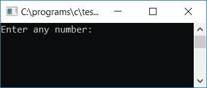

# C 程序检查偶数或奇数

> 原文：<https://codescracker.com/c/program/c-program-check-even-odd.htm>

在本教程中，我们将学习如何创建一个程序，要求用户输入任何数字作为输入，然后检查它是偶数还是奇数。我们还将学习如何创建一个程序，打印从开始到数字(由用户给出)的所有偶数和奇数。

## 检查 C 语言中的偶数或奇数

在 C 编程中，要检查任何给定的数字是偶数还是奇数，您必须要求用户输入一个数字，使用除以 2 的整除测试来检查偶数/奇数。即如果给定的数能被 2 整除，那么它将是偶数，否则它将是奇数。

```
#include<stdio.h>
#include<conio.h>
int main()
{
    int num;
    printf("Enter any number: ");
    scanf("%d", &num);
    if(num%2 == 0)
        printf("\nIt's an even number.");
    else
        printf("\nIt's an odd number.");
    getch();
    return 0;
}
```

由于上面的程序是在 **Code::Blocks** IDE 下编写和运行的，因此在成功构建和运行之后， 将会得到下面的输出。这是示例运行的第一个快照:



现在提供任意数字，比如 13，并按回车键查看输出，如示例运行的第二个快照所示:


以下是上述程序中使用的一些主要步骤:

*   接收任何数字作为输入，比如 13
*   现在使用 **if** 语句，检查给定的数是否能被 2 整除且不留余数
*   如果它不留余数，那么给定的数是偶数
*   否则它将是一个奇数

### 打印截至 N 的所有偶数

这是另一个程序，它要求用户输入 N 的值，然后打印从开始到 N 的所有偶数，假设用户输入了 20 作为 N 的值，那么将打印 1 到 20 之间的所有偶数，包括 1 和 20。

```
#include<stdio.h>
#include<conio.h>
int main()
{
    int N, i;
    printf("Enter the value of N (limit): ");
    scanf("%d", &N);
    printf("\nAll Even Numbers from 1 to %d:\n", N);
    for(i=1; i<=N; i++)
    {
        if(i%2 == 0)
            printf("%d ", i);
    }
    getch();
    return 0;
}
```

以下是上述程序运行示例的最终快照:


### 打印截至 N 的所有奇数

这个程序类似于前面的程序。但是这次输出的不是偶数，而是奇数。

```
#include<stdio.h>
#include<conio.h>
int main()
{
    int N, i;
    printf("Enter the value of N (limit): ");
    scanf("%d", &N);
    printf("\nAll Odd Numbers from 1 to %d:\n", N);
    for(i=1; i<=N; i++)
    {
        if(i%2 != 0)
            printf("%d ", i);
    }
    getch();
    return 0;
}
```

这是示例运行的最终快照:


#### 其他语言的相同程序

*   [C++ 奇偶校验](/cpp/program/cpp-program-check-even-odd.htm)
*   [Java 奇偶校验](/java/program/java-program-check-even-odd.htm)
*   [Python 检查奇偶](/python/program/python-program-check-even-odd.htm)

[C 在线测试](/exam/showtest.php?subid=2)

* * *

* * *