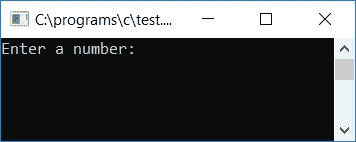

# C 程序：检查质数与否

> 原文：<https://codescracker.com/c/program/c-program-check-prime.htm>

在本教程中，我们将学习如何用 C 语言创建一个程序来检查给定的数字(由用户在运行时确定)是否是质数。我们还将学习如何打印任何两个数字之间的所有质数和合数，比如 1 和 20，即 1 到 20 之间的所有质数和合数。

最后，我们创建了一个程序，要求用户输入任意两个数字，以显示给定两个数字之间的所有质数和合数。让我们先来看看这个程序，它将检查用户输入的数字是否是一个质数。

### 怎么查质数？

如果数字能被从 **2 到比数字(即 n-1)** 小一的任何数字整除。假设用户 提供了一个数字，比如 37 作为输入，那么如果 37 可以被从 **2 到 36** 的任意数字整除，那么 就不是素数，否则它就是素数。

**注**——质数是一个除了 1 和数本身之外不能被任何数整除的数。

## 在 C 语言中检查质数与否

在 C 编程中，要检查输入的数是否是质数，你必须让用户输入一个数，并开始检查质数，如下面给出的程序所示。

```
#include<stdio.h>
#include<conio.h>
int main()
{
    int num, i, count=0;
    printf("Enter a number: ");
    scanf("%d", &num);
    for(i=2; i<num; i++)
    {
        if(num%i == 0)
        {
            count++;
            break;
        }
    }
    if(count==0)
        printf("\nIt's a prime number");
    else
        printf("\nIt's not a prime number");
    getch();
    return 0;
}
```

由于上面的程序是在 **Code::Blocks** IDE 下编写的，因此在成功构建和运行之后，这里是示例。 这是样本运行的第一张快照:



提供任意一个数字，如 **37** ，按回车键检查是否为质数。下面是示例运行的第二个快照:


#### 程序解释

*   接收任何数字作为输入，比如 37
*   为循环创建一个从 2 到 1 的[，即 **37-1** 或 **36**](/c/c-for-loop.htm)
*   在循环的**内，检查循环[变量](/c/c-variables.htm)say**I**T8】的当前值是否除以 say **37** (由用户在运行时给定)且不留余数**
*   如果它分支，那么程序流程进入 [if 块](/c/c-if-statement.htm)，并增加任何变量的值 比如 **count** 这里，然后使用 **break** 关键字退出循环。因为 如果除了 1 和这个数本身以外的任何数，除以这个数就意味着这个数不是质数
*   永远不要忘记在程序 开始时将**计数**变量初始化为 0 作为其初始值
*   现在无论是使用 [break 关键字](/c/c-break-statement.htm)还是正常退出循环后，检查 **count**变量是否保持原来的值，如果保持(即 0)，则说明程序 流程不会进入 **if** 块，说明从 2 到 36 的任何数都不会被 整除，因此给定的数是质数
*   否则，如果 **count** 变量的值不是 0，则意味着给定的数不是质数

### 打印所有质数和合数

现在让我们创建一个程序，查找并打印 1 到 20 之间的所有质数和合数:

```
#include<stdio.h>
#include<conio.h>
int main()
{
    int i, j, count=0;
    printf("\t\tBetween 1 to 20:\n\n");
    printf("Prime Numbers\t\tComposite Numbers\n");
    for(i=1; i<=20; i++)
    {
        for(j=2; j<i; j++)
        {
            if(i%j == 0)
            {
                count++;
		break;
            }
        }
        if(count==0)
            printf("%d", i);
        else
            printf("\t\t\t%d", i);
        count=0;
        printf("\n");
    }
    getch();
    return 0;
}

```

在成功构建和运行之后，下面是示例运行。这是第一张截图:


#### 程序解释

*   为从 1 到 20 的循环创建一个
***   对于循环变量的每一个值，比如说 **i** (1，2，3，4，...，20)，检查它是否是素数*   这里我们创建了两列，第一列是质数，第二列是合数*   如果发现该数字是质数，则打印它而不添加任何水平制表符(\t)*   如果发现该数字是合数，则在两三个水平制表符之后打印它，以在第二列中显示它*   现在进入正题，在循环的**内，我们用另一个循环变量比如 **j**创建了另一个**循环的**，这里我们已经运行了从 2 到比外部循环变量的当前值(i-1)小 1 的循环。也就是说，如果 **i** 的当前 值为 17，那么检查从 2 到 16 的任意一个数是否能整除 17(不留余数)或者 是否不能整除，如果整除，那么递增 **count** 变量并使用 **break** 关键字从**循环的内部**中退出***   现在检查**计数**是否保持其原始或初始值。如果成立，那么在 的第一列中把这个数字作为质数打印出来，也就是在数字前不加水平制表符*   如果**计数**为 0 以外的任何值，则在第二列，即在某个 水平制表符之后，将该数字打印为合数*   在返回第一个**循环**以再次检查和 执行上述相同步骤之前，不要忘记将**计数**变量再次初始化为 0*   这样，所有的质数和合数都作为输出打印出来**

 **让我们创建一个相同的程序，但是这次下面给出的程序在一行显示质数，在第二行显示合数。这个程序不会以表格的形式显示质数和合数。程序如下:

```
#include<stdio.h>
#include<conio.h>
int main()
{
    int i, j, count=0, arr[20], k=0;
    printf("\t\tBetween 1 to 20:\n\n");
    printf("Prime Numbers: ");
    for(i=1; i<=20; i++)
    {
        for(j=2; j<i; j++)
        {
            if(i%j == 0)
            {
                count++;
		break;
            }
        }
        if(count==0)
            printf("%d ", i);
        else
        {
            arr[k] = i;
            k++;
        }
        count=0;
    }
    printf("\nComposite Numbers: ");
    for(i=0; i<k; i++)
        printf("%d ", arr[i]);
    getch();
    return 0;
}
```

以下是示例:


在上面的程序中，我们按照上面的步骤检查了给定的数是否是质数，如果是，就打印出来，否则将当前值初始化为任意数组。这个数组将保存它的元素，因为所有的合数都在 1 到 20 之间。

### 允许用户定义范围

问题是，**用 C 写一个程序，打印给定范围**内的所有合数和质数:

```
#include<stdio.h>
#include<conio.h>
int main()
{
    int i, j, count=0, arr[100], k=0, rangeStart, rangeEnd;
    printf("Enter Starting Number: ");
    scanf("%d", &rangeStart);
    printf("Enter Ending Number: ");
    scanf("%d", &rangeEnd);
    printf("\t\tBetween %d to %d:\n\n", rangeStart, rangeEnd);
    printf("Prime Numbers: ");
    for(i=rangeStart; i<=rangeEnd; i++)
    {
        for(j=2; j<i; j++)
        {
            if(i%j == 0)
            {
                count++;
		break;
            }
        }
        if(count==0)
            printf("%d ", i);
        else
        {
            arr[k] = i;
            k++;
        }
        count=0;
    }
    printf("\nComposite Numbers: ");
    for(i=0; i<k; i++)
        printf("%d ", arr[i]);
    getch();
    return 0;
}
```

下面给出的快照是上述程序的运行示例:


现在输入范围。假设用户提供了 10 作为起始号码，40 作为结束号码。因此，按下`ENTER`键后，您将在输出屏幕上看到以下输出:


#### 其他语言的相同程序

*   [C++ 检查是否质数](/cpp/program/cpp-program-check-prime.htm)
*   [Java 检查是否质数](/java/program/java-program-check-prime.htm)
*   [Python 检查质数与否](/python/program/python-program-check-prime-number.htm)

[C 在线测试](/exam/showtest.php?subid=2)

* * *

* * ***