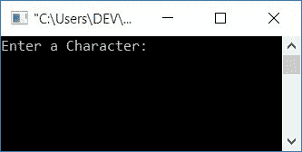
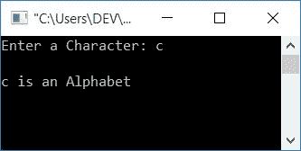
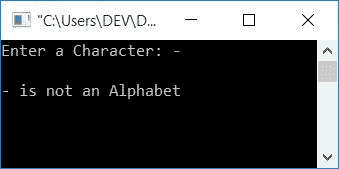
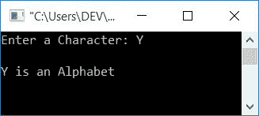

# C 程序检查字母或没有

> 原文：<https://codescracker.com/c/program/c-program-check-alphabet.htm>

在本文中，您将学习并获得关于检查用户(在运行时)给定的字符是否是字母表的代码。同一个程序有两个版本:

*   使用字符本身检查字母表的程序
*   使用字符的 ASCII 值检查字母表的程序

## 检查 C 语言中的字母表

问题是，**用 C 写个程序，检查给定的输入是不是字母表**。下面 给出了这个问题的答案。这个程序使用字符本身(由用户在运行时提供)来检查它是否是一个字母。

所有位于 **a-z** 或 **A-z** 之间的字符(包括 A，Z，A，Z)都是字母表。所以在 C 编程中，要检查输入的字符 是否是字母，你必须要求用户输入一个字符，然后检查它是否位于 **a-z** 或 **A-Z** 之间。如果它是，那么它是一个字母表，否则它不是一个字母表。让我们来看看下面给出的程序 :

```
#include<stdio.h>
#include<conio.h>
int main()
{
    char ch;
    printf("Enter a Character: ");
    scanf("%c", &ch);
    if((ch>='a' && ch<='z') || (ch>='A' && ch<='Z'))
        printf("\n%c is an Alphabet", ch);
    else
        printf("\n%c is not an Alphabet", ch);
    getch();
    return 0;
}
```

这个程序是使用 **Code::Blocks** IDE 编译和执行的。以下是运行示例:



现在提供任意字符作为输入，比如说 **c** 并按下 **ENTER** 键来查看输出，如下图所示:



由于 **c** 位于 **a-z** 之间。所以这是一个字母表。让我们来看看另一个运行示例，用户输入任何不在 **a-z** 和 **A-Z** 之间的字符 ，比如说 **-** (破折号或减号，随你怎么理解)。以下是运行示例:



### 使用 C 中的 ASCII 值检查字母表

问题是，**用 C 写一个程序，取任意一个字符作为输入，用这个字符 的 ASCII 值来检查它是不是字母表**。

这是大写字母的 ASCII 表:

| 性格；角色；字母 | ASCII 值 |
| A | Sixty-five |
| B | Sixty-six |
| C | Sixty-seven |
| ... | ... |
| Z | Ninety |

和小写字母的 ASCII 表:

| 性格；角色；字母 | ASCII 值 |
| a | Ninety-seven |
| b | Ninety-eight |
| c | Ninety-nine |
| ... | ... |
| z | One hundred and twenty-two |

现在使用上面的 ASCII 表来检查字母表，如下面给出的程序所示:

```
#include<stdio.h>
#include<conio.h>
int main()
{
    char ch;
    int ascii;
    printf("Enter a Character: ");
    scanf("%c", &ch);
    ascii = ch;
    if((ascii>=97 && ascii<=122) || (ascii>=65 && ascii<=90))
        printf("\n%c is an Alphabet", ch);
    else
        printf("\n%c is not an Alphabet", ch);
    getch();
    return 0;
}
```

下面是这个程序的运行示例:



从上面的程序可以看出，如果你将任意字符比如 **ch** (包含**Y**) 初始化为整型变量比如 **ascii** ，那么 **ch** (121，Y 的 ascii 码)的 ASCII 值就被初始化为 **ascii** [变量](/c/c-variables.htm)。所以如果 **ch** 持有 A 作为它的值，那么使用语句 **ascii = ch；**，65 被初始化为 **ascii 码**。因此，使用 [if-else](/c/c-if-statement.htm) case 检查并打印是否为字母。

你也可以直接用 **ch** 变量本身来检查，而不需要使用任何额外的变量，比如 **ascii** (在上面的程序中使用了 )。这里额外的变量比如说 **ascii** 只是用来让它更容易理解。

#### 其他语言的相同程序

*   [C++ 是否检查字母表](/cpp/program/cpp-program-check-alphabet.htm)
*   [Java 是否检查字母表](/java/program/java-program-check-alphabet.htm)
*   [Python 是否检查字母表](/python/program/python-program-check-alphabet.htm)

[C 在线测试](/exam/showtest.php?subid=2)

* * *

* * *