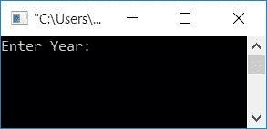
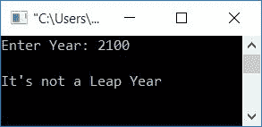
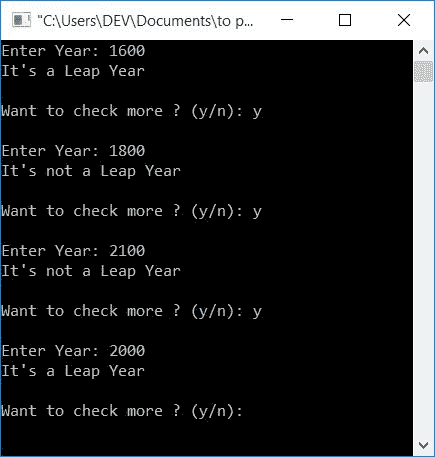

# C 程序：检查闰年

> 原文：<https://codescracker.com/c/program/c-program-check-leap-year.htm>

在本文中，您将学习并获得关于检查任何给定年份是否是闰年的代码。在进入程序之前，这里是检查给定年份是否是闰年的公式。

*   能被 4 整除但不能被 100 整除的年份
*   或者，能被 400 整除的年份

要了解，这个公式是从哪里来的，那就参考[闰年公式讲解](/nonprog/leap-year.htm)。 现在让我们继续，用 C 程序实现它。

## C 语言中的闰年程序

现在，我相信你已经完全了解闰年是什么，以及它是如何计算的。所以是时候在程序中应用它了:

```
#include<stdio.h>
#include<conio.h>
int main()
{
    int year;
    printf("Enter Year: ");
    scanf("%d", &year);
    if((year%4==0) && (year%100!=0))
        printf("\nIt's a Leap Year");
    else if(year%400==0)
        printf("\nIt's a Leap Year");
    else
        printf("\nIt's not a Leap Year");
    getch();
    return 0;
}
```

这个程序是使用 **Code::Blocks** IDE 编译和执行的。这是样本运行的第一个快照:



输入任意年份，如 **2100** ，按 **ENTER** 键，查看输出，如下图所示:



这是一个非常简单的程序，你可以很容易地理解它，因为在闰年背后使用的所有逻辑在本文的前面都有描述。让我们继续另一个使用函数的程序。

### 在 C 语言中用函数检查闰年与否

这个程序继续检查闰年，直到用户想终止它。因为在这里，我们添加了一些额外的代码，这样用户就可以在一次运行中查看任意次数的闰年。为了检查闰年，这个程序使用函数。让我们来看看:

```
#include<stdio.h>
#include<conio.h>
int checkLeapFun(int);
int main()
{
    int year, lORn;
    char choice='y';
    while(choice=='y')
    {
        printf("Enter Year: ");
        scanf("%d", &year);
        lORn = checkLeapFun(year);
        if(lORn == 0)
            printf("It's a Leap Year");
        else
            printf("It's not a Leap Year");
        printf("\n\nWant to check more ? (y/n): ");
        scanf(" %c", &choice);
        printf("\n");
    }
    getch();
    return 0;
}
int checkLeapFun(int yr)
{
    if((yr%4==0) && (yr%100!=0))
        return 0;
    else if(yr%400==0)
        return 0;
    else
        return 1;
}
```

下面是上述程序的运行示例:



这样，您可以继续检查，直到您想要终止。要查看下一年，只需按下**y**T6(表示是)并输入年份。要终止它，只需输入 **n** (代表否)或除 **y** 之外的任何其他字符。

#### 程序解释

*   声明 **int** (整数)类型的任意两个[变量](/c/c-variables.htm)，比如说 **year** 和 **lORn** (是否闰年)
*   这里 **year** 保存用户输入的年份值， **lORn** 变量用于获取函数 **checkLeapFun()** 的返回值
*   声明另一个变量 say **选择**的 **char** (字符)类型
*   用 **y** 作为它的值初始化它
*   这里 **y** 被初始化为**选择**的初始值，使得条件**选择= =‘y’**评估 为真(第一次)，进入**同时**循环进一步处理代码
*   在循环内部，扫描来自用户的年值，并将其传递给参数为**年**的[函数](/c/c-functions.htm) **check leapfun()**
*   现在在函数内部，应用闰年的条件并相应地返回它的值
*   也就是说，如果是闰年，则返回 0，否则返回 1 并初始化为 **lORn** 变量
*   在**返回**语句后，程序流返回到**内部，同时 **main()** 函数的**循环，并且 返回值被初始化为 **lORn** ，如前一步所述
*   根据 **lORn** 的值，使用 [if-else](/c/c-if-statement.htm) case 检查并打印输出
*   现在扫描用户的一个字符，不管他/她是否想再检查一年
*   如果想要检查更多，则按下 **y** 否则按下 **n**
*   输入字符初始化为**选择**变量，程序流程进入**状态，同时**循环
*   检查是否等于 **y** ，如果是，程序流程再次进入循环内部，否则 程序流程终止循环，转到循环后写的下一条语句，即**gets()；**
*   好了

**注意**——在扫描字符作为输入之前使用空格，因为 **%c** 转换说明符不会自动跳过任何 前导空格。因此，从前面的条目来看，如果输入流中有一个错误的换行符，那么 **scanf()** 调用将立即使用它 。

这里我们使用了:

```
scanf(" %c", &choice);
```

作为扫描字符的语句。因为格式字符串中的空格告诉 **scanf** 跳过任何前导空格。

#### 其他语言的相同程序

*   [C++ 检查闰年](/cpp/program/cpp-program-check-leap-year.htm)
*   [Java 查闰年](/java/program/java-program-check-leap-year.htm)
*   [Python 检查闰年](/python/program/python-program-check-leap-year.htm)

[C 在线测试](/exam/showtest.php?subid=2)

* * *

* * *