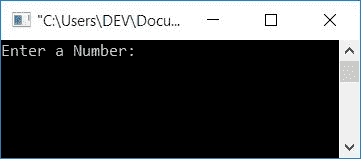
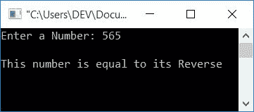
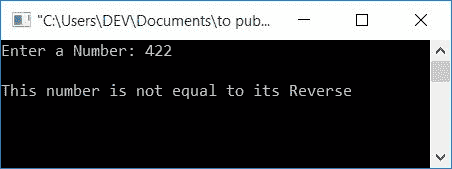

# C 程序检查数等于它的倒数

> 原文：<https://codescracker.com/c/program/c-program-check-reverse-equal-original.htm>

在本文中，您将学习如何检查用户给定的数字(在运行时)是否等于它的倒数。

## 支票号码等于它在 C 语言中的倒数

在 C 语言编程中，要检查一个数的倒数是否等于它的原数，你必须让用户输入这个数，然后求这个数的倒数。检查反向值是否等于原始值，如下面给出的程序所示:

```
#include<stdio.h>
#include<conio.h>
int main()
{
    int num, orig, rev=0, rem;
    printf("Enter a Number: ");
    scanf("%d", &num);
    orig = num;
    while(num>0)
    {
        rem = num%10;
        rev = (rev*10)+rem;
        num = num/10;
    }
    if(orig==rev)
        printf("\nThis number is equal to its Reverse");
    else
        printf("\nThis number is not equal to its Reverse");
    getch();
    return 0;
}
```

这个程序是使用 **Code::Blocks** IDE 编译和执行的。这是样本运行的第一张快照:



现在提供任意数字，比如说 **565** ，并按**回车**来查看输出，如下图所示:



由于 **565** 的倒数是数字本身，因此您将看到前面输出中给出的消息。

在反转给定数字之前，将其值初始化为任何变量，如 **orig** 。以便在反转 数字后，将其与**原始值**进行比较。这是另一个运行示例。假设用户这次输入了 **422** :



因为，422 不等于它的倒数，所以你会看到如前一张快照所示的消息。 **422** 的反向将是 **224** 。而这两个数字是不相等的。

#### 其他语言的相同程序

*   [C++ 检查反向是否等于原始值](/cpp/program/cpp-program-check-reverse-equal-original.htm)
*   [Java 检查反向等于原始](/java/program/java-program-check-reverse-equal-original.htm)
*   [Python 检查反向等于原始](/python/program/python-program-check-reverse-equal-original.htm)

[C 在线测试](/exam/showtest.php?subid=2)

* * *

* * *