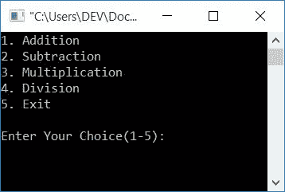
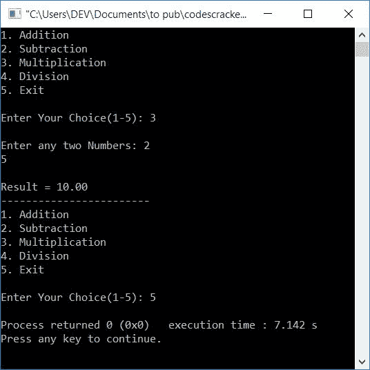

# C 程序：制作简单的计算器

> 原文：<https://codescracker.com/c/program/c-program-make-calculator.htm>

在本文中，您将学习并开始使用 c 创建一个简单的计算器程序。简单计算器是指一个可以执行四种基本数学运算的计算器，如加、减、乘和除。这里计算器程序以两种方式创建:

*   使用[开关盒](/c/c-switch-statement.htm)的计算器程序
*   使用开关和[功能](/c/c-functions.htm)的计算器程序

要在 C 编程中制作一个执行基本四种数学运算的简单计算器，使用**开关**来识别输入操作符，以执行所需的计算，如下面给出的程序所示。

## 使用 switch case 的 C 语言计算器程序

这是一个简单的菜单驱动程序，基于简单的计算，如根据用户的选择进行加减乘除:

```
#include<stdio.h>
#include<conio.h>
int main()
{
   float num1, num2, res;
   int choice;
   do
   {
      printf("1\. Addition\n");
      printf("2\. Subtraction\n");
      printf("3\. Multiplication\n");
      printf("4\. Division\n");
      printf("5\. Exit\n\n");
      printf("Enter Your Choice(1-5): ");
      scanf("%d", &choice);
      if(choice>=1 && choice<=4)
      {
         printf("\nEnter any two Numbers: ");
         scanf("%f %f", &num1, &num2);
      }
      switch(choice)
      {
         case 1:
            res = num1+num2;
            printf("\nResult = %0.2f", res);
            break;
         case 2:
            res = num1-num2;
            printf("\nResult = %0.2f", res);
            break;
         case 3:
            res = num1*num2;
            printf("\nResult = %0.2f", res);
            break;
         case 4:
            res = num1/num2;
            printf("\nResult = %0.2f", res);
            break;
         case 5:
            return 0;
         default:
            printf("\nWrong Choice!");
            break;
      }
      printf("\n------------------------\n");
   }while(choice!=5);
   getch();
   return 0;
}
```

这个程序是在 **Code::Blocks** IDE 下构建和运行的。以下是示例运行的初始快照:



现在，以如下方式提供任何输入(从 1 到 5 中选择):

*   输入 1 进行加法运算
*   输入 2 进行减法运算
*   输入 3 进行乘法运算
*   输入 4 表示除法
*   并输入 5 退出

假设用户输入 2 作为他/她的选择，那么程序将再次要求输入任意两个数字来执行减法。例如，如果用户输入 **2** 作为选择，并且 **20** 作为第一个数字，那么 **10** 作为第二个 数字。按下 **ENTER** 键查看输出，如下图所示:


按下 **5** 退出计算过程。我们来看看这个节目的解说。

#### 程序解释

*   因为一个 [do-while 循环](/c/c-do-while-loop.htm)首先执行它的语句，然后在运行了放置在这个循环的块中的所有语句之后检查 条件(在循环体的最后)
*   因此，程序流进入 **do** 主体，所有 5 个菜单自动打印
*   然后程序要求用户输入他/她从 1 到 5 的选择
*   假设用户输入 **2** 作为输入，2 被初始化为**选择**T4】变量
*   因为**选择**的值是*大于等于* 1 而*小于等于* 4
*   因此，程序流进入 [if](/c/c-if-statement.htm) 块并扫描来自用户的两个数字
*   让我们假设，用户输入两个数字，比如说 **20** 和 **10**
*   现在使用[开关用例](/c/c-switch-statement.htm)，程序流程进入它的程序块， 创建了所有 5 个用例及其相应的操作，即从加法到退出
*   因为用户输入 2 作为输入，所以 **case 2** 的语句被执行
*   因此 **num1-num2** 或 **20-10** 或 **10** 被初始化为 **res** 变量
*   并且 **res** 的值被打印为输出，它是两个给定数字的减法结果
*   然后使用 [break 语句](/c/c-break-statement.htm)转到 **do-while** 循环的条件部分，检查**选择** *的值是否不等于* 5
*   如果它不等于 5，则程序流再次回到 do-while 循环体的开始处
*   否则，如果等于 **5** ，则程序流程从 **do-while** 循环中退出
*   进行操作，直到用户输入 5 作为他/她的选择。好了

## 使用函数的 C 语言计算器程序

理解了上面的程序后，使用函数创建相同的程序就很容易了。这是在 c 语言中使用函数的计算器程序。

```
#include<stdio.h>
#include<conio.h>
float addFun(float, float);
float subFun(float, float);
float mulFun(float, float);
float divFun(float, float);
int main()
{
   float num1, num2, res;
   int choice;
   do
   {
      printf("1\. Addition\n");
      printf("2\. Subtraction\n");
      printf("3\. Multiplication\n");
      printf("4\. Division\n");
      printf("5\. Exit\n\n");
      printf("Enter Your Choice(1-5): ");
      scanf("%d", &choice);
      if(choice>=1 && choice<=4)
      {
         printf("\nEnter any two Numbers: ");
         scanf("%f %f", &num1, &num2);
      }
      switch(choice)
      {
         case 1:
            res = addFun(num1, num2);
            printf("\nResult = %0.2f", res);
            break;
         case 2:
            res = subFun(num1, num2);
            printf("\nResult = %0.2f", res);
            break;
         case 3:
            res = mulFun(num1, num2);
            printf("\nResult = %0.2f", res);
            break;
         case 4:
            res = divFun(num1, num2);
            printf("\nResult = %0.2f", res);
            break;
         case 5:
            return 0;
         default:
            printf("\nWrong Choice!");
            break;
      }
      printf("\n------------------------\n");
   }while(choice!=5);
   getch();
   return 0;
}
float addFun(float a, float b)
{
   return (a+b);
}
float subFun(float a, float b)
{
   return (a-b);
}
float mulFun(float a, float b)
{
   return (a*b);
}
float divFun(float a, float b)
{
   return (a/b);
}
```

下面是上述程序的运行示例:



这里所有的四个函数都以两个浮点值作为其参数，进行运算，然后将其返回给 **main** 函数。也就是说，它的返回值被初始化为 **res** 变量。要详细了解函数，那么参考 C 教程中的 [函数。](/c/c-functions.htm)

#### 其他语言的相同程序

*   [C++ 制作计算器](/cpp/program/cpp-program-make-calculator.htm)
*   [Java 制作计算器](/java/program/java-program-make-calculator.htm)
*   [Python 制作计算器](/python/program/python-program-make-calculator.htm)

[C 在线测试](/exam/showtest.php?subid=2)

* * *

* * *