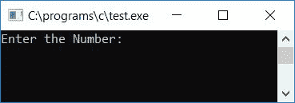
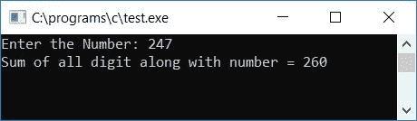

# C 程序：将一个数的数字和数本身相加

> 原文：<https://codescracker.com/c/program/c-program-add-number-digits.htm>

在 C 编程中，要将任意数字的所有位数与数字本身相加，您必须要求用户输入数字，将他们的位数与数字本身相加，然后在输出屏幕上显示结果。

假设用户输入了 247。然后，程序将计算给定数字中所有位数的和，数字本身，即 2+4+7 或 13，将再次加到数字本身，即 13+247 或 260，这将是与 247 的情况一样的最终输出。

## 用 C 语言实现数字的位数和个数相加的程序

问题是:用 C 语言写一个程序，要求用户输入任意一个数字，然后这个程序必须找到这个数字的所有数字的和以及这个数字本身。例如，如果数字是 23，那么 2 + 3 + 23 等于 260，这将是输出。

下面的 C 程序要求用户输入任意数字，并将该数字的位数与数字本身相加:

```
#include<stdio.h>
#include<conio.h>
int main()
{
    int num, rem=0, sum=0, temp;
    printf("Enter the Number: ");
    scanf("%d", &num);
    temp = num;
    while(num>0)
    {
        rem = num%10;
        sum = sum+rem;
        num = num/10;
    }
    sum = sum+temp;
    printf("Sum of all digit along with number = %d", sum);
    getch();
    return 0;
}
```

由于上面的程序是在 Code::Blocks IDE 中编写的，下面是成功构建和运行后的运行示例。这是示例运行的第一个快照:



现在提供任意一个数字，比如 247，来计算数字的和(2+4+7)以及数字本身，即 2+4+7+247。下面是示例运行的第二个快照:



以下是上述程序中使用的一些主要步骤:

*   接收任何数字作为输入，比如 247。
*   将这个数字初始化为一个变量，比如说 temp。
*   创建一个`while`循环，该循环一直运行到数字大于 0。
*   在`while`循环中，使用模或余数运算符找到数字的最后一位，并将该数字一个接一个地相加。将数字除以 10 进行检查，并再次进入循环以找到下一个数字的和。
*   也就是说，在第一次运行时，num 或 247 大于 0，因此程序流程进入循环，num%10 或 7 将被初始化为 rem。然后 sum+rem 或 7 将被初始化为 sum(不要忘记在程序开始时将 0 初始化为 sum)。最后，将数字除以 10，即 num/10、247/10 或 24 将被初始化为 num。在这之后，让我们再次检查 num 的值是否大于 0。
*   如果是，那么程序流再次进入`while`循环，执行与前面相同的操作。
*   这样，我们就有了一个名为“sum”的变量，它将保存给定数字的所有位数的和的值。
*   现在把这个加到数字本身上。也就是说，在 temp 变量进入`while`循环之前，我们将它的值初始化为 temp 变量。
*   求和后，在输出屏幕上输出 sum 变量的值，即 2 + 4 + 7 + 247 或 260。

[C 在线测试](/exam/showtest.php?subid=2)

* * *

* * *