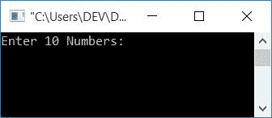
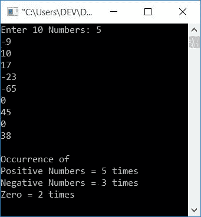
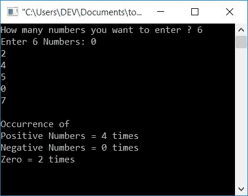

# 计算正数、零和负数的 c 程序

> 原文：<https://codescracker.com/c/program/c-program-count-positive-negative-zero.htm>

在本教程中，您将学习并获得有关计算正数、负数和零在用户给定的数字列表中出现次数的代码(在运行时)。

## 计算 C 语言中正负零的出现次数

在 C 编程中，要从用户输入的给定的一组数中计数正数、负数和零的个数，应用循环的[来检查所有的数，无论当前数是 0、小于 0 还是大于 0 的 。并增加相应变量的值，如下面给出的程序所示。](/c/c-for-loop.htm)

```
#include<stdio.h>
#include<conio.h>
int main()
{
    int countPositive=0, countNegative=0, countZero=0, arr[10], i;
    printf("Enter 10 Numbers: ");
    for(i=0; i<10; i++)
        scanf("%d", &arr[i]);
    for(i=0; i<n; i++)
    {
        if(arr[i]<0)
            countNegative++;
        else if(arr[i]>0)
            countPositive++;
        else
            countZero++;
    }
    printf("\nOccurrence of");
    printf("\nPositive Numbers = %d times", countPositive);
    printf("\nNegative Numbers = %d times", countNegative);
    printf("\nZero = %d times", countZero);
    getch();
    return 0;
}
```

这个程序是使用 **Code::Blocks** IDE 构建和运行的。以下是运行示例:



提供任意 10 个数字，如 **5，-9，10，17，-23，-65，0，45，0，38** 作为输入，按 **ENTER** 键查看输出，如下图所示:



你看到了上面的输出，因为 **-9，-23，-65** 是 3 个负数， **5，10，17，45，38** 是 5 个正数， **0，0** 是所有给定的 10 个数中的两个零。

### 允许用户定义大小

这是另一个程序，允许用户定义数组的大小(他想要输入多少个数字)。让我们来看看这个程序:

```
#include<stdio.h>
#include<conio.h>
int main()
{
    int countPositive=0, countNegative=0, countZero=0, arr[10], n, i;
    printf("How many numbers you want to enter ? ");
    scanf("%d", &n);
    printf("Enter %d Numbers: ", n);
    for(i=0; i<n; i++)
        scanf("%d", &arr[i]);
    for(i=0; i<n; i++)
    {
        if(arr[i]<0)
            countNegative++;
        else if(arr[i]>0)
            countPositive++;
        else
            countZero++;
    }
    printf("\nOccurrence of");
    printf("\nPositive Numbers = %d times", countPositive);
    printf("\nNegative Numbers = %d times", countNegative);
    printf("\nZero = %d times", countZero);
    getch();
    return 0;
}
```

下面给出的快照显示了上述程序的运行示例:



#### 其他语言的相同程序

*   [C++计数正数、零和负数](/cpp/program/cpp-program-count-positive-negative-zero.htm)
*   [Java 计数正数、零和负数](/java/program/java-program-count-positive-negative-zero.htm)

[C 在线测试](/exam/showtest.php?subid=2)

* * *

* * *