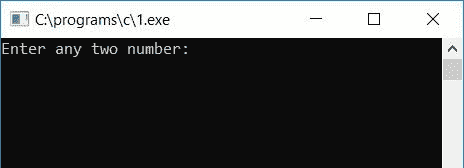
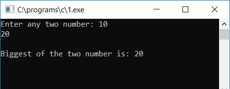
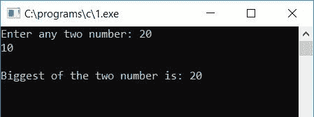
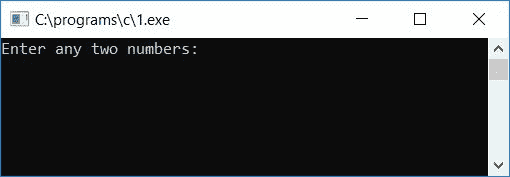
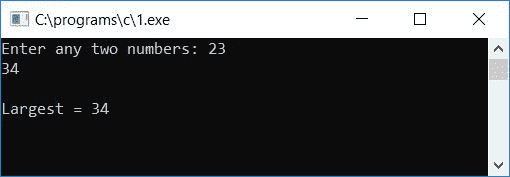
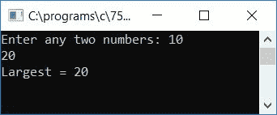

# C 程序寻找两个数中最大的一个

> 原文：<https://codescracker.com/c/program/c-program-find-greatest-of-two-numbers.htm>

在本教程中，您将学习并获得关于如何通过以下方法由用户(在运行时)查找并打印任意给定两个数字之间的最大数字的代码:

*   使用 [if-else 语句](/c/c-if-statement.htm)
*   使用[三元运算符](/c/c-ternary-operator.htm)
*   使用[功能](/c/c-functions.htm)

## 使用 if-else 查找两个数字中最大的一个

在 C 语言编程中，要找出任意给定的两个数之间最大的一个，你必须让用户输入任意两个数来检查并找出哪个更大，如下面给出的程序所示:

```
#include<stdio.h>
#include<conio.h>
int main()
{
    int a, b, big;
    printf("Enter any two number: ");
    scanf("%d%d", &a, &b);
    if(a>b)
        big=a;
    else
        big=b;
    printf("\nBiggest of the two number is: %d", big);
    getch();
    return 0;
}
```

由于上述程序是用 **Code::Blocks** IDE 编写的，因此在成功构建并运行后，会产生如下结果:



现在你必须提供任意两个数字，比如说 **10** 和 **20** ，然后按`ENTER`查看第二个快照中给出的 输出。众所周知，20 大于 10，因此您会看到输出为 20:



如果您想检查第一个数字是 20，第二个数字是 10，那么您也可以这样做，这里是输出:



#### 程序解释

*   取任意两个数，放入两个[变量](/c/c-variables.htm)中，比如说 **a** 和 **b**
*   检查 **a** 是否大于 **b** 或者是否使用 **if** 语句
*   如果是，那么 **a** 的值将被初始化为 **big**
*   否则， **b** 的值将被初始化为**大**
*   无论最大值是多少，**大**持有它
*   最后打印出**大**变量的值作为输出

## 使用三元运算符查找两个数字之间的最大值

这是另一个程序，它的工作与前一个程序相同。此程序使用三元运算符来查找较大的一个:

```
#include<stdio.h>
#include<conio.h>
int main()
{
    int num1, num2, large;
    printf("Enter any two numbers: ");
    scanf("%d%d", &num1, &num2);
    large = (num1>num2) ? num1 : num2;
    printf("\nLargest = %d", large);
    getch();
    return 0;
}
```

下面是示例运行的第一个屏幕截图:



现在提供任意两个数字，并按`ENTER`查看第二个快照中显示的最大数字:



主要的逻辑代码是:

```
large = (num1>num2) ? num1 : num2;
```

这里如果 **num1** 大于 **num2** ，那么 num1 将被初始化为大，否则 num2 将被初始化为大。

或者可以这么说，如果 num1 大于 num2，那么 **large =** 之后的整个表达式就会变成**num 1；**，因此语句变为:

```
large = num1;
```

否则(如果 num1 小于 num2)，则语句变为:

```
large = num2;
```

## 用函数求两个数中的最大值

这是我创建函数 **findLarge()** 的最后一个程序，该函数将用户给出的数字作为参数，并将返回最大的一个。

```
#include<stdio.h>
#include<conio.h>
int findLarge(int, int);
int main()
{
    int num1, num2, larg;
    printf("Enter any two numbers: ");
    scanf("%d%d", &num1, &num2);
    larg = findLarge(num1, num2);
    printf("Largest = %d", larg);
    getch();
    return 0;
}
int findLarge(int a, int b)
{
    if(a<b)
        return b;
    else
        return a;
}
```

以下是示例运行的最终快照:



在名为 **findLarge()** 的函数中，如果 **b** 的值大于 **a** 的值，那么 **b** 将被 返回并初始化为 **large** 变量，否则 **a** 将被返回并初始化为 **main()** 函数中的 **large** 变量。

#### 其他语言的相同程序

*   [C++寻找两个数中最大的一个](/cpp/program/cpp-program-find-greatest-of-two-numbers.htm)
*   [Java 寻找两个数中最大的一个](/java/program/java-program-find-largest-of-two-numbers.htm)
*   [Python 找到两个数中最大的一个](/python/program/python-program-find-largest-of-two-numbers.htm)

[C 在线测试](/exam/showtest.php?subid=2)

* * *

* * *