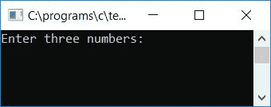
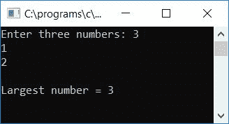
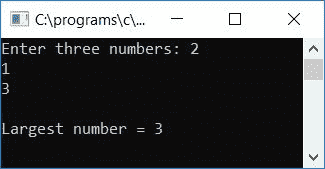
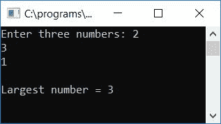
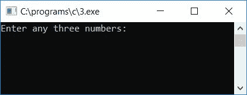
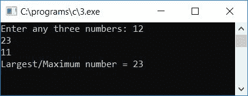
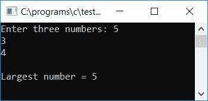

# c 程序寻找三个数中最大的一个

> 原文：<https://codescracker.com/c/program/c-program-find-greatest-of-three-numbers.htm>

在本教程中，您将学习和了解如何通过用户(在运行时)使用和不使用三元运算符在给定的三个数中找到最大或最大的数。以下是您将经历的方法:

*   使用 if-else-if 语句
*   使用 if-else 语句
*   使用三元运算符
*   使用功能

## 使用 if-else-if 找到三个数中最大的一个

在 C 编程中，要在给定的三个数字中找出最大的数字，你必须要求用户输入任意三个数字，现在开始使用 [if-else 块](/c/c-if-statement.htm) 检查哪个是最大的，如下面给出的程序所示:

```
#include<stdio.h>
#include<conio.h>
int main()
{
    int a, b, c, big;
    printf("Enter three numbers: ");
    scanf("%d%d%d", &a, &b, &c);
    if(a>b)
    {
        if(b>c)
            big = a;
        else
        {
            if(c>a)
                big = c;
            else
                big = a;
        }
    }
    else
    {
        if(b>c)
            big = b;
        else
            big = c;
    }
    printf("\nLargest number = %d", big);
    getch();
    return 0;
}
```

由于上述程序是在 **Code::Blocks** IDE 下编写的，因此在成功构建并运行后，您将得到以下输出:



提供任意三个数字，如 **3** 、 **1** 和 **2** 。按`ENTER`键查看样品运行的第二张快照中给出的最大数字:



下面是另一个运行示例:



下面是上述程序的最后一次运行示例:



在下面的例子中，用户可以输入三个数字:

*   第一个数字最大，第二个数字第二大
*   第一个数字最大，第三个数字第二大
*   第二个数字最大，第一个数字第二大
*   第二个数字最大，第三个数字第二大
*   第三个数字最大，第一个数字第二大
*   第三个数字最大，第二个数字第二大

#### 程序解释

*   接收三个数字作为输入并存储在三个[变量](/c/c-variables.htm)中作为 第一、第二和第三个数字表示 **a** 、 **b** 和 **c**
*   检查第一个数字说 **a** 是否大于第二个数字说 **b**
*   如果是，则转到 **if** 块，检查 **b** 内的值是否也大于 **c**
*   如果是，那么出现在第一个数字上的值比如说 **a** 将被初始化为变量 **big** ，否则， 检查第三个数字比如说 **c** 是否大于第一个数字比如说 **a**
*   如果是，则出现在 **c** 的值被初始化为**大**，否则将 **a** 初始化为**大**T10】并从 **if** 块中出来
*   如果 **a** 小于 **b** ，则检查 **b** 是否大于 **c**
*   如果是，则将 **b** 的值初始化为**大**，否则将 **c** 的值初始化为**大**
*   打印 **big** 变量的值作为输出，这将是给定的三个数字中的最大值

## 使用 if-else 语句找出三个数中最大的一个

该程序也做同样的工作，但方式简单，使用 C 语言的 **if-else** 语句:

```
#include<stdio.h>
#include<conio.h>
int main()
{
    int a, b, c, big;
    printf("Enter three numbers: ");
    scanf("%d%d%d", &a, &b, &c);
    if(a>b && a>c)
        big = a;
    else if(b>a && b>c)
        big = b;
    else
        big = c;
    printf("\nLargest number = %d", big);
    getch();
    return 0;
}
```

与上面的程序相比，上面的程序很难创建和理解。您将看到与前一个相同的输出。

## 使用三元运算符找出三个数中的最大值

我将再次使用[三元运算符](/c/c-ternary-operator.htm)(?:)

```
#include<stdio.h>
#include<conio.h>
int main()
{
    int num1, num2, num3, large;
    printf("Enter any three numbers: ");
    scanf("%d%d%d", &num1, &num2, &num3);
    large = (num1>num2) ? ((num1>num3)?num1:num3) : ((num2>num3)?num2:num3);
    printf("Largest/Maximum number = %d", large);
    getch();
    return 0;
}
```

成功构建并运行上述程序后，下面是示例运行的第一个屏幕截图:



现在提供任意三个数字作为输入，比如说 **12** 、 **23** 和 **11** ，然后按`ENTER`查看以下输出:



#### 程序解释

*   接收任意三个数字作为输入，比如 **num1** 、 **num2** 和 **num3**
*   使用三元运算符(？:)并将最大值初始化为变量 say **large**
*   这里如果 **num1** 的值大于**num 2**T4 的值
    *   并且在 **num1** 的值也大于在**num 3**T4 的值
        *   然后 **num1** 将被初始化为**大**
        *   否则 **num3** 将被初始化为**大**
*   而如果 **num2** 大于**num 1**T4】
    *   而且 **num2** 也大于**num 3**T4】
        *   然后 **num2** 将被初始化为**大**
        *   否则 **num3** 将被初始化为**大**
*   打印保存最大值的变量 **large** 的值

这里我们使用了嵌套的三元运算符，即三元运算符内部的三元运算符。

## 用函数找出三个数中的最大值

这是另一个程序，它做的工作和前面所有的程序一样。与以前的程序唯一不同的是，它是使用用户定义的函数 **findLarge()** 创建的。

```
#include<stdio.h>
#include<conio.h>
int findLarge(int, int, int);
int main()
{
    int a, b, c, big;
    printf("Enter three numbers: ");
    scanf("%d%d%d", &a, &b, &c);
    big = findLarge(a, b, c);
    printf("\nLargest number = %d", big);
    getch();
    return 0;
}
int findLarge(int num1, int num2, int num3)
{
    if(num1>num2)
    {
        if(num2>num3)
            return num1;
        else
        {
            if(num3>num1)
                return num3;
            else
                return num1;
        }
    }
    else
    {
        if(num2>num3)
            return num2;
        else
            return num3;
    }
}
```

以下是样本运行的最终快照:



在这里，该函数将三个给定的数字作为其参数，并将返回最大的一个，该参数将被初始化为变量，比如在 **main()** 函数中的 **big** 。打印 big 的值，它将保存给定的三个数中的最大值 。要了解关于[功能](/c/c-functions.htm)的更多信息，那么 你可以跟随关于它的单独教程。

#### 其他语言的相同程序

*   [C++寻找三个数中最大的一个](/cpp/program/cpp-program-find-greatest-of-three-numbers.htm)
*   [Java 寻找三个数字中最大的一个](/java/program/java-program-find-largest-of-three-numbers.htm)
*   [Python 找到三个数字中最大的一个](/python/program/python-program-find-largest-of-three-numbers.htm)

[C 在线测试](/exam/showtest.php?subid=2)

* * *

* * *