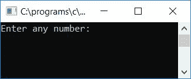
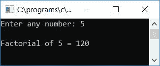
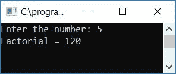
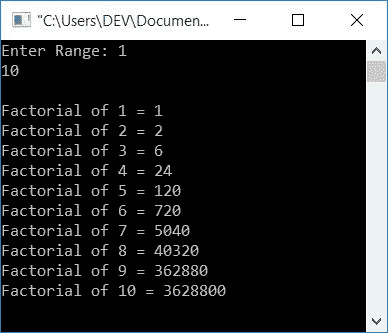

# C 程序：求数的阶乘

> 原文：<https://codescracker.com/c/program/c-program-find-factorial.htm>

在本教程中，我们将学习如何在使用和不使用[函数](/c/c-functions.htm)的情况下找到并打印任意给定数字的阶乘。这里我们还创建了一个递归函数来找出任意数字的阶乘 。以下是您将经历的项目列表:

*   求给定数字的阶乘
*   用函数求给定数字的阶乘
*   用递归求给定数字的阶乘
*   找出给定范围内所有数字的阶乘

但是在开始这些程序之前，让我们先了解一个数的阶乘是如何计算的。

### 如何求任意数的阶乘？

要找到任意数的阶乘 f ，比如说 **n** ，使用以下公式

```
Factorial of n (n!) = (n)*(n-1)*(n-2)*....*3*2*1
```

或者

```
n! = 1*2*3*....*(n-2)*(n-1)*n
```

例如，使用上面的公式找出 **5** 的阶乘

```
5! = 5*4*3*2*1
   = 120
```

所以 5 的阶乘是 120。现在让我们继续，用 C 程序实现它。

## 在 C 语言中求给定数字的阶乘

在 C 编程中，要找到任意给定数字的阶乘，你必须让用户输入数字。现在用上面的公式，如下面给出的程序所示，求出这个数的阶乘。从公式中可以看出，如果一个数是 **n** ，那么 乘法就会发生 **n** 次。

或者举例来说，如果数字是 5，那么乘法发生 5 次，即 **5*4*3*2*1** 。所以这里需要 创建[循环](/c/c-loops.htm)，运行 **n** 次

```
#include<stdio.h>
#include<conio.h>
int main()
{
    int num, i, fact=1;
    printf("Enter any number: ");
    scanf("%d", &num);
    for(i=num; i>0; i--)
        fact = fact*i;
    printf("\nFactorial of %d = %d", num, fact);
    getch();
    return 0;
}
```

由于该程序是在 **Code::Blocks** IDE 下编写的，因此在成功构建和运行后，您将获得以下输出:



现在提供任意数字，比如说 **5** ，并按回车键查看 5 的阶乘输出，如下所示:



#### 程序解释

*   使用 **scanf()** 函数获取数字作为输入，比如说 **5**
*   为循环创建一个[，在本例中从数字 5 开始](/c/c-for-loop.htm)
*   继续运行`for`循环，直到数字(这里变量 I 保存 num 的值)变为 0
*   如果用户已经提供了数字 **5** 作为输入，那么在`for`循环的第一次运行时，I 保存大于 0 的 5， 并且这里 fact 保存 1 作为其初始值，因此 **fact*i** 或 **5*1** 或 **5** 被初始化为 **fact** 变量
*   在第二次运行时 **i** 被递减并保持再次大于 0 的值 **4** ，因此在循环内， T4 事实*i 或 **5*4** 或 **20** 被初始化为事实。同样，在第三次、第四次和第五次运行时，fact 将其最终的 值保存为 **5*4*3*2*1** 或 **120** 。在第六次，当 I 递减并变为不大于 0 的 0 时，因此 条件评估为假，因此程序流程从**退出**循环
*   现在打印**事实** [变量](/c/c-variables.htm)的值，它包含给定数字比如说 5 的阶乘值比如说 120

## 用函数求数字的阶乘

这个程序做同样的工作，但是使用用户定义的函数 **findFact()** 。要了解函数，那么 参考它单独的教程，在那里你可以找到它的深入教程。

```
#include<stdio.h>
#include<conio.h>
int findFact(int);
int main()
{
    int num, fact;
    printf("Enter any number: ");
    scanf("%d", &num);
    fact = findFact(num);
    printf("\nFactorial of %d = %d", num, fact);
    getch();
    return 0;
}
int findFact(int n)
{
    int i=n, f=1;
    while(i>0)
    {
        f = f*i;
        i--;
    }
    return f;
}
```

## 用递归求一个数的阶乘

下面是另一个使用递归函数计算任意给定数的阶乘的程序:

```
#include<stdio.h>
#include<conio.h>
int findFact(int);
int main()
{
    int num, fact;
    printf("Enter the number: ");
    scanf("%d", &num);
    fact = findFact(num);
    printf("Factorial = %d", fact);
    getch();
    return 0;
}
int findFact(int val)
{
    if(val==1)
        return val;
    else
        return val*findFact(val-1);
}
```

以下是示例运行的最终快照:



#### 程序解释

*   用一个参数声明函数，以传递用户给定的值或数字
*   在主函数中，接收数字作为输入并调用函数，这样函数会将其返回值初始化为包含给定数字阶乘值的变量，比如说 **fact**
*   在递归函数定义中，我们检查了值或数字(通过参数传递)是否等于 1，如果是，则返回变量 **val** 的值，否则返回 **val*findFact(val-1)**
*   例如，如果用户提供了 5 作为输入，那么 5 是传递给递归函数的参数，在第一次，5 不等于 1，因此程序流转到 **else** 块的语句，这里返回值是 **5 * find fact(5-1)**或 **5*findFact(4)** 。由于我们已经返回了函数本身，因此函数 **findFact()** 被称为自身(这就是所谓的递归函数)。
*   使用参数 **4** 调用该函数，因此 4 再次不等于 1，然后程序流再次转到 **else**块的语句，因此这次返回值将是，返回 **5*4*findFact(4-3)** 或 **20*findFact(3)**
*   同样，在参数值变为 1 之前，最终返回值将是 return **120*findFact(2-1)** 或 **120*findFact(1)**
*   最后，当参数值为 1 时，则程序流转到 **if** 块的语句，该语句仅返回 变量 **val** 的值，该值保存第一次作为参数传递给函数 5 的数字的阶乘值，比如 120
*   最后，120 被初始化为 **main()** 函数内的变量**事实**
*   打印**事实**变量的值，它包含给定数字的阶乘值

如果你对以上解释不满意。那么我推荐你参考 C 教程中的[递归。在那里你当然会理解所有的东西，递归是如何工作的。](/c/c-recursion.htm)

## 找出给定范围内所有数字的阶乘

现在，这是最后一个程序，将找到给定范围内所有数字的阶乘。例如，如果用户输入两个数字 **1** 和 **10** (范围)。然后，程序将找到并打印从 1 到 10 的所有数字的阶乘。

```
#include<stdio.h>
#include<conio.h>
int findFact(int);
int main()
{
    int num1, num2, i;
    long int fact;
    printf("Enter Range: ");
    scanf("%d %d", &num1, &num2);
    if(num1<num2)
    {
        for(i=num1; i<=num2; i++)
        {
            fact = findFact(i);
            printf("\nFactorial of %d = %ld", i, fact);
        }
    }
    else
    {
        for(i=num2; i<=num1; i++)
        {
            fact = findFact(i);
            printf("\nFactorial of %d = %ld", i, fact);
        }
    }
    getch();
    return 0;
}
int findFact(int n)
{
    int i=n;
    long int f=1;
    while(i>0)
    {
        f = f*i;
        i--;
    }
    return f;
}
```

下面是它的运行示例:



#### 其他语言的相同程序

*   [C++ 求数字](/cpp/program/cpp-program-find-factorial.htm)的阶乘
*   [Java 寻找数字的阶乘](/java/program/java-program-find-factorial.htm)
*   [Python 求数字的阶乘](/python/program/python-program-find-factorial-of-number.htm)

[C 在线测试](/exam/showtest.php?subid=2)

* * *

* * *