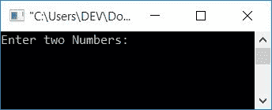
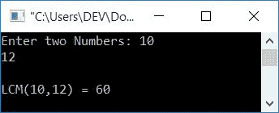
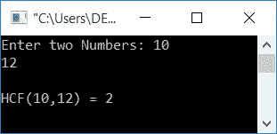

# C 程序：求两个数的 LCM 和 HCF

> 原文：<https://codescracker.com/c/program/c-program-find-hcf-lcm.htm>

在本教程中，您将学习并获得关于由用户查找任意两个给定数字的 LCM 和 HCF 的代码(在运行时)。但是，在阅读该计划之前，如果您不知道如何找到 LCM 和 HCF，那么我建议您阅读以下两篇文章:

*   [如何找到 LCM](/nonprog/find-lcm.htm)
*   [如何找到 HCF](/nonprog/find-hcf.htm)

我相信，在一分钟之内，你会对这两个话题有完全的了解。让我们继续，用 C 程序实现它。

## 在 C 语言中求两个数的 LCM

让我们首先创建一个程序来找出两个数字的 LCM:

```
#include<stdio.h>
#include<conio.h>
int main()
{
    int num1, num2, mp;
    printf("Enter two Numbers: ");
    scanf("%d %d", &num1, &num2);
    if(num1>num2)
        mp=num1;
    else
        mp=num2;
    while(1)
    {
        if((mp%num1==0) && (mp%num2==0))
            break;
        else
            mp++;
    }
    printf("\nLCM(%d,%d) = %d", num1, num2, mp);
    getch();
    return 0;
}
```

这个程序是在 **Code::Blocks** IDE 下构建和运行的。下面是它的运行示例:



现在提供任意两个数字作为输入，比如说 **10** 和 **12** 。然后按`ENTER`键查看以下输出:



因为 LCM 是必须被这两个数整除的数(余数为 0)。例如，如果 **10** 和 **12** 是两个数。为了找到它的 LCM，我们必须首先检查哪一个更大。 将较大的数字初始化为一个[变量](/c/c-variables.htm)比如说 **mp** 。现在使用语句:

```
if((mp%num1==0) && (mp%num2==0))
    break;
```

我们已经检查了 **mp** 中的值是否能被两个数整除。如果是，则使用[中断语句](/c/c-break-statement.htm)退出 T2 同时循环。 否则，增加其值并继续下一次检查。在退出循环时，我们在 **mp** 中存储了一个值，该值将等于两个给定数字的 LCM。将 **1** 作为**中的条件，同时循环** 无限期运行，直到 **break** 语句执行。

有很多方法可以用来计算 LCM 或 HCF。由你来决定。

### 不使用 if-else 在 C 中查找 LCM

现在让我们创建相同目的的程序，不使用下面给出的 [if-else](/c/c-if-statement.htm) :

```
#include<stdio.h>
#include<conio.h>
int main()
{
    int num1, num2, lcm, a, b, temp;
    printf("Enter two Numbers: ");
    scanf("%d %d", &num1, &num2);
    a=num1;
    b=num2;
    while(b!=0)
    {
        temp = b;
        b = a%b;
        a = temp;
    }
    lcm = (num1*num2)/a;
    printf("\nLCM(%d,%d) = %d", num1, num2, lcm);
    getch();
    return 0;
}
```

这将产生与前一个相同的输出。

## 在 C 中求两个数的 HCF

现在让我们创建一个程序来查找用户输入的两个数字的 HCF:

```
#include<stdio.h>
#include<conio.h>
int main()
{
    int num1, num2, mp;
    printf("Enter two Numbers: ");
    scanf("%d %d", &num1, &num2);
    if(num1>num2)
        mp=num1;
    else
        mp=num2;
    while(1)
    {
        if((num1%mp==0) && (num2%mp==0))
            break;
        else
            mp--;
    }
    printf("\nHCF(%d,%d) = %d", num1, num2, mp);
    getch();
    return 0;
}
```

下面是它的运行示例:



从上面的程序中可以看出，如果阻塞来自:

```
(mp%num1==0) && (mp%num2==0)
```

到

```
(num1%mp==0) && (num2%mp==0)
```

和声明来自

```
mp++;
```

到

```
mp--;
```

如果你已经阅读了前面提到的两篇文章(如何找到 LCM 和 HCF ),那么你就会完全理解上面两篇文章的颠倒，即条件和语句。

因为在 HCF 中，我们必须找到两个数的最大公因数，因此我们将较大的数初始化为 **mp** ，并检查它是否能被两个数整除。如果是，则从循环中断开 ,否则减少其值并继续检查下一个值。例如，如果 两个给定的数字是 **18** 和 **27** ，则程序流程如下:

*   最高数字 27 被初始化为 **mp**
*   数字 1 作为**的条件，而**循环总是评估为真
*   如此程序流继续运行，直到**关键字发生**中断
*   在循环内部，使用 **if** 块，检查数字 18 和 27 是否能被 27 整除
*   因为它不能被第一个数字 **18** 整除，所以 **else** 块的语句被执行，并且 **mp** 的值被递减
*   当 **mp** 的值变为 9 时
*   然后在 **if** block 的条件下，因为 18 和 27 这两个数都能被 9 整除
*   因此，如果块的语句和**中断，程序流程进入**内部；**被处决**
*   这从循环中退出
*   最后将 **mp** 的值打印为两个给定数字的 HCF 结果。好了

### 使用 while 循环查找 C 中的 HCF

现在让我们创建另一个程序来找出两个数的 HCF，而不使用 if-else 块

```
#include<stdio.h>
#include<conio.h>
int main()
{
    int num1, num2, a, b, temp, hcf;
    printf("Enter two Numbers: ");
    scanf("%d %d", &num1, &num2);
    a=num1;
    b=num2;
    while(b!=0)
    {
        temp = b;
        b = a%b;
        a = temp;
    }
    hcf = a;
    printf("\nHCF(%d,%d) = %d", num1, num2, hcf);
    getch();
    return 0;
}
```

#### 关于 LCM 和 HCF 的更多计划

*   [C 求 n 个数的 LCM](/c/program/c-program-find-lcm-n-numbers.htm)
*   [C 找出 n 个数的 HCF](/c/program/c-program-find-hcf-n-numbers.htm)

#### 其他语言的相同程序

*   [C++ 查找 LCM & HCF](/cpp/program/cpp-program-find-hcf-lcm.htm)
*   [Java 查找 LCM & HCF](/java/program/java-program-find-hcf-lcm.htm)
*   [Python 找到 LCM & HCF](/python/program/python-program-find-hcf-lcm.htm)

[C 在线测试](/exam/showtest.php?subid=2)

* * *

* * *