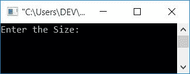
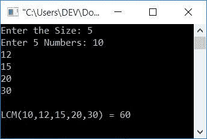

# C 程序：求 n 个数的 LCM 

> 原文：<https://codescracker.com/c/program/c-program-find-lcm-n-numbers.htm>

在本教程中，您将学习并获得关于寻找 n 个数的 LCM 的代码。或者你可以说，这个程序是用来寻找一个数组的 LCM 的。但是在浏览节目之前，我推荐你去访问[找两个号码](/c/program/c-program-find-hcf-lcm.htm)的 LCM 一次(如果没访问过的话)。因为，这里给出的程序是与那篇文章中的程序相关的 。

## 求 C 中 n 个数的 LCM

问题是**用 C 写个程序求 n 个数(给定数组)**的 LCM。这个问题的答案是:

```
#include<stdio.h>
#include<conio.h>
int main()
{
    int arr[10], n, mp, i, count;
    printf("Enter the Size: ");
    scanf("%d", &n);
    printf("Enter %d Numbers: ", n);
    for(i=0; i<n; i++)
        scanf("%d", &arr[i]);
    i=0;
    mp = arr[i];
    while(i<n)
    {
        if(mp<arr[i])
            mp = arr[i];
        i++;
    }
    while(1)
    {
        i=0;
        count=0;
        while(i<n)
        {
            if(mp%arr[i]==0)
                count++;
            i++;
        }
        if(count==n)
            break;
        else
            mp++;
    }
    printf("\nLCM(");
    for(i=0; i<(n-1); i++)
        printf("%d,", arr[i]);
    printf("%d) = %d", arr[i], mp);
    getch();
    return 0;
}
```

这个程序是在 **Code::Blocks** IDE 下构建和运行的。下面是它的运行示例:



现在提供 **5** 作为尺寸，并输入 5 个数字，比如 **10、12、15、20、30** 。然后按下`ENTER`键 可以看到如下输出:



#### 程序解释

声明:

```
while(i<n)
{
    if(mp%arr[i]==0)
        count++;
    i++;
}
```

用于检查 **mp** 的值是否能被所有数字整除。如果它能被任何数整除， 则增加**计数**的值。退出[循环](/c/c-loops.htm)后，检查 **计数**是否等于[数组](/c/c-arrays.htm)的大小。如果相等，那么 **mp** 就是 能被所有的数整除。因为每次 [if 块](/c/c-if-statement.htm) 的条件评估为真，程序流程进入块内，并增加 **count** 的值。

例如，假设数组的大小为 **5** ，元素为 **10，12，15，20，30** 。然后程序流程是这样的:

*   索引 0(第一个数字)处的元素被初始化为 **mp**
*   将其与下一个索引的元素(第二个数字)进行比较
*   如果 **mp** 的值小于下一个索引的数值，则将其值初始化为 **mp**
*   创建这段代码只是为了将数组中最大的元素分配给 **mp** ，从最大的数字开始
*   使用 **1** 作为 [while 循环](/c/c-while-loop.htm)的条件，总是评估为真
*   因此，这个循环继续运行，直到出现 **break** 关键字
*   在循环内部，0 被初始化为**计数**和 **i**
*   创建一个 **while** 循环，运行 5 次
*   在循环内部，检查 **mp** 处的值是否能被当前索引处的数字整除
*   如果是，则增加**计数**的值，并继续下一个元素
*   检查完所有 5 个元素后
*   检查**计数**是否等于数组的大小
*   如果相等，那么意味着条件 **mp%arr[i]==0** 评估为真，5 次。这意味着， **mp** 可以被所有的 5 个数整除
*   因此使用 [break 语句](/c/c-break-statement.htm)并退出循环
*   并将其值打印为给定 5 个数字的 LCM
*   如果不相等，则增加 **mp** 的值，并继续相同的过程
*   直到它能被所有 5 个数整除。好了

[C 在线测试](/exam/showtest.php?subid=2)

* * *

* * *