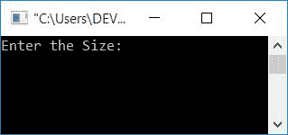
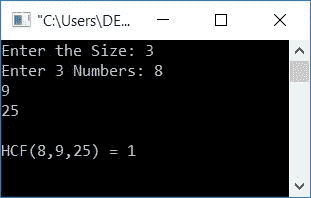
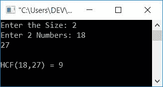

# C 程序：求 n 个数的 HCF 

> 原文：<https://codescracker.com/c/program/c-program-find-hcf-n-numbers.htm>

在这篇文章中，你将学习并获得关于寻找 n 个数的 HCF 的代码。但是在浏览节目之前，我建议你去参观一下 [Find HCF 的两个号码](/c/program/c-program-find-hcf-lcm.htm) (如果没去过的话)。因为，这里给出的程序与那篇文章中的程序是相关的。

## 求 C 中 n 个数的 HCF

现在让我们创建一个程序来查找用户在运行时给出的所有数字的 HCF。

```
#include<stdio.h>
#include<conio.h>
int main()
{
    int arr[10], n, mp, i, count;
    printf("Enter the Size: ");
    scanf("%d", &n);
    printf("Enter %d Numbers: ", n);
    for(i=0; i<n; i++)
        scanf("%d", &arr[i]);
    i=0;
    mp = arr[i];
    while(i<n)
    {
        if(mp<arr[i])
            mp = arr[i];
        i++;
    }
    while(1)
    {
        i=0;
        count=0;
        while(i<n)
        {
            if(arr[i]%mp==0)
                count++;
            i++;
        }
        if(count==n)
            break;
        else
            mp--;
    }
    printf("\nHCF(");
    for(i=0; i<(n-1); i++)
        printf("%d,", arr[i]);
    printf("%d) = %d", arr[i], mp);
    getch();
    return 0;
}
```

这个程序是在 **Code::Blocks** IDE 下构建和运行的。以下是运行示例:



现在提供尺寸，比如说 **3** ，并输入任意 3 个数字，比如说 **8、9、25** 。按`ENTER`键查看以下输出:



这是另一个针对两个数字的示例:



该程序与 C 中 n 个数的前一个程序 [LCM 相同。 除外我们已经扭转了**的状况如果**挡自:](/c/program/c-program-find-lcm-n-numbers.htm)

```
mp%arr[i]==0
```

到

```
arr[i]%mp==0
```

和声明来自:

```
mp++;
```

到

```
mp--;
```

C 中两个数的 [LCM & HCF 中讨论了这两个为什么颠倒。 简要描述是:](/c/program/c-program-find-hcf-lcm.htm)

*   在 LCM 的情况下，我们必须找到多个(最低的公约数)
*   在 HCF 的情况下，我们必须找到因子(最常见的)

因为一个数的倍数大于该数，而一个数的因数小于该数。我希望你对此有所了解。如果没有，请访问:

*   [如何找到 LCM](/nonprog/find-lcm.htm)
*   [如何找到 HCF](/nonprog/find-hcf.htm)

[C 在线测试](/exam/showtest.php?subid=2)

* * *

* * *