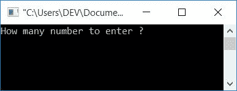
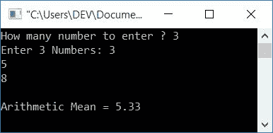

# 计算算术平均值的 c 程序

> 原文：<https://codescracker.com/c/program/c-program-calculate-arithmetic-mean.htm>

在本文中，您将学习并获得关于如何通过用户(在运行时)找到给定数字列表算术平均值的代码。

## 算术平均值是如何计算的？

要计算算术平均值，请使用公式**mean =(n<sub>1</sub>+n<sub>2</sub>+n<sub>2</sub>+...+n<sub>n</sub>/n**。 此处**n<sub>1</sub>T13】代表第一个数字，**n<sub>2</sub>T17】代表第二个数字，以此类推。鉴于， **n** (分母部分)是表示数的数量的值。例如，如果有三个数字说 **3，5，8** 。所以 要找到它的算术平均值，使用前面给出的公式。因此 **3、5、8** 的算术平均值将为 **(3+5+8)/3** 或 **16/3** 或 **5.33** 。****

## C 语言中的算术平均程序

在 C 编程中计算算术平均值，你必须要求用户输入，他/她想要提供多少个数字(数量)，比如说 **3** 。然后要求输入该尺寸(3)的所有数字(比如 3、5、8)。现在应用下面程序中所示的简单公式 计算算术平均值:

```
#include<stdio.h>
#include<conio.h>
int main()
{
    int i, size;
    float num, sum, am;
    printf("How many number to enter ? ");
    scanf("%d", &size);
    sum = 0;
    printf("Enter %d Numbers: ", size);
    for(i=0; i<size; i++)
    {
        scanf("%f", &num);
        sum = sum+num;
    }
    am = sum/size;
    printf("\nArithmetic Mean = %0.2f", am);
    getch();
    return 0;
}
```

这个程序使用 **Code::Blocks** IDE 编译并执行。下面是上述程序的运行示例:



现在提供大小(用户想要输入多少个数字来找到这些输入数字的算术平均值)，比如说 **3** 。然后输入所有的 **3**数字，如 **3、5、8** ，最后按**回车键**查看输出，如下图所示:



#### 前一程序中使用的步骤

以下是上述程序中使用的一些主要步骤:

*   声明 **int** (整型)的任意两个变量，比如说**大小**和 **i**
*   声明另外三个变量 **float** (浮点型)比如 **num、**sum、 **am**
*   这里 **num** 用于存储数字的逐个数值， **sum** 用于存储 个数字的总和， **am** 用于存储用户给定的所有数字的算术平均值
*   来自用户的扫描尺寸，即他/她想要提供的数量
*   现在为循环创建一个**,扫描该大小的所有数字。例如，如果用户提供 10 作为大小， 然后创建一个循环，运行 10 次来逐个扫描所有的 10 个数字**
*   每次扫描后，应用求和操作，这样在退出循环后，您将拥有一个名为 **sum** 的变量，它保存用户给定的所有数字的总和
*   现在只需应用算术平均公式，打印出 **am** 的值作为输出。就这样
*   **%0.2f** 格式说明符用于打印最多两位小数的数值

#### 其他语言的相同程序

*   [C++计算算术平均值](/cpp/program/cpp-program-calculate-arithmetic-mean.htm)
*   [Java 计算算术平均值](/java/program/java-program-calculate-arithmetic-mean.htm)
*   [Python 计算算术平均值](/python/program/python-program-calculate-average-of-numbers.htm)

[C 在线测试](/exam/showtest.php?subid=2)

* * *

* * *